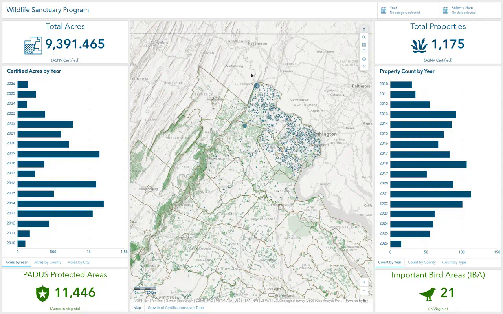
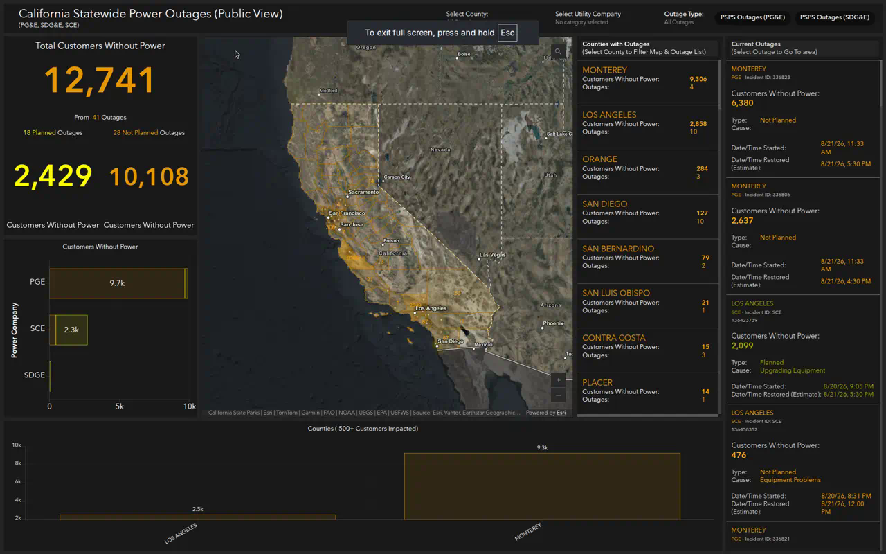

# How to Build Professional ArcGIS Online Dashboards

This tutorial reverse-engineers two public ArcGIS Dashboards and shows how to recreate that quality in your own organization. It is written for the current ArcGIS Dashboards builder (not Dashboards Classic).

**Reference dashboards**

| Type | Live dashboard | Pattern |
| --- | --- | --- |
| Informational / program | [ASNV Wildlife Sanctuary Program](https://www.arcgis.com/apps/dashboards/96896859c42c4301a8032609493a9e00) | Light theme, branded header, KPI cards, tabbed charts, map-driven filters |
| Operational / real-time | [California Statewide Power Outages](https://www.arcgis.com/apps/dashboards/7edefc1970d44b839ebbfd7b45e51e2d) | Dark theme, header selectors, live lists, zoom/flash actions, 10-minute refresh |





---

## 1. What these dashboards are actually doing

Both apps look different, but they follow the same architecture:

1. **A web map is the data backbone.** Charts, indicators, lists, and selectors all read operational layers from that map (or hosted feature layers that also appear on the map).
2. **The screen is a single-purpose story.** ASNV answers “how is the sanctuary program performing?” Cal OES answers “where is power out right now, and how many customers are affected?”
3. **The largest element is the map.** Supporting KPIs and charts sit around it. Extra analysis is hidden behind tabs so the first screen stays clean.
4. **Header selectors filter everything at once.** Year, date, county, utility, and outage type are not decorations. Each selection writes a filter (and sometimes a zoom/flash) to the map layer and every dependent element.
5. **Professional polish comes from consistency.** One brand color, one number format, one interaction pattern, one empty-state behavior.

If you skip the web map and try to “just add widgets,” the dashboard will never feel like these two.

---

## 2. Choose the dashboard type before you click Create

Esri describes four dashboard types. These examples are two of them:

| | ASNV Wildlife Sanctuary | Cal OES Power Outages |
| --- | --- | --- |
| Type | Informational / strategic | Operational |
| Audience | Public, members, partners | Emergency staff and the public during an event |
| Viewing place | Daylight desktop / projector | EOC wall, dark room, phone |
| Theme | Light, navy `#004c73`, forest green `#267300` | Dark, near-black `#1a1a1a` / `#242424`, amber `#e69800` / `#ffaa00` / `#ffff00` |
| Data cadence | Historical program records (2010–present) | Utility feed refreshed about every 5–10 minutes |
| Main question | How many properties and acres are certified, and where? | How many customers are without power, where, and is it planned? |

Write one sentence that the dashboard must answer. Everything that does not serve that sentence stays off the first screen.

---

## 3. Prerequisites

You need:

- An ArcGIS Online (or Enterprise) account with privileges to create content
- A hosted feature layer (or view) with the fields you will chart, filter, and list
- A web map in Map Viewer
- Optional: a PNG logo (about 48×48 for a large header), brand hex colors, and a short disclaimer

Recommended data-prep rules, taken from these dashboards:

- Use **hosted feature layer views** for the public dashboard so you can hide staff-only fields.
- Give fields human names: `Year`, `Acres`, `County`, `ImpactedCustomers`, `OutageType`, `OutageStatus`.
- Store a **status field** (`Active` / `Restored`) and a **type field** (`Planned` / `Not Planned`). Filters become simple.
- For live operations, set the layer **refresh interval** in the web map (Cal OES uses **5 minutes**).
- Pre-calculate summary fields that lists will show (Cal OES county polygons include `Number_Impacted_Customers` and `Number_Incidents`). Lists cannot do complex joins at runtime.

---

## 4. Build the web map first (this is the hidden half of the dashboard)

Open **Map Viewer** and author the map the dashboard will display. The dashboard map element can only show tools and layers that already exist here.

### 4.1 Informational map (ASNV pattern)

Web map used by the live dashboard: *ASNV Wildlife Sanctuary Program Summary (Public)*.

1. Choose a **light, quiet basemap** (ASNV uses a simplified hillshade basemap, with World Imagery available but off by default).
2. Add context layers that explain the program, then the layer you will actually analyze:
   - Protected areas (PADUS)
   - Important Bird Areas
   - Chapter / study-area boundary
   - Generalized county boundaries
   - **Certified properties** (the analysis layer)
3. Style the analysis layer twice if needed:
   - Unique values by `Type` (Business, Government, Library, Residence, …) for a pie chart that **color-matches** the map
   - Class breaks by `Acres` for the default map view
4. Configure **pop-ups** with only the public fields: jurisdiction, acres, type, year, city, ZIP. Turn off empty fields.
5. Add a **bookmark** for the default extent (ASNV has “App Placement”).
6. Save the map with a public-facing title and summary.

### 4.2 Operational map (Cal OES pattern)

Web map used by the live dashboard: *Cumulative Statewide Power Outages (Public View)*.

1. Choose a **dark or imagery basemap** so amber outage symbols pop (Cal OES uses NAIP Imagery Hybrid).
2. Add layers in draw order from background to foreground:
   - Mask / study-area layer (keeps attention on California)
   - County polygons with outage counts
   - Outage area polygons
   - Outage incident points (one layer for statewide zoom, one for closer zoom if you use scale ranges)
3. Symbolize incidents with **unique values on `OutageType`**:
   - Planned = yellow `#ffff00`
   - Not planned = amber `#ffaa00`
4. Configure pop-ups as a readable sentence, for example `{UtilityCompany}: ID - {IncidentId}`.
5. Set **layer refresh** to 5 minutes on every operational layer.
6. Add a **Statewide** bookmark.
7. Save.

Dashboard maps inherit this work. If the map is messy, the dashboard will be messy.

---

## 5. Create the dashboard

1. Sign in to ArcGIS Online.
2. Open the web map’s item page.
3. Click **Create app → Dashboards**.
4. Title it clearly:
   - Informational: `Wildlife Sanctuary Program Summary (Public)`
   - Operational: `Statewide Power Outages (Public View)`
5. Add tags, a one-sentence summary, and a folder. Click **Create dashboard**.

Alternatively: **App launcher → Dashboards → Create dashboard**, then add the map as the first element.

**Tip from Esri:** add the map first. Other elements can then use that map’s operational layers as their data source, which is required for map-extent filters and zoom/flash actions.

---

## 6. Set theme and dashboard settings before adding widgets

Click **Theme** on the left action bar.

### Light / program dashboard

1. Keep **Light**.
2. Click **Customize selected theme**.
3. Set primary text / accent to the brand navy (ASNV: `#004c73`).
4. Use a second color only for a second concept (ASNV uses `#267300` for statewide context KPIs that are *not* program certifications).
5. Check **color contrast** in the theme panel. Navy on white passes; pale gray on white often fails.

### Dark / operations dashboard

1. Choose **Dark**.
2. Customize:
   - Dashboard background `#242424`
   - Element outline `#1a1a1a`
3. Pick **one alert color family** (amber/yellow). Do not mix red, blue, green, and purple on the same operational screen.
4. Make sure the web map basemap is dark or imagery so map and dashboard feel like one product.

Then open **Settings**:

| Setting | ASNV | Cal OES | Recommendation |
| --- | --- | --- | --- |
| Allow element resizing | On | Off | Off for wall displays; on for analyst desktops |
| Allow element expansion | On | On | On |
| Allow reset | Off | Off | On if you have many filters |
| Last update text | Map on; charts off | Map on | Show it where data is live |

---

## 7. Add a branded header and global filters

Click **View → Header → Add header**.

### Header content

**Informational (ASNV)**

1. Title: `Wildlife Sanctuary Program` (keep it short; this is the only H1 on the page).
2. Title color `#004c73`, background white.
3. Optional background image, sized to **Fit height**, centered. Use a subtle banner, not a busy photo.
4. Logo size **Large** if you include a logo.

**Operational (Cal OES)**

1. Logo: agency mark, HTTPS URL, large size, linking to the GIS program page.
2. Subtitle under the title: `(PG&E, SDG&E, SCE)` so users immediately know coverage.
3. Header background `#1a1a1a`.
4. Turn **Sign out** off for a public dashboard.
5. Add a **menu information window** for the disclaimer (Cal OES states the feed is compiled from utilities and is not independently verified).

A header with selectors is always **large**. That is correct: filters belong in the header, not buried in the map.

### Add selectors (this is what makes the dashboard feel “alive”)

Still on **View → Header → Add selector**.

#### Category selector from grouped values (Year, Utility)

ASNV **Year** selector:

1. Type: **Category selector**.
2. Data: certified-properties layer, **Categories from Grouped values**, field `Year`, sort `Year` ascending.
3. Selection: **Multiple**, allow none.
4. Display: **Dropdown**, compact, show search.
5. Caption: `Year`.
6. **Actions → Filter** every chart, indicator, and the map’s properties layer. Field map: `Year` → `Year`.
7. Do **not** require a selection. “No category selected” means “all years.”

Cal OES **Select Utility Company**:

1. Grouped values on `UtilityCompany`.
2. Multiple selection, allow none, dropdown.
3. Filter all outage layers and all indicators/charts/lists.
4. **Zoom** the map to the selected features.

#### Category selector from features (County)

Cal OES **Select County**:

1. Categories from **Features** (the county polygon layer), item text `{NAME}`.
2. Sort `NAME` ascending, max features ~60.
3. Selection: **Single**, allow none, none label `All Counties`, default = first (All).
4. Display: dropdown with search.
5. Actions:
   - **Filter** outage points/areas by `NAME` → `County`
   - **Filter** the county list by `NAME` → `NAME`
   - **Zoom** and **Flash** the map

Feature-based categories are how you get a spatial zoom instead of “just a SQL filter.”

#### Category selector from defined values (Outage type / PSPS)

Cal OES **Outage Type**:

1. Categories from **Defined values**.
2. Example values used in the live app:
   - Label `PSPS Outages (PG&E)` → the exact cause/status string in the data
   - Label `PSPS Outages (SDG&E)` → the SDG&E string
3. Display: **Inline button bar** (not a dropdown). Critical filters should be one click.
4. None label: `All Outages`.
5. Filter the incident layer and every KPI/list/chart.

#### Date selector (program dashboard)

ASNV **Select a date**:

1. Type: **Date selector**.
2. Date picker, **range**, operator **between**, time off.
3. Presentation: dropdown.
4. Actions: **Filter** using `filterField` → `Close_Date` on the properties layer and every element that uses it.

---

## 8. Layout: three columns, map in the middle

Professional dashboards in this class use a **docking layout**, not a scatter of floating cards.

Target proportions from the live apps:

**ASNV (balanced story)**

```
Header
-------------------------------------------------
| 25% acres      | 50% map / story | 25% counts |
| KPI            |                 | KPI        |
| tabbed charts  | map  (tab:     | tabbed     |
| context KPI    | growth embed)  | charts     |
|                |                 | context KPI|
-------------------------------------------------
```

**Cal OES (situation awareness)**

```
Header + selectors
--------------------------------------------------------------------
| 27% KPIs +     | 52% map              | 20% county list | 18%   |
| company chart  |                      |                 | outage|
|                |                      |                 | list  |
|---------------------------------------------------------|       |
| 25% counties with 500+ customers chart                  |       |
--------------------------------------------------------------------
```

### How to dock, stack, and group

1. Add the **Map** element first. It fills the canvas.
2. Click **Add element** on the **left** edge → Indicator (left column).
3. Click **Add element** on the **right** edge → Indicator (right column).
4. Drag borders until the map is about half the width.
5. **Stack for tabs:** drag a chart onto the center of another element until the hint says **Stack the items**. Rename tabs (`Acres by Year`, `Acres by County`, `Acres by City`).
6. **Group related KPIs:** hold **Shift** while docking so Planned / Not planned stay glued together.
7. In the layout tree, use **Distribute width/height evenly** on a row of sibling KPIs.

ASNV hides extra analysis in tabs so the opening view is: two KPIs, two charts, one map. That is why it looks calm despite 12 elements.

---

## 9. Tutorial A — recreate the Wildlife Sanctuary dashboard

Use this when you have a point or polygon inventory (properties, projects, permits, habitats) and you want the public to understand **totals + geography + breakdowns**.

### 9.1 Map element

1. **Add element → Map**.
2. Choose the web map from section 4.1.
3. Enable: **Default extent and bookmarks**, **Legend**, **Layer visibility**, **Search**, **Scalebar (ruler)**, **Pop-ups**, **Last update**.
4. Disable: compass, locate, pan/rotate (not needed for a 2D public map).
5. Point zoom scale: `200000` (county-scale when a point is the target of a zoom action).
6. **Map actions → Filter** when extent changes: every acre/count chart and both program KPIs, **by geometry**.

That last step is the “professional” trick. Pan the map to Fairfax and the charts retotal to what is on screen.

### 9.2 KPI indicators

Add four **Indicator** elements. Data source = the map layer (or a related layer).

| Indicator | Statistic | Top text | Middle | Bottom | Color |
| --- | --- | --- | --- | --- | --- |
| Total Acres | Sum of `Acres` | Total Acres | `{value}` + icon | (ASNV Certified) | `#004c73` |
| Total Properties | Count of features | Total Properties | `{value}` + icon | (ASNV Certified) | `#004c73` |
| PADUS Protected Areas | Count (or sum of acres) on the PADUS layer | PADUS Protected Areas | `{value}` + shield icon | (Acres in Virginia) | `#267300` |
| Important Bird Areas | Count of IBA sites | Important Bird Areas (IBA) | `{value}` + bird icon | (In Virginia) | `#267300` |

Configuration pattern for each:

1. **Data:** Statistic (not feature).
2. **Indicator tab:** fill **top / middle / bottom**. Middle is the number. Top is the label. Bottom is the unit/caveat in parentheses.
3. Add an SVG icon on the **left** of the middle text.
4. Number format: grouping on, 0–3 decimal places. Turn **unit prefixing off** for acres if you want `9,391` not `9.4k`.
5. Turn **Last update** off on static program KPIs.

The two green cards are *context*, not the same metric as the navy cards. That color split teaches the user what is “our program” vs “the landscape.”

### 9.3 Horizontal bar charts (serial charts)

ASNV uses **horizontal bar charts** (`rotated` / orientation swap) in brand navy, no legend, no data labels clutter.

Create five charts, then stack them into two tab sets.

**Left tabs — acres**

| Tab name | Group by | Statistic | Max categories | Sort |
| --- | --- | --- | --- | --- |
| Acres by Year | `Year` | Sum `Acres` | all | Year descending |
| Acres by County | `Jurisdicti` (county) | Sum `Acres` | 10 | value descending |
| Acres by City | `City` | Sum `Acres` | 10 | value descending |

**Right tabs — counts**

| Tab name | Group by | Statistic | Notes |
| --- | --- | --- | --- |
| Count by Year | `Year` | Count | same years as acres chart |
| Count by County | county field | Count | override long labels (`Arlington/City of Alexandria` → `Alexandria`) |
| Count by Type | `Type` | Count | this one is a **pie chart**, not a bar |

For each serial chart:

1. **Add element → Serial chart**.
2. Layer = certified properties.
3. Categories from **Grouped values**.
4. **Series:** Bar/column, fill `#004c73`, tooltips on, data labels off, legend off.
5. **Axes:** swap orientation so categories are on the Y axis (easier to read place names).
6. Character limit ~11 on category labels, or use **Override** for readable names.
7. Title in the caption, navy, 20 px, bold: `Certified Acres by Year`.
8. Value format: grouping on, 0–1 decimal, unit prefix on for large acre totals.

### 9.4 Pie chart that matches the map

1. **Add element → Pie chart**.
2. Group by `Type`, count features.
3. Turn **color match** on, or set unique colors to the same RGB values as the map renderer.
4. Hide slice labels; show a legend. Percent labels at 0 decimals.
5. Stack it as the **Count by Type** tab.

When the pie and the map use the same colors, users trust both without a second legend.

### 9.5 Embedded content tab (the “story” behind the map)

ASNV stacks an **Embedded content** element under the map, tab named **Growth of Certifications over Time**, pointing at an ArcGIS Experience:

`https://experience.arcgis.com/experience/<your-experience-id>`

Use this for a time-enabled chart, StoryMap, or methodology page that would crowd the main canvas.

1. **Add element → Embedded content**.
2. Content type: document / page.
3. Stack onto the map. Rename the tabs `Map` and `Growth of Certifications over Time`.

---

## 10. Tutorial B — recreate the Power Outage dashboard

Use this when you have **incidents that change during the day** and people need to filter, click a list, and fly to the map.

### 10.1 Map element

1. Add the operational web map.
2. Enable **Search**, **Navigation / zoom**, **Pop-ups**, **Last update**.
3. Keep tools minimal (Cal OES only enables Search). On a wall monitor, extra tools become noise.
4. Flash repeats: **3**.
5. Selection/highlight: dark orange selection (`#732600`) so it reads on imagery.

### 10.2 Three KPI cards with a reference count

Cal OES does not show a naked number. Each card answers two questions: **how many customers** and **from how many outages**.

**Total Customers Without Power**

1. Indicator, data source = incident layer.
2. **Value (main):** Sum of `ImpactedCustomers`.
3. **Reference:** Count of `OBJECTID`.
4. Caption: `Total Customers Without Power`.
5. Description: `From {reference} Outages` (amber).
6. Middle text: `{value}` in `#e69800`, large.
7. Filter later via selectors; do **not** hard-filter this one to a subtype.

**Planned Outages** (yellow)

1. Main dataset filter: `OutageType = Planned`. Statistic: sum of `ImpactedCustomers`.
2. Reference dataset filter: `OutageType = Planned AND OutageStatus = Active`. Statistic: count.
3. Caption: `{reference} Planned Outages`.
4. Middle: `{value}` in `#ffff00`.
5. Bottom: `Customers Without Power`.

**Not Planned Outages** (amber)

1. Main: `OutageType = Not Planned`, sum of customers.
2. Reference: `OutageStatus = Active AND OutageType <> Planned`, count.
3. Caption: `{reference} Not Planned Outages`.
4. Middle: `{value}` in `#e69800`.

Group the two subtype KPIs side by side under the total. That grouping is how the live dashboard reads as one “scoreboard.”

### 10.3 Serial chart: customers by utility, stacked by type

1. Serial chart, incidents layer.
2. Filter: `OutageStatus = Active`.
3. Category: `UtilityCompany`.
4. **Split by** `OutageType`.
5. Statistic: sum of `ImpactedCustomers`.
6. Series colors: Not Planned `#ffaa00`, Planned `#ffff00`.
7. Horizontal bars, value labels on, integers only, legend off (the KPI colors already explain Planned vs Not Planned).
8. Axis title: `Power Company`.
9. Caption: `Customers Without Power`.

### 10.4 Serial chart: only the counties that matter

A statewide bar chart of 58 counties is unreadable. Cal OES filters to **500+ customers**.

1. Serial chart, county layer.
2. Filter: `Number_Impacted_Customers > 499`.
3. Category field `NAME`, sum of impacted customers.
4. Vertical columns, labels rotated 30°.
5. Caption: `Counties ( 500+ Customers Impacted)`.
6. Dock this chart under the map at ~25% height.

### 10.5 County list (the spatial filter control)

1. **Add element → List**.
2. Layer: counties, max 60, sort `Number_Impacted_Customers` descending.
3. Line item template (rich text):

```html
<p><span style="color:#e69800;font-size:18px">{NAME}</span></p>
<table border="0" cellpadding="0" cellspacing="0" style="width:100%">
  <tr>
    <td>Customers Without Power:</td>
    <td><strong><span style="color:#ffaa00">{Number_Impacted_Customers}</span></strong></td>
  </tr>
  <tr>
    <td>Outages:</td>
    <td><span style="color:#ffaa00">{Number_Incidents}</span></td>
  </tr>
</table>
```

4. Caption: `Counties with Outages` and a one-line instruction: `(Select County to Filter Map & Outage List)`.
5. Background `#1a1a1a`, selection color `#732600`.
6. **Actions on selection:**
   - Filter outage layers (`NAME` → `County`)
   - Filter KPIs, utility chart, and outage list
   - **Zoom** the map
   - **Flash** the selected county

This list is not a report. It is a control surface.

### 10.6 Outage list (the incident queue)

1. List, incident layer.
2. Filter: `OutageStatus = Active`.
3. Sort: `ImpactedCustomers` descending, max 100.
4. Build a compact HTML card:

```html
<table style="width:50%" align="left"><tr>
  <td><span style="color:{OutageTypeColor}">{County}</span></td>
</tr></table>
<table style="width:50%" align="right"><tr>
  <td><span style="font-size:11px;color:{OutageTypeColor}">{UtilityCompany} - Incident ID: {IncidentId}</span></td>
</tr></table>
<p>Customers Without Power:</p>
<p><strong><span style="font-size:18px;color:{OutageTypeColor}">{ImpactedCustomers}</span></strong></p>
<p>Type: <span style="color:{OutageTypeColor}">{OutageType}</span></p>
<p>Cause: <span style="color:{OutageTypeColor}">{Cause}</span></p>
<p>Date/Time Started: <span style="color:{OutageTypeColor}">{StartDate}</span></p>
<p>Date/Time Restored (Estimate): <span style="color:{OutageTypeColor}">{EstimatedRestoreDate}</span></p>
```

`{OutageTypeColor}` only works if that field exists on the layer or you create it with **Arcade advanced formatting** (return yellow vs amber based on `OutageType`). That is the technique that makes Planned and Unplanned rows distinguishable without a second legend.

5. **Actions:** Zoom + Flash the map. Do not also filter the whole dashboard unless you want the KPIs to collapse to one incident.

### 10.7 URL parameter (deep link a county)

Cal OES defines a **feature URL parameter** named `County` on the county layer, field `NAME`. When the parameter changes it zooms the map and filters the same targets as the county selector.

After saving, a partner can open:

`https://www.arcgis.com/apps/dashboards/<itemid>#County=Monterey`

Use this for situation reports, 911 CAD links, and social media cards.

---

## 11. Wire every action (the difference between a poster and a dashboard)

Work through this matrix. If a cell is empty, the dashboard will feel broken.

| Source | Filter charts/KPIs | Filter map layer | Zoom map | Flash map |
| --- | --- | --- | --- | --- |
| Header category selector | Yes | Yes | Yes if spatial | Optional |
| Header date selector | Yes | Yes | No | No |
| Map extent change | Yes (informational) | — | — | — |
| County / category list | Yes | Yes | Yes | Yes |
| Incident list | No (or limited) | No | Yes | Yes |
| Serial chart selection | Optional | Optional | Optional | Optional |
| URL parameter | Yes | Yes | Yes | Optional |

Rules used by these two apps:

- Selectors **never require** a selection; “all” is the default.
- Map extent filters **charts**, not the header selectors (avoid circular filters).
- Clicking a **row in a list** always **goes to the map**. If it does not, users stop trusting the list.
- Use **field mapping** whenever the source field name differs (`NAME` → `County`).

To configure: open the element → **Actions** tab → add Filter / Zoom / Pan / Flash / Show pop-up → pick targets.

---

## 12. Make it look designed, not default

### Color

- One brand color for the primary metric (navy or amber).
- One supporting color for a second concept (green context, yellow planned).
- Element backgrounds match the theme (`#ffffff` or `#1a1a1a`). Do not give every widget a unique fill.
- Charts in ASNV all use the same navy fill. Charts in Cal OES all use the same amber/yellow pair.

### Typography and captions

- Dashboard title = Heading 1, once.
- Element titles = Heading 2, short, no jargon.
- Put **how to use it** in the caption: `(Select County to Filter Map & Outage List)`.
- Keep numbers grouped (`12,741`). Use unit prefixes (`9.7k`) only on charts, not on the hero KPI if precision matters (ASNV shows `9,391.465` acres).

### Icons

Indicators in the sanctuary dashboard use a house, a plant, a shield, and a bird. Icons are SVG, sit to the left of the number, and share the text color. Do not mix filled raster clip-art.

### Empty and no-filter states

Configure **No data** and **No filter** on every element so a county with zero outages does not show a broken chart. Cal OES keeps captions visible in both states.

### Performance

- `maxFeatures` on lists (60 counties, 100 incidents).
- Top 10 on city/county charts.
- One map, few tools.
- Layer views instead of the full staff dataset.
- Refresh only on live layers.

---

## 13. Add a mobile view

Desktop layouts this dense **will not** work on a phone. After the desktop view is done:

1. **View → Add mobile view**.
2. Copy only: header title, one KPI (total customers or total properties), the map, and one list.
3. Put selectors in the **drawer**, not the header.
4. Maximum **one map**, one operational layer if possible.
5. Drop tabbed chart stacks; keep a single chart or none.
6. Test at 390×844 and on a real phone. ArcGIS loads the mobile view below about **600 px** width.

---

## 14. Item details, sharing, and QA

On the dashboard item page:

1. Thumbnail: a true screenshot of the running dashboard (both live items do this).
2. Summary: one sentence (`Dashboard of all properties participating in the Wildlife Sanctuary Program` / `Current power outages from the major utilities in California`).
3. Description: mission, data vintage, update frequency, and a link to the program site.
4. Share the **dashboard, web map, and every layer/view** to the same audience (Public, Organization, or a group). A public dashboard with a private layer shows empty widgets.
5. If you proxy premium layers (ASNV proxies NLCD and wetlands), configure **app proxies** on the dashboard item so anonymous users do not consume named-user credits unexpectedly.

**QA checklist before you announce it**

- [ ] Default view answers the one-sentence question without clicking
- [ ] Every selector filters every relevant widget
- [ ] List click zooms/flashes the correct feature
- [ ] Map pan updates charts (if you configured extent actions)
- [ ] Deep link / URL parameter works
- [ ] Pop-ups are public-safe (no owner names, phone numbers, or internal IDs unless intended)
- [ ] Disclaimer is visible
- [ ] Contrast passes for title, KPI, and chart labels
- [ ] Mobile view loads and the drawer filters work
- [ ] Layer refresh is on for live feeds
- [ ] Tested at the wall-monitor resolution if that is the destination

---

## 15. Copy-this element recipe

If you only remember one workflow, use this:

1. **Model the layer** with the fields the UI will show.
2. **Author the web map** (symbology, pop-ups, refresh, bookmarks).
3. **Create dashboard from the map.**
4. **Theme + header + selectors** before you fall in love with charts.
5. **Map in the center**, KPIs on the sides, extra charts in **tabs**.
6. **Indicators** = statistic + top/middle/bottom text + one icon.
7. **Lists** = sorted, HTML line items, zoom/flash actions.
8. **Actions matrix** until filters feel inevitable.
9. **Mobile view** as a reduction, not a squeeze.
10. **Share the whole dependency chain.**

That is the pattern behind both of these dashboards. The wildlife app is the same machine as the outage app: a map, a few honest numbers, filters that actually filter, and nothing extra on the first screen.
