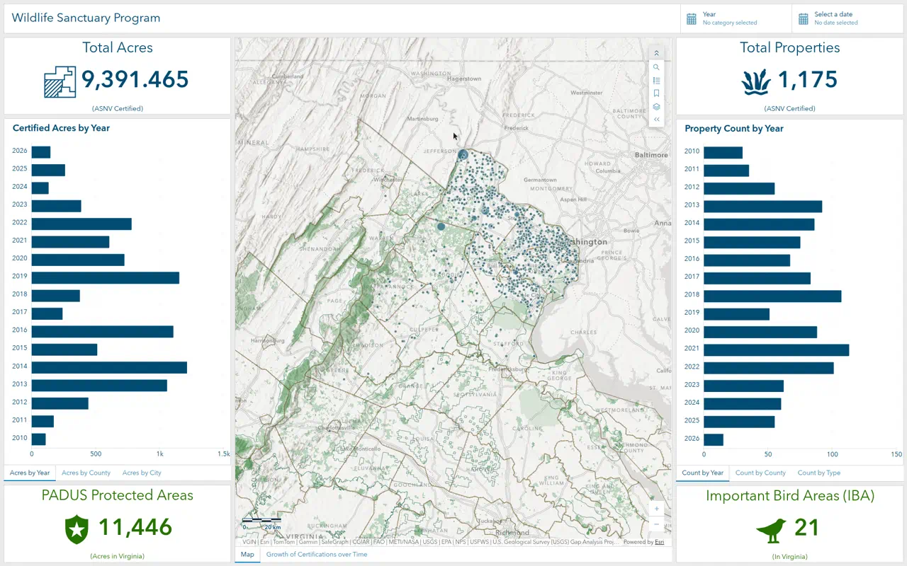
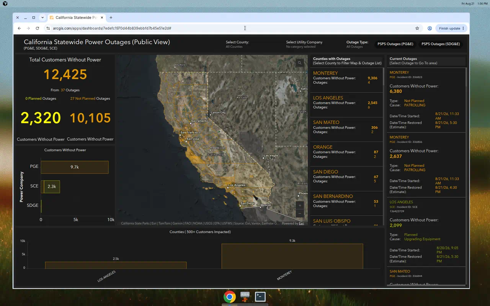
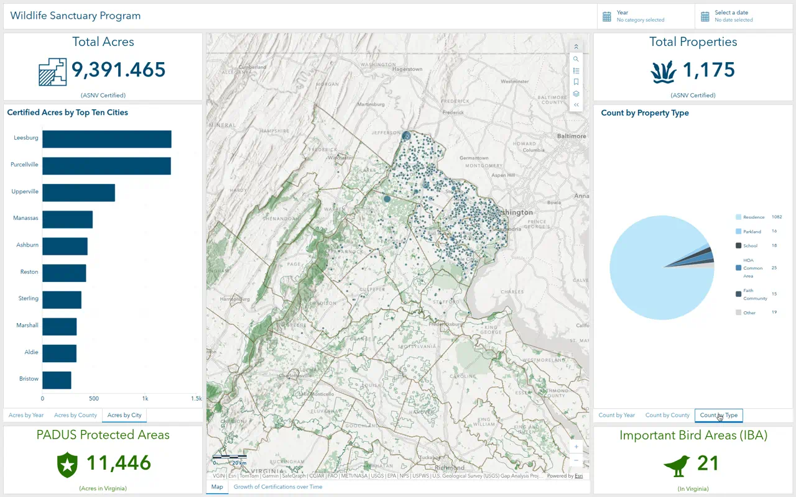
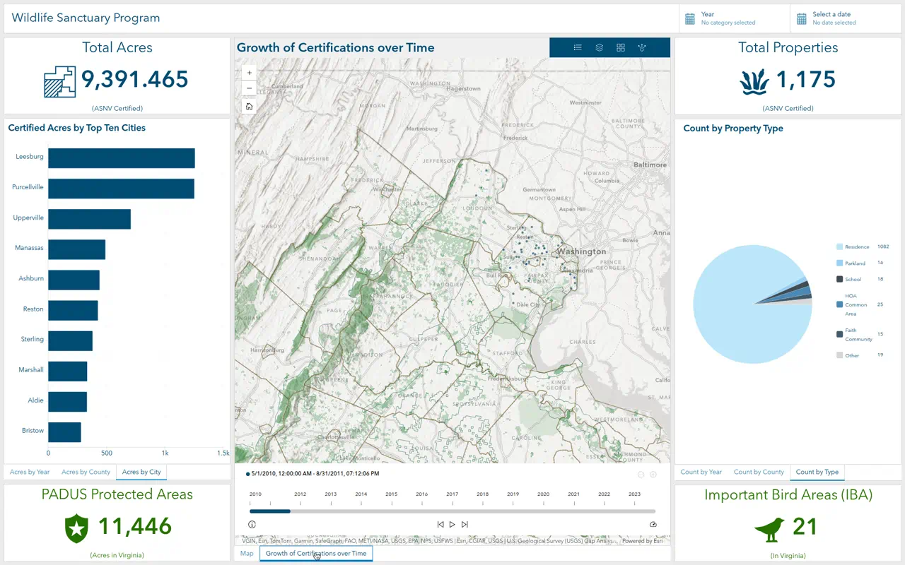
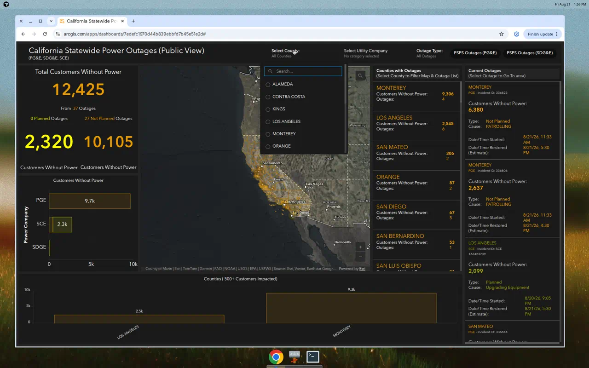

# Build professional ArcGIS Online dashboards

A step-by-step tutorial based on two public reference dashboards:

| Type | Dashboard | Why it is a good model |
| --- | --- | --- |
| Informational / program summary | [ASNV Wildlife Sanctuary Program](https://www.arcgis.com/apps/dashboards/96896859c42c4301a8032609493a9e00) | Light branded theme, KPI strip, tabbed charts, map as the center, year and date filters |
| Operational / real-time | [California Statewide Power Outages](https://www.arcgis.com/apps/dashboards/7edefc1970d44b839ebbfd7b45e51e2d) | Dark 24/7 theme, live refresh, status color coding, lists that drive the map, URL parameters |

Both were reverse-engineered from their ArcGIS Online item JSON (layout, widgets, selectors, actions, and source web maps). You can follow this guide with **your own layers**. You do not need the Audubon or Cal OES data.





---

## What “professional” actually means here

These dashboards work because of product design, not because they use every widget.

1. **One audience, one job.** ASNV answers “How is the sanctuary program growing, and where?” Cal OES answers “Who is without power right now, and where should I look first?”
2. **The map is the spatial engine.** Charts, lists, and KPIs are windows onto the same layers that are on the map.
3. **Visual hierarchy.** The largest number is the number a decision-maker needs first (total acres, customers without power). Detail sits below or to the side.
4. **Filters are global.** Header selectors update the map **and** every KPI, chart, and list.
5. **Color means something.** ASNV uses navy for certified properties and green for conservation context. Cal OES uses orange for unplanned outages and yellow for planned outages — the same colors on the map, indicators, and charts.
6. **Tabs hide density.** ASNV packs six charts into two tab groups so the first screen stays clean.
7. **The web map does the hard work.** Refresh intervals, definition queries, scale ranges, symbology, and pop-ups are configured in Map Viewer *before* the dashboard is built.

If you skip data prep and jump straight into Dashboards, the result will look unfinished no matter how carefully you dock the panels.

---

## Before you start

You need:

- An ArcGIS Online account that can create hosted feature layers, web maps, and dashboards (Creator / Professional user types typically include Dashboards).
- A hosted feature layer (or view) with the attributes you will chart, filter, and list.
- About 30–90 minutes for a first dashboard after the data is clean.

Recommended Esri docs while you work:

- [Create a dashboard](https://doc.arcgis.com/en/dashboards/latest/get-started/create-a-dashboard.htm)
- [Configure an element](https://doc.arcgis.com/en/dashboards/latest/get-started/configure-an-element.htm)
- [Use selectors](https://doc.arcgis.com/en/dashboards/latest/create-and-share/selectors.htm)
- [Configure actions](https://doc.arcgis.com/en/dashboards/latest/create-and-share/configuring-actions-on-dashboard-elements.htm)

---

# Part A — Design the dashboard on paper (15 minutes)

Do this before opening ArcGIS. Both reference dashboards can be sketched as a grid.

## A1. Write the one-sentence purpose

Examples:

- “Show the public how many properties and acres ASNV has certified, by year, county, city, and type.”
- “Show emergency managers how many California customers are without power right now, by county, utility, and outage type.”

If you cannot say it in one sentence, the dashboard will sprawl.

## A2. Pick the dashboard type

| Type | Refresh | Typical widgets | Theme |
| --- | --- | --- | --- |
| Informational (ASNV) | Daily / static | Indicators, serial charts, pie chart, map, embedded story | Light, brand colors |
| Operational (Cal OES) | Minutes | Indicators with reference counts, lists, stacked bars, map, header filters | Dark, high contrast |
| Strategic | Weekly / monthly | Gauges vs targets, trend lines | Light or org theme |

## A3. Sketch the layout

**ASNV pattern (balanced, educational):**

```
HEADER: Title                          [Year selector] [Date selector]
+------------------+------------------------+------------------+
| KPI: Total Acres |                        | KPI: Properties  |
| Tabbed charts:   |   MAP  (+ time tab)    | Tabbed charts:   |
|  acres by year / |                        |  count by year / |
|  county / city   |                        |  county / type   |
| KPI: PADUS       |                        | KPI: IBAs        |
+------------------+------------------------+------------------+
```

Column widths in the live dashboard are roughly **25% | 50% | 25%**. Top and bottom KPIs are about 15% of column height; the chart stack is about 70%.

**Cal OES pattern (ops floor):**

```
HEADER: Logo + title     [County] [Utility] [Outage type] [PSPS buttons]
+------------------+--------------------+----------+----------------+
| Total customers  |                    | Counties | Current        |
| Planned | Unpl.  |        MAP         |  list    | outages list   |
| Utility stacked  |                    |          |                |
| bar              | Counties 500+ chart|          |                |
+------------------+--------------------+----------+----------------+
```

Live proportions are roughly: left+map+county list **82%**, outage list **18%**. Inside the left block, the map is the large center, KPIs/chart sit left of the map, and a county bar chart sits under that row.

## A4. List the questions each widget answers

ASNV:

- How many acres / properties are certified? → **Indicators**
- How did that grow over time? → **Serial chart grouped by Year** (sum acres, count properties)
- Where is the land? → **Serial chart grouped by County / City**
- What kinds of properties? → **Pie chart grouped by Type**
- Where are they on the landscape? → **Map**
- How did certification spread year by year? → **Embedded time-enabled map / Experience**

Cal OES:

- How many people are dark right now? → **Indicator (sum ImpactedCustomers)**
- How many incidents is that? → **Same indicator’s reference (count)**
- Planned vs unplanned? → **Two filtered indicators + stacked bar**
- Which counties are worst? → **List sorted descending + bar chart with a 500+ filter**
- Which incident should I fly to? → **Outage list that zooms and flashes the map**

If a widget does not answer a question, do not add it.

---

# Part B — Prepare data and the web map (the real work)

Dashboards only visualize what the map and layers already know.

## B1. Design the attribute table

Minimum fields for an **informational** layer (ASNV-style):

| Field | Type | Used for |
| --- | --- | --- |
| `Year` | Integer or text | Category selector + bar chart |
| `Close_Date` | Date | Date selector |
| `Acres` | Double | Sum in indicators and charts |
| `Type` | Text coded domain | Pie chart + unique-value symbology |
| `City` | Text | Top-10 chart (`maxFeatures` = 10) |
| `Jurisdicti` (county) | Text | County charts |
| `ObjectId` | OID | Count statistic |

Minimum fields for an **operational** layer (Cal OES-style):

| Field | Type | Used for |
| --- | --- | --- |
| `County` / `NAME` | Text | Selector, list, chart, URL parameter |
| `UtilityCompany` | Text | Selector and stacked bar |
| `OutageType` | Text (`Planned` / `Not Planned`) | Color, filters, stacked series |
| `OutageStatus` | Text (`Active`) | Definition query |
| `ImpactedCustomers` | Integer | Sum KPIs and charts |
| `IncidentId` | Text | List item template |
| `Cause` | Text | List detail |
| `StartDate`, `EstimatedRestoreDate` | Date | List timestamps |

**Professional rules:**

- Use domains / consistent spelling (`Not Planned` not `Unplanned` in one layer and `Not Planned` in another).
- Publish a **hosted feature layer view** for the public dashboard so you can hide fields, filter rows, and change sharing without touching the source.
- ASNV uses a public view named `ASNV Certified Properties (Public View)`. Cal OES uses `Power_Outages_(View)`.

## B2. Create context layers

ASNV does not only map certified properties. The web map also includes:

- USGS PAD-US protected areas
- Audubon Important Bird Areas
- Chapter boundary
- USA counties
- Optional imagery layer (off by default)

Those extra layers make the map feel like a *place*, not a scatter of dots. They also feed the bottom KPIs (count of PADUS features, count of IBAs).

Cal OES adds:

- A **mask layer** (`StateName <> 'California'`) so the rest of the country is dimmed
- County polygons with a customer-count renderer
- Outage **areas** (polygons) plus outage **incidents** (points)
- A hidden “last week” incidents layer for optional history

## B3. Symbolize in Map Viewer, not in the dashboard

Open **Map Viewer** and configure the web map that the dashboard will consume.

### Informational map (ASNV)

1. Basemap: a light human-geography / hillshade mix (they use “Simplified Basemap with Hillshade”).
2. Certified properties: **class breaks** on `Acres` *or* a second copy of the layer with **unique values** on `Type` (Residence, School, Faith Community, Parkland, Business, Government). The live map uses both.
3. Protected areas and IBAs: simple fill, muted green, so points stay readable.
4. Pop-ups: county, acres, type, year, city, zip — not every field.
5. Bookmarks: at least one bookmark for the program extent (“App Placement”).
6. Save the map with a public-facing title, snippet, and description. The dashboard inherits that context.

### Operational map (Cal OES)

1. Basemap: dark imagery hybrid (high contrast for orange/yellow symbols).
2. Incidents: **unique values** on `OutageType`
   - Not Planned → orange (`#ffaa00`)
   - Planned → yellow (`#ffff00`)
3. County layer: Arcade / unique values on customer-count bins (0–1,000; 1,001–2,000; 2,001–5,000; 5,000+), definition query `Number_Impacted_Customers > 0`.
4. Definition query on incident layers: `OutageStatus = 'Active'`.
5. **Refresh interval: 5 minutes** on every operational layer (the dashboard description says data updates every 10 minutes; the map layers refresh at 5).
6. Scale ranges: a “zoomed out” incident layer vs a detailed incident layer so the map does not overplot.
7. Pop-up title: `{UtilityCompany}: ID - {IncidentId}`.
8. Search: enable feature search on county name if you want the dashboard Search tool to find counties.

Save the web map. Example titles from the references:

- `ASNV Wildlife Sanctuary Program Summary (Public)`
- `Cumulative Statewide Power Outages (Public View)`

**The dashboard map element is just this web map.** If the map looks wrong in the dashboard, fix the map, not the dashboard.

---

# Part C — Create the dashboard shell

## C1. Create the item

1. Sign in to [ArcGIS Online](https://www.arcgis.com).
2. **Content** → **Create app** → **Dashboards**.
3. Title it clearly, for example `Wildlife Sanctuary Program` or `Statewide Power Outages (Public View)`.
4. Add tags, a one-line summary, and a folder. Click **Create dashboard**.

You can also open the web map → **Create app** → **Dashboards**. That pre-loads the map element, which is usually faster.

## C2. Set theme first

Click the **Theme** button on the left action bar.

**ASNV (light / conservation):**

- Theme: Light (or a custom theme)
- Title color: `#004c73`
- Chart series fill: `#004c73`
- Conservation KPIs: `#267300`
- Header background: white
- Optional header background image (ASNV uses a wide nature photo, `fit-height`, centered)

**Cal OES (dark / operations):**

- Theme: Dark
- Dashboard background: `#242424`
- Element outline: `#1a1a1a`
- Header background: `#1a1a1a`
- Primary value color: `#e69800` (customers without power)
- Planned series: `#ffff00`
- Unplanned series: `#ffaa00`

Set theme before adding 12 widgets. Recoloring later is tedious.

## C3. Add a header

1. Open the **View** pane.
2. Add a **header**.
3. Title: short and public-facing. ASNV uses `Wildlife Sanctuary Program` (not the item’s long technical name). Cal OES uses the full operational name plus subtitle `(PG&E, SDG&E, SCE)`.
4. Optional logo:
   - Cal OES places a large org logo on the left and links it to the GIS division website.
   - ASNV skips a logo and lets the title plus background image carry the brand.
5. Logo size: **Large**.
6. Turn **Show sign out menu** on for internal dashboards; off for public kiosks.

## C4. Add the map

1. **Add element** → **Map**.
2. Choose the web map from Part B.
3. **Map functions / tools**
   - ASNV: Bookmarks, Legend, Layers, Search, navigation, ruler scale bar, pop-ups on. Point zoom scale `200000`.
   - Cal OES: Search only, navigation, pop-ups on, no scale bar. Keep the map visually quiet so outage color is the story.
4. Flash repeats: 3 (used when a list zooms to a feature).
5. Do **not** enable editing on a public dashboard.

Click **Done**. Dock the map in the center (ASNV) or center-right of the main block (Cal OES). Drag the left or right edge to get close to the proportions in section A3.

---

# Part D — Build the ASNV-style informational dashboard

Follow this if you want the three-column conservation / program-summary look.

## D1. Add four indicator KPIs

**Add element** → **Indicator**, four times.

### Total Acres (top left)

| Setting | Value |
| --- | --- |
| Layer | Certified properties (public view) |
| Value type | Statistic |
| Statistic | Sum of `Acres` |
| Top text | `Total Acres` color `#004c73` |
| Middle | `{value}` (in newer Dashboards: `{calculated/value}`) large |
| Bottom | `(ASNV Certified)` |
| Icon | Parcel / boundary, left aligned, same navy |

### Total Properties (top right)

Same layer. Statistic: **Count** of `ObjectId`. Label `Total Properties`. Icon: plant / leaf.

### PADUS Protected Areas (bottom left)

Layer: protected areas. Statistic: Count. Color `#267300`. Bottom text: `(Acres in Virginia)` *only if you are actually summing acres*. The live ASNV dashboard labels this “Acres” while counting features — avoid that mismatch. If you mean acres, **Sum** the acre field.

### Important Bird Areas (bottom right)

Layer: IBA polygons. Count of site id. Green bird icon. Bottom: `(In Virginia)`.

**Number format:** grouping on, 0–3 decimal places, no unit prefix. That is why ASNV shows `9,391.465` acres instead of `9.4k`.

Dock: drop each indicator onto the left or right of the map, then stack them above/below the future chart panels.

## D2. Add five serial charts and one pie chart

All six charts use the **same** certified-properties layer. That is why one Year filter can drive everything.

### Certified Acres by Year

1. **Add element** → **Serial chart**.
2. Categories from **Grouped values**, field `Year`.
3. Statistic: **Sum** `Acres`.
4. Sort: Year descending or original.
5. Chart type: **Bar**, **rotated** (horizontal bars).
6. Series color: `#004c73`.
7. Legend off. Data labels off. Tooltips on.
8. Title (General): `Certified Acres by Year`.

### Certified Acres by County

Same as above, group by `Jurisdicti` (county). Max features **10**. Sort by value descending. Optional **label overrides** (`Arlington/City of Alexandria` → `Alexandria`).

### Certified Acres by Top Ten Cities

Group by `City`. Max features **10**. Sort value descending. Title: `Certified Acres by Top Ten Cities`.

### Property Count by Year

Group by `Year`. Statistic: **Count**. Horizontal bars.

### Property Count by County

Group by county. Count. Horizontal bars.

### Count by Property Type (pie)

1. **Add element** → **Pie chart**.
2. Grouped values on `Type`.
3. Count of features.
4. Legend on the **right**, show numeric value, hide percentages if the counts are the story.
5. Title: `Count by Property Type`.

## D3. Stack charts into tabs

This is the ASNV trick that keeps the first screen clean.

1. Drag **Acres by County** onto **Acres by Year** until you see the **tabs** hint. Drop.
2. Drag **Acres by City** onto the same tab group.
3. Rename tabs: `Acres by Year` | `Acres by County` | `Acres by City`.
4. On the right column: `Count by Year` | `Count by County` | `Count by Type`.

You now have six analyses in two panels.

## D4. Optional: Growth over time tab

ASNV puts an **embedded content** element in a tab with the map:

- Type: document / URL
- URL: an Experience Builder (or time-enabled web app) that plays certification dates
- Tab name: `Growth of Certifications over Time`

To build that companion app:

1. Time-enable the properties layer on `Close_Date` or `Year`.
2. In Map Viewer, turn on time animation.
3. Create an Experience (or keep a time-enabled map) and paste its URL into **Embedded content**.

If you do not need animation, skip this and keep a single map.





## D5. Header selectors

Selectors can only live on the **header** or **sidebar** (desktop) or the **drawer** (mobile).

### Year selector

1. View pane → header → **Add selector** → **Category selector**.
2. Caption: `Year`.
3. Categories from **Grouped values**, field `Year`, order ascending.
4. Selection: **Multiple**. Allow none (so “all years” is the default).
5. Display: dropdown list.
6. **Actions** tab → **Filter** → enable for:
   - Map layer: certified properties
   - Every chart
   - Total Acres and Total Properties indicators
7. Operator: `is in`.

Do **not** filter the PADUS / IBA indicators unless those layers also have a Year field.

### Date selector

1. **Add selector** → **Date selector**.
2. Option: **Date picker**, selection type **Range**, operator **Between**, time off.
3. Presentation: dropdown. Placeholder: `Select a date`.
4. **Actions** → Filter the same targets, field map `Close_Date`.

## D6. Map extent as a filter

This is what makes panning the ASNV map feel “alive.”

1. Hover the map → **Configure**.
2. **Map actions** tab.
3. When **extent changes** → **Filter**:
   - Acres by Year / County / City
   - Count by Year / County / Type
   - Total Acres and Total Properties

Filter **by geometry**. Now a zoom to Loudoun updates the KPIs and charts to that extent. The Year selector and the map work together.

## D7. ASNV polish checklist

- [ ] Navy `#004c73` on program KPIs and bars; green `#267300` on conservation KPIs
- [ ] Grouping separators on indicators
- [ ] Horizontal bars so year/county labels stay readable
- [ ] Map tools: legend + layers + bookmarks + search
- [ ] Item description explains the program and links to the chapter website
- [ ] Sharing: public, if that is the intent; otherwise org

---

# Part E — Build the Cal OES-style operational dashboard

Follow this if you want a live incident / outage / 911-style dashboard.

## E1. Indicators with a value and a reference

Cal OES “Total Customers Without Power” is not one number. It is:

- **Value:** Sum of `ImpactedCustomers` (the big orange `12,425`)
- **Reference:** Count of outage features (the subtitle `From 37 Outages`)

### Total customers

1. **Add element** → **Indicator**.
2. Data: outage incidents layer (the same layer as the map).
3. Statistic: **Sum** `ImpactedCustomers`.
4. Add a **reference** statistic: **Count**.
5. Middle text: `{value}` color `#e69800`, very large.
6. Caption: `Total Customers Without Power`.
7. Description: `From {reference} Outages`.
8. Background: `#1a1a1a`.

### Planned vs not planned (two side-by-side indicators)

Duplicate the indicator. On each, add a **filter** on the Data tab:

**Planned**

- `OutageType` equals `Planned`
- `OutageStatus` equals `Active` (if the layer is not already filtered)
- Value color: `#ffff00`
- Caption: `{reference} Planned Outages`
- Bottom: `Customers Without Power`

**Not planned**

- `OutageType` not equal `Planned` (or equals `Not Planned`)
- Value color: `#e69800`
- Caption: `{reference} Not Planned Outages`

Dock them as a pair under the total. That pair is the operational “so what.”

## E2. Stacked bar by utility

1. **Serial chart**, grouped values.
2. Category field: `UtilityCompany`.
3. Split by: `OutageType`.
4. Statistic: Sum `ImpactedCustomers`.
5. Filter: `OutageStatus = Active`.
6. **Rotate** (horizontal).
7. Series colors:
   - Not Planned → `#ffaa00`
   - Planned → `#ffff00`
8. Stack type: regular (stacked).
9. Category axis title: `Power Company`.
10. Value prefixes on (`9.7k`).
11. Title: `Customers Without Power`.

This chart must use the **same two colors** as the map renderer. If they disagree, users stop trusting the dashboard.

## E3. Counties chart with a threshold

Cal OES does not chart every county. The bottom chart is titled `Counties (500+ Customers Impacted)` and the data tab has:

- Group by `NAME`
- Sum `Number_Impacted_Customers`
- Filter: `Number_Impacted_Customers` greater than `499`

That is a professional pattern: **do not chart noise**. Small counties still appear in the list; the chart is for the big hits.

## E4. County list that drives the whole dashboard

1. **Add element** → **List**.
2. Layer: counties-with-outages (or the county polygon layer).
3. Sort: `Number_Impacted_Customers` descending.
4. Max features: ~60.
5. Line item template (General / List):

```
{NAME}
Customers Without Power: {Number_Impacted_Customers}
Outages: {Number_Incidents}
```

6. Caption:

```
Counties with Outages
(Select County to Filter Map & Outage List)
```

7. Selection: multiple or single. Icon: none. Color county names to match the theme (orange/gold).
8. **Actions** on selection:
   - **Filter** the incidents layer, KPI indicators, utility chart, outage list, and county chart. Field map `NAME` → `County` when the field names differ.
   - **Zoom** the map.
   - **Flash** the map.

Field mapping is required whenever the list layer uses `NAME` and the incidents layer uses `County`. The live Cal OES dashboard does this throughout.

## E5. Current outages list (the incident queue)

1. Another **List** on the incidents layer.
2. Filter: `OutageStatus = Active`.
3. Sort: `ImpactedCustomers` descending.
4. Max features: 100.
5. Rich line item:

```
{County}
{UtilityCompany} - Incident ID: {IncidentId}

Customers Without Power:
{ImpactedCustomers}

Type: {OutageType}
Cause: {Cause}

Date/Time Started: {StartDate}
Date/Time Restored (Estimate): {EstimatedRestoreDate}
```

6. Caption:

```
Current Outages
(Select Outage to Go To area)
```

7. **Actions:** Zoom + Flash the map (not a full dashboard filter). Selecting an incident should fly you there, not hide every other outage.

Dock this list as a tall right column (~18% width). It is the “work queue.”



## E6. Header selectors

### County (categories from features)

- Caption: `Select County:`
- Categories from **Features** (so you can zoom spatially), display field `{NAME}`
- Sort `NAME` ascending
- Selection: **Single**, none option labeled `All Counties`
- Display: dropdown, compact, show filter/search
- Actions: Filter (with field maps), Zoom, Flash

### Utility company (grouped values)

- Caption: `Select Utility Company`
- Grouped values on `UtilityCompany`
- Selection: **Multiple**, allow none
- Actions: Filter + Zoom

### Outage type / PSPS (defined values as a button bar)

Cal OES uses **defined (static) values**, not a field, for the two PSPS buttons:

| Label | Value (matches a cause / description field) |
| --- | --- |
| PSPS Outages (PG&E) | *the PG&E PSPS message string* |
| PSPS Outages (SDG&E) | *the SDG&E PSPS message string* |

- Display: **Button bar**, inline
- None option: `All Outages`
- Actions: Filter the map layers, lists, and indicators

If your data has a clean `OutageType` domain, a grouped-values selector on that field is simpler than static values. Use static values when you need custom labels that are not in the table.

## E7. URL parameter for deep links

Cal OES defines a **feature** URL parameter named `County` on the county layer, id field `NAME`. When the parameter changes it:

- Zooms the map
- Filters every outage layer and widget (with `NAME` → `County` field maps)

That lets another app or email open:

`https://www.arcgis.com/apps/dashboards/<id>#<county-parameter>`

To add one: dashboard **options / URL parameters** → **Feature** → pick the county layer → configure the same Filter + Zoom actions as the header selector.

## E8. Cal OES polish checklist

- [ ] Dark theme, almost no chrome on the map
- [ ] Orange = unplanned, yellow = planned, everywhere
- [ ] Indicators show **customers** as the value and **outage count** as the reference
- [ ] Lists explain how to use them in the caption (“Select County to Filter…”)
- [ ] Layer refresh 5–10 minutes; item description states the update cadence
- [ ] Definition queries keep restored outages off the map
- [ ] Public disclaimer in the item `licenseInfo` (Cal OES states the data is compiled from utilities and is not certified)
- [ ] Element expansion on, resizing off (ops users should not drag panels during an incident)

---

# Part F — Wire actions (the difference between a poster and a dashboard)

Work through this table after the widgets exist. Enable only what you need.

| Source | Event | Typical targets | ASNV | Cal OES |
| --- | --- | --- | --- | --- |
| Header category selector | Selection | Filter map layers + all widgets | Year | County, utility, PSPS |
| Header date selector | Selection | Filter by date field | `Close_Date` | — |
| Map | Extent change | Filter charts and KPIs by geometry | Yes | Usually no (extent is statewide) |
| List | Selection | Zoom, flash, filter | — | County list filters everything; outage list zooms |
| Serial / pie chart | Selection | Filter map and other charts | Optional (mono selection is on) | Optional |
| URL parameter | Parameter change | Zoom + filter | — | County |

**Field maps.** If the source field is not the same name as the target field, you must map them (`NAME` → `County`). Forgetting this is the most common reason a selector “does nothing.”

**Allow none.** For public dashboards, default to *no selection* so the first view is statewide / all years. For a kiosk that must always show one county, turn on **Require selection** and set a default.

**Render only when filtered.** Use this on a details panel that should stay blank until the user picks an outage. Do not use it on the headline KPI.

---

# Part G — Layout craft

## Docking, not floating

ArcGIS Dashboards uses a **docking layout**. Drag a widget to a map edge until a bar highlights, then drop. Avoid overlapping floating panels.

## Tabs vs side-by-side

- Use **tabs** for alternate cuts of the same question (acres by year *or* county *or* city).
- Use **side-by-side** for questions that must be compared at a glance (planned vs unplanned).

## Height of KPIs

Keep indicators short (~15% of column height) so the number is huge and the chart below still has room. If the indicator is too tall, ArcGIS shrinks the type and it stops looking like a KPI.

## Mobile view

After the desktop view works:

1. View pane → **Add mobile view**.
2. Do **not** copy every widget. Take: header/drawer selectors, one KPI, the map, and one list.
3. Put selectors in the **drawer**.
4. Test on a phone width.

ASNV and Cal OES are clearly designed for a **wide desktop**. A public operational dashboard should still get a mobile view: a county selector + customers KPI + map is enough.

---

# Part H — Share, document, and maintain

## Item page

Fill these. They show up in search and in “view item.”

- **Snippet:** one sentence (ASNV: “Dashboard of all properties participating in the ASNV's Wildlife Sanctuary Program 2010-2019”).
- **Description:** who you are, what the numbers mean, link to more information.
- **Tags:** topic, geography, org name.
- **License / disclaimer** for operational data.
- Thumbnail: a real screenshot of the dashboard, not the default.

## Sharing

1. Share the **feature layer views**, **web map**, and **dashboard** to the same group or to Everyone.
2. If a layer is private, the dashboard will show empty widgets for the public — the most common “it works for me” bug.
3. Cal OES uses app proxies / views so raw editing endpoints are not public. Prefer **views** with editing disabled.

## Refresh and time zone

- Operational layers: set refresh in the **web map**.
- Dashboard time zone: System (ASNV) unless every timestamp is UTC and your users are not.
- State the cadence in the header or description (“Updated every 10 minutes from the utilities”).

## Test like a stranger

1. Open the dashboard in a private browser, signed out.
2. Change every selector, including none / all.
3. Pan the map (ASNV) and confirm KPIs change.
4. Click a list row (Cal OES) and confirm zoom + flash.
5. Resize to a laptop (1366×768) and a widescreen. If a KPI truncates, shorten the label, do not shrink the font below ~20px.
6. Send the URL to someone who does not know the data. If they cannot explain the headline number in five seconds, rewrite the indicator text.

---

# Part I — Copy-this configuration sheets

## Sheet 1 — ASNV Wildlife Sanctuary Program

| Piece | Configuration |
| --- | --- |
| Web map | `ASNV Wildlife Sanctuary Program Summary (Public)` |
| Map tools | Bookmarks, legend, layers, search |
| Theme | Light, navy `#004c73`, green `#267300` |
| Header | Title + nature background image; Year (multi, grouped); Date range on `Close_Date` |
| Left | Indicator Sum `Acres` → tabbed serial charts (Year / County / City) → PADUS count |
| Center | Map tab + embedded growth-over-time app |
| Right | Indicator Count properties → tabbed charts (Year / County / pie Type) → IBA count |
| Map action | Extent filters all program charts and the two program KPIs |
| Chart style | Horizontal navy bars; pie legend with counts |

## Sheet 2 — California Statewide Power Outages

| Piece | Configuration |
| --- | --- |
| Web map | `Cumulative Statewide Power Outages (Public View)` |
| Layers | Mask, counties by customer bins, active incidents, outage areas; 5 min refresh; `OutageStatus = 'Active'` |
| Theme | Dark `#242424` / `#1a1a1a` |
| Header | Logo; County (features, single, All Counties); Utility (grouped, multi); PSPS button bar (defined values) |
| KPIs | Sum customers + count reference; planned vs not planned split |
| Chart | Horizontal stacked bar, `UtilityCompany` split by `OutageType` |
| Chart | Counties with `Number_Impacted_Customers > 499` |
| Lists | Counties (filter/zoom/flash); Current outages (zoom/flash) |
| URL param | Feature `County` / `NAME` |
| Colors | Unplanned orange, planned yellow |

---

# Part J — A 12-step path you can finish in one sitting

Use this when you already have a clean hosted layer.

1. Decide informational vs operational, and write the one-sentence purpose.
2. Add missing fields (`Year`, `Type`, `Status`, `ImpactedCustomers`, etc.) and publish a **view**.
3. Build the **web map**: symbology, pop-ups, definition queries, refresh, bookmarks.
4. **Content → Create app → Dashboards**. Set the **theme**.
5. Add **header** (title, logo) and **map**.
6. Add **2–4 indicators** for the headline numbers. Format grouping and color.
7. Add **1–2 charts** that explain the headline (by time, by geography, or by category).
8. Add **tabs** only after the first chart is correct.
9. Add **1 list** if users need to pick a feature (county, incident, property).
10. Add **header selectors** and wire **Filter** (plus Zoom/Flash for operational).
11. For informational maps, enable **extent → filter**. For operational maps, enable **list → zoom**.
12. Fill the item description, share the view + map + dashboard together, and test signed out.

---

# Common mistakes (seen even on otherwise good dashboards)

1. **Charting a different layer than the map.** Selectors then filter one and not the other.
2. **No hosted view.** The public dashboard exposes fields you never meant to show.
3. **Label does not match the statistic.** “Acres” while the indicator is a feature count.
4. **Too many widgets on the first screen.** Use tabs or a second dashboard.
5. **Unique colors on every chart.** Pick two brand colors and repeat them.
6. **No “all” state on selectors.** Users get stuck in a filtered view and think the data is gone.
7. **Pop-ups with 40 fields.** Three to six fields, written in plain language.
8. **Operational dashboard with no time stamp or refresh.** People will not trust it.
9. **Filter without a field map** when `NAME` ≠ `County`.
10. **Building the dashboard before the map.** Always map first.

---

# Next steps

- Recreate **ASNV** if your goal is public storytelling, fundraising, or an annual program report.
- Recreate **Cal OES** if your goal is dispatch, outages, 311 requests, inspections, or any live queue.
- When the desktop view is solid, add a **mobile view** with the headline KPI, map, and one selector.

The two live dashboards are the finished pictures. This document is the build order that produces that kind of result: data and web map first, theme and header second, headline indicators third, explanatory charts and lists fourth, selectors and actions last.
