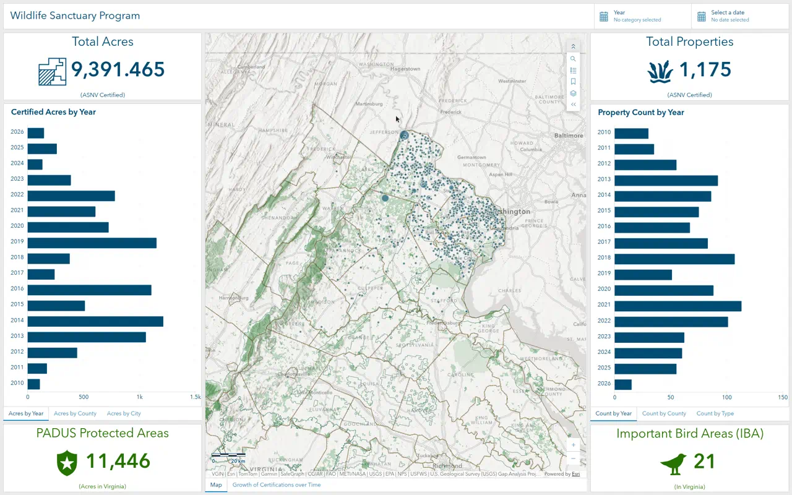
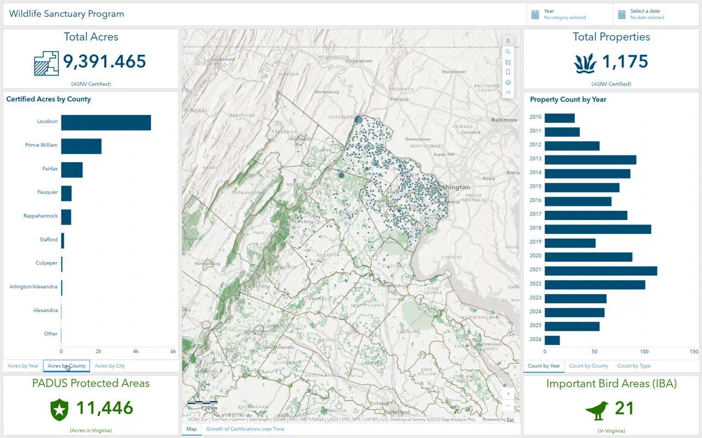
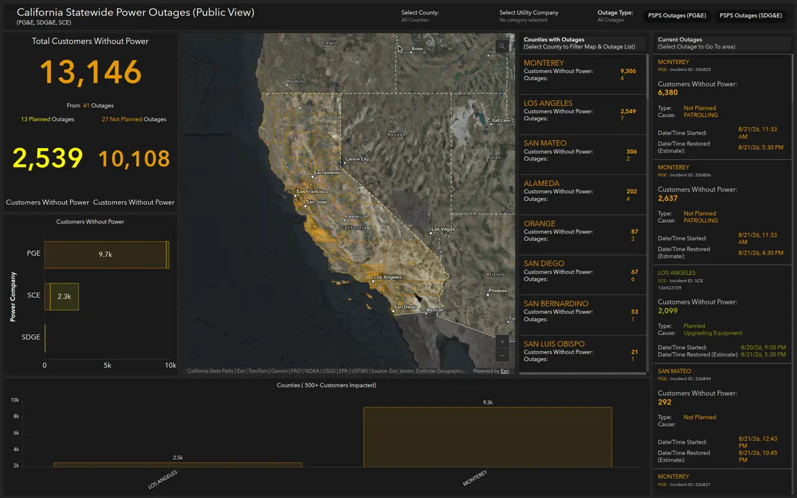
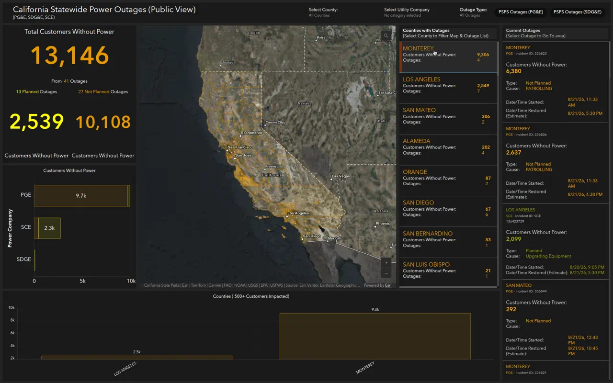

# Professional ArcGIS Online Dashboards

## A step-by-step tutorial based on two live public dashboards

This guide reverse-engineers two production ArcGIS Online dashboards and turns their design into a repeatable build process. Follow it with your own data to produce dashboards that look like command-center products, not a pile of unconnected widgets.

**Reference dashboards (public):**

1. [Wildlife Sanctuary Program](https://www.arcgis.com/apps/dashboards/96896859c42c4301a8032609493a9e00) — Audubon Society of Northern Virginia / Northern Virginia Bird Alliance. An **informational / strategic** dashboard that reports program outcomes over time.
2. [California Statewide Power Outages (Public View)](https://www.arcgis.com/apps/dashboards/7edefc1970d44b839ebbfd7b45e51e2d) — California Governor's Office of Emergency Services (Cal OES). An **operational / real-time** dashboard that monitors live utility outages.

Open both dashboards in another browser tab while you work. Everything below is taken from their live configuration (web map, widgets, selectors, filters, and actions), not from a generic template.

---

## What you need

- An ArcGIS Online (or ArcGIS Enterprise) account with privileges to create content, publish hosted feature layers, and create dashboards.
- A dataset with **locations** plus the attributes you want to summarize (counts, sums, categories, dates).
- About 2–4 hours for a first dashboard if the data is already clean.

You do **not** need ArcGIS Pro for the dashboard itself. Pro is only useful if you need to clean, join, or calculate fields before publishing.

---

## 1. Study the two reference dashboards first

Do not start by adding widgets. Spend 10 minutes clicking through both dashboards and name what each panel is *for*. Professional dashboards answer a small set of questions on one screen.

### Dashboard A — Wildlife Sanctuary Program (light, strategic)



**The question it answers:** How much certified wildlife habitat exists, where is it, and how has the program grown?

**Layout (three columns, header on top):**

| Zone | Elements | Role |
| --- | --- | --- |
| Header | Title *Wildlife Sanctuary Program*; **Year** category selector; **Select a date** range picker | Branding + global filters |
| Left column, top | Indicator: **Total Acres** (sum of `Acres`) | Headline KPI |
| Left column, middle | Tabbed serial charts: **Acres by Year**, **Acres by County**, **Acres by City** | Distribution of acreage |
| Left column, bottom | Indicator: **PADUS Protected Areas** (count of protected-area features in Virginia) | Context: existing protected land |
| Center | Map of Northern Virginia, stacked with an embedded Experience Builder time view (*Growth of Certifications over Time*) | Where the sanctuaries are |
| Right column, top | Indicator: **Total Properties** (count of certified sites) | Second headline KPI |
| Right column, middle | Tabbed charts: **Count by Year**, **Count by County**, **Count by Type** (pie) | Distribution of sites |
| Right column, bottom | Indicator: **Important Bird Areas (IBA)** (count of IBA polygons in Virginia) | Context: conservation geography |

**What makes it feel professional**

- One brand color (`#004c73` navy) for program KPIs and charts, and a second color (`#267300` green) for contextual conservation layers. Color is meaning, not decoration.
- Tabs hide six charts in the space of two. The screen stays calm.
- Header selectors filter the map, both KPI pairs, and every chart at once.
- Panning or zooming the map filters the charts and KPIs (extent action). The dashboard behaves like one instrument, not eight reports.
- The map is the largest object. Side panels frame it; they do not compete with it.

Switch the left tabs to **Acres by County** and you get the same KPI frame with a different cut of the data:



### Dashboard B — California Statewide Power Outages (dark, operational)



**The question it answers:** How many customers are without power *right now*, where, which utility, and is it planned or unplanned?

**Layout:**

| Zone | Elements | Role |
| --- | --- | --- |
| Header | Cal OES logo; title + subtitle `(PG&E, SDG&E, SCE)`; **Select County**; **Select Utility Company**; **Outage Type** button bar (All / PSPS PG&E / PSPS SDG&E) | Agency identity + operational filters |
| Upper left | Indicator: **Total Customers Without Power** (sum of `ImpactedCustomers`) with reference text *From {count} Outages* | Primary KPI |
| Upper left, split | Two indicators: **Planned** (yellow `#ffff00`) vs **Not Planned** (orange `#e69800`) | Status split |
| Lower left | Horizontal serial chart: customers by `UtilityCompany`, split by `OutageType` | Who is affected |
| Center | Satellite map of California with outage areas, county choropleth, and incident points | Where it is happening |
| Upper right | List: **Counties with Outages** sorted by customers descending | Ranked geography |
| Far right | List: **Current Outages** with incident ID, cause, start, estimated restore | Actionable detail |
| Bottom | Serial chart of counties with **500+ customers** impacted | Exception view (ignore noise) |

**What makes it feel professional**

- Dark theme (`#1a1a1a` / `#242424`) with amber numbers. That is a 24-hour operations-center look, not a report look.
- Every number has a unit and a qualifier (*Customers Without Power*, *From 41 Outages*, *Not Planned*). Naked numbers are not used.
- The county list is a **controller**: selecting a county zooms/flashes the map and filters the outage list and KPIs.
- The outage list is a **locator**: selecting a row zooms and flashes that incident on the map.
- The bottom chart is filtered to `Number_Impacted_Customers > 499`. Small outages stay in the list; they do not clutter the statewide chart.
- Data refreshes from the utilities on a short interval. The dashboard is a window onto a live layer, not a static export.

The county list is the control surface. Each row shows the county name, customers without power, and outage count. Selecting a row is meant to drive the map and the incident list:



---

## 2. Choose your dashboard type before you design

These two examples are different products. Copy the *pattern that matches your question*, not the widgets from both.

| | Wildlife Sanctuary | Power Outages |
| --- | --- | --- |
| Esri type | Informational / strategic | Operational |
| Time | Historical (2010–present) | Right now (active outages) |
| Theme | Light, branded navy/green | Dark, high-contrast amber |
| Map | Context + exploration | Situation awareness |
| Filters | Year, date range | County, utility, outage type |
| Success look | Totals, trends, mix of property types | Big number, exceptions, drill to incident |
| Update cadence | After new certifications | Every ~10 minutes |

Write one sentence in this form before you open ArcGIS:

> This dashboard exists so that **[audience]** can **[decision or understanding]** about **[theme]**, using **[geography]** updated **[how often]**.

Examples:

- *This dashboard exists so the public can see how much wildlife habitat ASNV has certified in Northern Virginia, updated after each certification cycle.*
- *This dashboard exists so emergency managers and residents can see which California counties currently have customers without power, updated every 10 minutes.*

If you cannot write that sentence, you are not ready to add elements.

---

## 3. Design the one-screen story

Professional dashboards follow a visual path. Sketch this on paper first.

```
HEADER   title + 1–3 selectors that filter everything
ROW 1    2–4 headline indicators (the answers)
ROW 2    MAP (largest) | ranked list or chart (the "where / who")
ROW 3    supporting chart or details (the "why / trend")
```

**Rules that both reference dashboards follow:**

1. **Five-second test.** A new visitor should read the title, see the biggest number, and know the subject without clicking.
2. **One map.** Both dashboards have a single map element. Extra maps split attention and slow load time.
3. **Headline numbers sit at the edge of the map**, not buried under a chart.
4. **Tabs for alternate cuts of the same measure** (acres by year vs county vs city). Do not put three nearly identical charts side by side.
5. **Exception filters** for operational charts (500+ customers). Show everything in a list; show only what matters in a chart.
6. **Two colors maximum for meaning.** Sanctuary uses navy for program stats and green for landscape context. Outages uses orange for unplanned and yellow for planned.

Sketch your panels and label each one with the **field + statistic** it will use (`sum(Acres)`, `count(ObjectId)`, `sum(ImpactedCustomers) where OutageStatus = Active`). If a panel has no field, delete it.

---

## 4. Prepare the data (this is 60% of the work)

Dashboards can only chart, filter, and list what is in the layer. Both reference dashboards succeed because the hosted layers are dashboard-ready.

### 4.1 Put everything in hosted feature layers

Publish (or use) hosted feature layers in ArcGIS Online. Dashboards read:

- A **web map** (for the Map element and for layer-driven widgets).
- Optionally additional layers or tables from the same map.

Do not point widgets at shapefiles on disk or one-off CSV uploads that you have not published.

### 4.2 Use the field pattern from the examples

**Sanctuary-style (sites / assets / projects):**

| Field | Type | Used for |
| --- | --- | --- |
| `Jurisdicti` (County) | Text | Group charts, labels |
| `City` | Text | Top-10 chart (`max features = 10`) |
| `Type` | Text domain | Pie chart (Business, Library, Residence, …) |
| `Year` | Integer or text | Year selector + bar charts |
| `Close_Date` | Date | Date-range selector |
| `Acres` | Double | Sum in indicators and charts |
| `ObjectId` | OID | Count of properties |

**Outage-style (incidents / events):**

| Field | Type | Used for |
| --- | --- | --- |
| `IncidentId` | Text | List identity |
| `UtilityCompany` | Text | Header selector + grouped bar chart |
| `County` / `NAME` | Text | County selector, list, chart (map field names!) |
| `OutageStatus` | Text (`Active` / …) | Filter lists and KPIs to live events |
| `OutageType` | Text (`Planned` / `Not Planned`) | Split indicators and stacked bars |
| `Cause` | Text | List detail |
| `ImpactedCustomers` | Integer | Sum KPI |
| `StartDate`, `EstimatedRestoreDate` | Date | List timestamps |
| `Number_Impacted_Customers`, `Number_Incidents` | Integer (county layer) | Ranked county list |

### 4.3 Clean values before they reach the dashboard

- **Domains / consistent spelling.** `Planned` vs `planned` vs `PSPS` will split a chart into junk categories. Use a domain or Arcade to standardize.
- **No nulls in grouping fields.** Empty `County` becomes a "Null" slice. Calculate a value such as `Unknown`.
- **Pre-aggregate when needed.** Cal OES does not make the dashboard count outages per county on the fly for the list. It uses a **county polygon layer** that already has `Number_Impacted_Customers` and `Number_Incidents`. That is why the county list is fast and sortable.
- **Public vs internal views.** Both examples use **hosted feature layer views** (`… (Public View)`, `Power_Outages_(View)`). Create a view that hides owner names, addresses, or internal codes, then build the dashboard on the view.
- **Refresh.** For operational dashboards, set the layer to a short refresh interval in the web map (Cal OES pulls utility feeds about every 10 minutes). For program dashboards, a nightly or on-edit update is enough.

### 4.4 Create a view that is already filtered (optional but powerful)

If 90% of widgets need `OutageStatus = Active`, put that definition query on a view. Then every widget inherits it, and you cannot accidentally chart restored outages. Cal OES still adds extra filters on some widgets (planned vs not planned, 500+ customers). That is the right split: **always-on filters in the view**, **story filters on the widget**.

---

## 5. Author the web map (do this before the dashboard)

Dashboards inherit pop-ups, symbology, scale visibility, labels, and bookmarks from the map. A weak map makes a weak dashboard.

### 5.1 Create the map

1. In ArcGIS Online, open **Map Viewer**.
2. Add your operational layers.
3. Choose a basemap that matches the dashboard type:
   - **Informational:** light canvas / human geography / hillshade (Sanctuary uses Human Geography + hillshade).
   - **Operational night desk:** dark gray + imagery hybrid (Outages uses NAIP / Firefly imagery with a dark gray base).
4. Set the default extent to the area of interest and save a **bookmark** (`Statewide`, `App Placement`). The dashboard map can expose bookmarks as a tool.

### 5.2 Symbolize for a dashboard, not for a cartographic atlas

- **Points of interest (sanctuaries, incidents):** unique-value by type or a single brand color. Keep symbols small; there will be hundreds.
- **Areas of impact (outage polygons, PADUS):** transparent fills, strong outline. They must sit on top of imagery without hiding it.
- **County choropleth:** classify by the same number the KPI uses (customers without power), so the map and the big number agree.
- **Scale ranges:** Cal OES has *Power Outage Incidents* and *Power Outage Incidents - Zoomed Out*. Use two copies of the layer with different scale visibility so statewide view is not a cloud of overlapping points.
- Turn **clustering** on only if individual points at statewide scale are unreadable. Turn it off if the list zooms to a single incident — clustered features are harder to flash.

### 5.3 Build pop-ups that match the list

The outage list shows County, Utility, Incident ID, customers, type, cause, start, restore. Put **exactly those fields** in the map pop-up, in the same order, with formatted dates and thousand separators. Users will click the map after they click the list; the two should feel like the same record.

Sanctuary pop-ups use `Jurisdicti`, `Acres`, `Type`, `Year`, `City`, `Zip`, `Close_Date`. Same rule.

### 5.4 Layer list hygiene

Name layers as the public should see them (`ASNV Certified Properties`, `Power Outage Areas`), not as gdb aliases (`Layer_3168`). The dashboard **Map layers** tool shows these names.

Sanctuary map layers (in stacking order, simplified):

- World Imagery (off by default; user can enable it)
- USGS PADUS Protected Areas
- Audubon Important Bird Areas (Virginia)
- ASNV Chapter Boundary
- USA Counties
- Certified Properties by Type
- Certified Properties (Public View)

Outages map layers:

- CalOES mask (keeps the map focused on California)
- Power Outages by County (choropleth)
- Counties
- Incidents last week (off)
- Incidents zoomed-out
- Power Outage Areas
- Power Outage Incidents

### 5.5 Save the map

Save with a title the dashboard can reuse, for example `Wildlife Sanctuary Program Summary (Public)` or `Cumulative Statewide Power Outages (Public View)`. Share it to the same group or to **Everyone** if the dashboard will be public.

Item IDs from the live examples (so you can inspect them):

- Sanctuary web map: `fd8e15e1be434958833f3a59240a7ceb`
- Outages web map: `2d5a95786c69479c84e3291ab4cadffe`

---

## 6. Create the dashboard shell

1. Sign in to ArcGIS Online.
2. Click the **app launcher** (grid) → **Dashboards**.
3. Click **Create dashboard**.
4. Title it for the public, not for yourself:
   - Good: `California Statewide Power Outages (Public View)`
   - Bad: `PSPS_v3_final_NEW`
5. Add tags, a one-sentence summary, and the folder. Create the dashboard.

You land on an empty **desktop view**. A later step adds a **mobile view**. Do not add the mobile view first.

### 6.1 Theme

**Settings (gear) → Theme**

| Dashboard type | Theme | Background | Element outline | Accent |
| --- | --- | --- | --- | --- |
| Sanctuary / public program | Light | White / `#f3f3f3` | Light gray | Brand navy `#004c73` |
| Outages / EOC | Dark | `#242424` dashboard, `#1a1a1a` elements | `#1a1a1a` | Amber `#e69800` / yellow `#ffff00` |

Cal OES also sets:

- Dashboard background: `#242424`
- Element outline: `#1a1a1a`
- Header background: `#1a1a1a`

Use **one custom theme**, then override individual indicators only when a color carries meaning (planned vs not planned, program vs context).

### 6.2 Header

**View pane → Header → Add header** (or configure the existing header).

**Sanctuary header recipe**

- Title: `Wildlife Sanctuary Program`
- Title color: `#004c73`
- Background: white, optional banner image behind the title (`fit-height`, centered)
- Logo: organization mark, large
- Selectors: Year (dropdown, multiple), Date (range)

**Outages header recipe**

- Title from the item name; subtitle `(PG&E, SDG&E, SCE)` placed **below** the title
- Logo: Cal OES mark, linked to the GIS division site, size **large**
- Background `#1a1a1a`, show margin
- Selectors on the right: County, Utility, Outage Type (button bar)
- Sign-out menu **off** for a public dashboard

Keep the header short. If the title wraps to two lines, shorten it.

### 6.3 General settings

**Settings → General**

- **Allow element expansion:** on (both examples; viewers can full-screen a chart).
- **Allow element resize:** on for exploratory dashboards (Sanctuary), off for operations dashboards (Outages) so staff cannot break the EOC layout.
- **Allow reset:** usually off unless you have many filters.

---

## 7. Add the map first

Esri’s own guidance is to add the map before other elements, because the map’s operational layers become the data sources for everything else.

1. **Add element → Map**.
2. Choose the web map you saved in section 5.
3. **Map tools** — only what the audience will use:

   | Tool | Sanctuary | Outages |
   | --- | --- | --- |
   | Search | Yes | Yes |
   | Legend | Yes | No (EOC screens are dense) |
   | Layer list (Map contents) | Yes | No |
   | Bookmarks | Yes | No (one statewide bookmark is enough as default extent) |
   | Initial view / Home | Default extent | Statewide bookmark |
   | Basemap switcher | Optional | Usually off |
   | Measure | Off for public | Off |

4. Pop-ups: leave **on** for public exploration; consider off on a dedicated video-wall dashboard.
5. Point zoom scale: set so that clicking a list item does not zoom to 1:500 on a single house unless that is useful.
6. Click **Done**. Dock the map in the **center** and stretch it so it is the largest element (roughly 45–55% of width on a sanctuary-style layout; ~50% of the remaining body on an outages-style layout).

---

## 8. Add headline indicators

Indicators are the first thing people read. Build them next so the rest of the layout has something to align to.

### 8.1 Common indicator setup

1. **Add element → Indicator**.
2. **Data** tab: pick the layer (from the map).
3. **Value type:** Statistic.
4. Statistic + field:
   - Count of sites → `count` on `ObjectId`
   - Total acres / customers → `sum` on `Acres` or `ImpactedCustomers`
5. **Indicator** tab: three text slots — top (label), middle (value), bottom (qualifier).

### 8.2 Sanctuary indicators (copy this pattern)

**Total Properties**

- Layer: Certified Properties (Public View)
- Statistic: Count of `ObjectId`
- Top: `Total Properties` in `#004c73`
- Middle: `{calculated/value}` in `#004c73`, large
- Bottom: `(ASNV Certified)`
- Icon: a simple bird / habitat icon in the same navy

**Total Acres**

- Statistic: Sum of `Acres`
- Top: `Total Acres`
- Bottom: `(ASNV Certified)`
- Number format: thousands separators, 0–3 decimal places (the live dashboard shows `9,391.465`)

**PADUS Protected Areas** (context, not program)

- Layer: USGS PADUS (the map’s protected-areas layer)
- Statistic: Count (or sum of acres if the layer has an acre field)
- Color: `#267300` on all three text slots
- Bottom: `(Acres in Virginia)` or `(In Virginia)`
- These two green indicators are **not** filtered by Year/Date in the live dashboard. That is intentional: they are landscape context, not program performance.

**Important Bird Areas**

- Layer: IBA polygons
- Count of `site_id` (or ObjectId)
- Same green treatment
- Bottom: `(In Virginia)`

Place them as a frame: navy KPIs above the tabbed charts, green KPIs below. The eye reads *program → detail → context*.

### 8.3 Outages indicators (copy this pattern)

**Total Customers Without Power**

- Main statistic: `sum(ImpactedCustomers)`
- Reference statistic: `count(OBJECTID)` of the same incident layer
- Comparison: **Statistic** (so you can use `{reference}` in text)
- Middle: `{value}` in `#e69800`, very large
- Description / caption: `Total Customers Without Power` and `From {reference} Outages`
- Background: `#1a1a1a`

**Planned Outages**

- Main: `sum(ImpactedCustomers)` where `OutageType = Planned`
- Reference: `count` where `OutageType = Planned` AND `OutageStatus = Active`
- Caption: `{reference} Planned Outages`
- Middle color: `#ffff00`
- Bottom: `Customers Without Power`

**Not Planned Outages**

- Main: `sum(ImpactedCustomers)` where `OutageType = Not Planned`
- Reference: `count` of active, not-planned outages
- Caption: `{reference} Not Planned Outages`
- Middle color: `#e69800`
- Bottom: `Customers Without Power`

Dock the two split indicators **side by side** under the big total. That 1-then-2 stack is the signature of the Cal OES header strip.

**Filter the incident layer to `OutageStatus = Active`** on every outage widget unless you are deliberately showing restored events.

---

## 9. Add charts

### 9.1 Serial charts (bars)

1. **Add element → Serial chart**.
2. **Data:** Categories from **Grouped values**.
3. Category field + statistic, matching the sanctuary charts:

   | Chart | Category | Statistic | Sort | Max categories | Orientation |
   | --- | --- | --- | --- | --- | --- |
   | Certified Acres by Year | `Year` | Sum `Acres` | Year descending or chronological | all | Horizontal |
   | Certified Acres by County | `Jurisdicti` | Sum `Acres` | value desc | 10 | Horizontal |
   | Certified Acres by Top Ten Cities | `City` | Sum `Acres` | value desc | 10 | Horizontal |
   | Property Count by Year | `Year` | Count | chronological | 1000 | Horizontal |
   | Property Count by County | `Jurisdicti` | Count | value desc | all | Horizontal |
   | Customers Without Power (utility) | `UtilityCompany` | Sum `ImpactedCustomers` | value desc | all | Horizontal |
   | Counties 500+ | `NAME` | Sum `Number_Impacted_Customers` | default | all | Vertical |

4. **Split by** (outages utility chart): field `OutageType`, colors `#ffaa00` (Not Planned) and `#ffff00` (Planned).
5. **Filter** (outages county chart): `Number_Impacted_Customers is greater than 499`.
6. **Series:** column/bar, legend off unless you split by a field.
7. **Category axis:** for many county names, set labels to **rotated ~30°** (Cal OES bottom chart). For horizontal bars, no rotation is needed.
8. **Value format:** thousands separators, 0 or 1 decimal. Enable **unit prefixing** (`9.7k`) on operational charts so labels fit.
9. Color: one series in the brand color. Do not use the rainbow default.

Horizontal bars are easier to read for long category names (counties, cities, years). Both dashboards use them heavily.

### 9.2 Pie chart (property type)

1. **Add element → Pie chart**.
2. Group by `Type`, statistic = count.
3. Turn **color match** on so pie slices match the map’s unique-value colors for `Type`.
4. Legend on the **right**, showing the numeric count (Sanctuary does this) rather than only percentages.
5. Hover: category, count, percent.

Use a pie only for **one** part-to-whole question with fewer than ~8 categories. Sanctuary puts this pie on a tab, not on the front of the layout.

### 9.3 Tab the alternate charts (critical layout skill)

This is how Sanctuary fits six charts into two panels.

1. Add the first chart and dock it in the left column.
2. Add the second chart, drag it onto the **center** of the first chart until the hint reads **Stack the items**, then drop.
3. Repeat for the third chart.
4. Click each tab name → edit: `Acres by Year`, `Acres by County`, `Acres by City`.
5. Repeat on the right for `Count by Year`, `Count by County`, `Count by Type`.

Stack the map with embedded content the same way: tabs `Map` and `Growth of Certifications over Time`.

---

## 10. Add lists (operational dashboards)

Lists turn a dashboard into a working tool. Sanctuary does not need one; Outages depends on two.

### 10.1 Ranked geography list (Counties with Outages)

1. **Add element → List**.
2. Layer: the **county** layer (not the incident points), so each row is one county.
3. Sort: `Number_Impacted_Customers DESC`.
4. Maximum features: 60.
5. Selection mode: **Multiple** or Single depending on whether you want combined filters. Cal OES uses multiple.
6. Line item template (HTML), matching the live dashboard:

```html
{NAME}

Customers Without Power:
{Number_Impacted_Customers}

Outages:
{Number_Incidents}
```

Use the rich-text editor to make `{NAME}` large and amber, and the two metrics a two-column inner table. That is what produces the MONTEREY / 9,306 / 4 Outages cards.

7. Caption:

```
Counties with Outages
(Select County to Filter Map && Outage List)
```

The caption is an instruction. Public users will not guess that the list is clickable unless you say so.

### 10.2 Incident detail list (Current Outages)

1. Layer: incident points.
2. Filter: `OutageStatus = Active`.
3. Sort: `ImpactedCustomers DESC`.
4. Maximum features: 100.
5. Template:

```html
{County}

{UtilityCompany} - Incident ID: {IncidentId}

Customers Without Power:
{ImpactedCustomers}

Type: {OutageType}
Cause: {Cause}

Date/Time Started: {StartDate}
Date/Time Restored (Estimate): {EstimatedRestoreDate}
```

Format `{ImpactedCustomers}` as a large amber number. Format dates as locale-aware date-time.

6. Caption: `Current Outages (Select Outage to Go To area)`.

---

## 11. Add header selectors

Selectors belong in the header so they are always visible.

### 11.1 Category selector — Year (Sanctuary)

1. Header → **Add category selector**.
2. Data: Certified Properties, **Grouped values** on `Year`, order `Year ASC`.
3. Presentation: **Dropdown**, compact, show filter box.
4. Selection: **Multiple**, operator **is in**, allow none (so “all years” is the default).
5. Caption: `Year`.
6. Actions → Filter: map layer + every chart + both navy indicators.

### 11.2 Date selector — Close_Date (Sanctuary)

1. Header → **Add date selector**.
2. Type: **Date picker**, selection **Range**, operator **between**, time off.
3. Presentation: dropdown.
4. Actions → Filter, field map `filterField` → `Close_Date`, targeting the same widgets as Year.

### 11.3 Category selector — County (Outages)

1. Data: county layer, categories from features, display field `NAME`, order `NAME ASC`.
2. Caption: `Select County:`.
3. Allow none, none label `All Counties`.
4. Actions → Filter, with a **field map** because the county layer field is `NAME` and the incident layer field is `County`:

| Source | Target |
| --- | --- |
| `NAME` | `County` (incidents, outage areas) |
| `NAME` | `NAME` (county list / county chart) |

Also enable **Zoom** (and optionally **Flash**) on the map.

### 11.4 Category selector — Utility (Outages)

- Grouped values on `UtilityCompany`.
- Caption: `Select Utility Company`.
- Filter all incident-driven widgets and the relevant map layers.

### 11.5 Button-bar selector — Outage type / PSPS (Outages)

Cal OES uses a **static** category selector (not grouped from data) as a button bar:

- Values such as `PSPS Outages (PG&E)` and `PSPS Outages (SDG&E)`, with `All Outages` as the none option.
- Presentation: **Inline button bar**.
- The selected value filters `Cause` (or an equivalent text field) to the utility’s PSPS message.

Use a button bar when there are 2–4 named modes the audience must understand at a glance. Use a dropdown when there are many counties or years.

---

## 12. Wire actions (this is what makes it “professional”)

A dashboard without actions is a poster. Configure actions on the **source** element, **Actions** tab.

### 12.1 Action matrix — Sanctuary

| When the user… | Action | Targets |
| --- | --- | --- |
| Changes Year | Filter | Map (certified properties), all six charts, Total Properties, Total Acres |
| Changes date range | Filter (`Close_Date`) | Same set + the Year selector’s data |
| Pans / zooms the map | Filter by geometry | All six charts + both navy indicators |

Do **not** let Year/Date filter the PADUS or IBA indicators. Those are statewide context.

### 12.2 Action matrix — Outages

| When the user… | Action | Targets |
| --- | --- | --- |
| Selects a county in the header | Filter (+ zoom map) | Map layers, KPIs, both lists, both charts |
| Selects a utility | Filter | Same |
| Selects PSPS mode | Filter | Incident layers / cause |
| Clicks a county in the list | Filter, Zoom, Flash | Map, outage list, KPIs, charts |
| Clicks an outage in the list | Zoom + Flash | Map only (do not also filter the county list) |
| URL parameter `NAME` (optional) | Zoom + Filter | Deep link from another app into one county |

**Field maps are required** when names differ (`NAME` vs `County`). If a selector appears to do nothing, check the field map first.

### 12.3 How to configure

1. Hover the source element → **Configure**.
2. **Actions** (map: **Map actions** and **Layer actions**).
3. Enable **Filter** / **Zoom** / **Flash** and tick each target.
4. For filters across different layers, set the field mapping.
5. Done. Test: one click should change the big number, the chart, and the map together.

---

## 13. Layout: dock, stack, size

Dashboards always fill 100% of the browser. You are carving a rectangle, not placing free-floating widgets.

**Sanctuary docking sequence**

1. Add the map; leave it full screen.
2. Dock **Total Acres** to the **left** (~25% width).
3. Dock **Total Properties** to the **right** (~25% width). The map stays in the middle (~50%).
4. Under Total Acres, add the acres chart; stack the other two acres charts as tabs.
5. Under that stack, dock **PADUS** so the left column is KPI / tabs / KPI.
6. Mirror on the right: properties KPI / count tabs / IBA KPI.
7. Stack **embedded content** on the map for the time-growth view.
8. Drag column gutters until the two side columns are equal and the map is still dominant.

**Outages docking sequence**

1. Map in the center.
2. Left column (~27% of the body): total KPI, then the two split KPIs as a side-by-side group, then the utility bar chart.
3. Right of the map: county list (~20%).
4. Far right (~18%): outage list, full height.
5. Below the map+left+county block: 500+ county chart (~25% of height).

Use **Group** (side by side) for the planned / not-planned pair. Use **Stack** (tabs) for alternate charts. Use **Dock** for everything else.

Turn on **Allow element expansion** so a viewer can full-screen the map during a briefing.

---

## 14. Embedded content and extra context

Sanctuary embeds an Experience Builder app (`Growth of Certifications over Time`) as a second tab on the map. Use this when a time animation or a second layout would wreck the main screen.

1. **Add element → Embedded content**.
2. Type: document / URL.
3. Paste a public Experience, Story Map, or chart URL that already has sharing set to Everyone.
4. Stack it on the map and name the tab.

Do not embed an entire second dashboard. One job per screen.

---

## 15. Empty states, last update, and number formatting

Small settings separate a draft from a product.

- **Last update text:** on for operational headers and lists (Outages shows data freshness). Off for a static program snapshot if it distracts.
- **No data:** write a human sentence (`No active outages for this county`) instead of a blank panel. Cal OES often uses an empty string with vertical alignment middle so a filtered county does not flash error chrome.
- **Thousand separators** on every integer. **Unit prefixes** (`k`, `M`) on dense charts.
- **Time zone:** set the dashboard time zone to the data’s zone (Pacific for Cal OES, system/local for a community dashboard) so `StartDate` is not off by hours.

---

## 16. Mobile view

After the desktop view works:

1. **View** pane → **Add mobile view**.
2. Do not copy the entire desktop layout. Mobile is a different product.
3. Recommended mobile stack for these two types:

**Sanctuary mobile:** Header (title only, Year selector in the drawer) → Total Properties → Total Acres → Map → one tabbed chart (Count by Year / County / Type).

**Outages mobile:** Header → Total Customers → Planned / Not Planned → Map → Current Outages list. Put County and Utility selectors in the **drawer**. Skip the 500+ chart or stack it under the list.

Esri’s mobile rules that both examples imply:

- At most **one map**.
- One operational layer on that map if you can.
- No hover-only interactions; selection must work with a tap.
- Pop-ups off or very short.
- Screen-width threshold is 600 px unless you force a view with a URL parameter.

---

## 17. Item page, sharing, and trust

A public dashboard is only as trusted as its item page.

1. **Save** the dashboard.
2. Open the item page. Fill:
   - Summary (one sentence, the same as your “this dashboard exists so that…” line)
   - Description (who maintains it, refresh rate, data sources, caveats)
   - Thumbnail (Cal OES uses a branded “Dashboard / PUB / CAL OES GIS” tile)
   - Credits and license (Outages: compiled from utilities, not certified, changing constantly)
   - Categories / tags
3. Share the **dashboard, web map, and every layer** to the same audience. If the map is org-only and the dashboard is public, visitors see a broken map.
4. For public apps that use subscriber content (Living Atlas imagery, NLCD), configure **app proxies** as Sanctuary does for USA NLCD and USA Wetlands, or the public will be prompted to sign in.
5. Test in a private/incognito window while signed out.

Cal OES marks the item **Authoritative**. Use that only if your organization has a review process.

---

## 18. Build sequence you can follow tomorrow

Use this as a checklist. It is the shortest path that still produces a dashboard in the same class as the two examples.

1. Write the one-sentence purpose and pick **informational** or **operational**.
2. Sketch the layout: header, 2–4 KPIs, one map, one list or tabbed charts.
3. Publish a clean hosted feature layer (and a public view if needed).
4. Author the web map: basemap, symbology, pop-ups, bookmarks, layer names, refresh interval.
5. Create the dashboard, set theme and header.
6. Add the map and configure tools.
7. Add indicators (value, reference, filters, colors).
8. Add charts; tab the alternate cuts.
9. Add lists with instructional captions and HTML line items.
10. Add header selectors.
11. Wire Filter / Zoom / Flash actions and field maps.
12. Tighten layout gutters; set expansion/resize.
13. Add mobile view (reduced).
14. Fill the item page, share all dependencies, test signed out.
15. Click every selector and one list row. If the big number, chart, and map do not move together, fix actions before you add any more widgets.

---

## 19. Professionalism checklist

Use this before you send the link to anyone.

**Story**

- [ ] One audience, one time horizon, one primary KPI
- [ ] Title describes the subject without jargon
- [ ] Subtitle names the data providers or geography

**Visual hierarchy**

- [ ] Map is the largest element
- [ ] Headline number is readable from across a desk
- [ ] At most two semantic colors
- [ ] Tabs used for alternate cuts, not extra pages of clutter

**Data**

- [ ] Grouping fields have domains and no nulls
- [ ] Operational widgets filter to *current* records
- [ ] Exception charts use a threshold (like 500+ customers)
- [ ] Public view hides sensitive attributes

**Interaction**

- [ ] Header selectors filter the whole story
- [ ] Lists say “select to filter / go to area”
- [ ] Zoom + flash on locate actions
- [ ] Field maps connect `NAME` ↔ `County` (or your equivalent)

**Trust**

- [ ] Last-update or refresh interval is visible or documented
- [ ] Caveats are on the item page
- [ ] Signed-out test passed
- [ ] Mobile view is usable with one map and the primary KPI

---

## 20. Recreating each example with your own data

### If you are building a program / conservation / asset dashboard (Sanctuary pattern)

Substitute:

| Their layer | Your layer |
| --- | --- |
| Certified properties | Projects, parcels, members, trees, facilities |
| `Acres` | Miles, dollars, kilowatts, beds |
| `Year` / `Close_Date` | Install year / completion date |
| `Type` | Asset class |
| PADUS / IBA | Any *context* layer that should not be filtered by the program year |

Keep the **three-column frame**: KPI + tabbed measure on the left, map in the center, KPI + tabbed count on the right, context KPIs at the bottom in a second color.

### If you are building a live incident dashboard (Outages pattern)

Substitute:

| Their layer | Your layer |
| --- | --- |
| Outage incidents | 911 calls, work orders, flood gauges, 311 requests |
| County polygons with counts | Districts / facilities with rolled-up counts |
| `ImpactedCustomers` | People, tickets, dollars at risk |
| `OutageType` Planned / Not Planned | Priority, status, planned vs emergency |
| Utility selector | Agency, contractor, or source system |

Keep the **dark theme, ranked list, detail list, exception chart, and zoom-to-row actions**. That combination is what makes an EOC dashboard feel alive.

---

## Official Esri references

- [Create a dashboard](https://doc.arcgis.com/en/dashboards/latest/get-started/create-a-dashboard.htm)
- [Dashboard layouts (dock, stack, group)](https://doc.arcgis.com/en/dashboards/latest/get-started/dashboard-layout.htm)
- [Configure actions](https://doc.arcgis.com/en/dashboards/latest/create-and-share/configuring-actions-on-dashboard-elements.htm)
- [Dashboard settings (theme, URL parameters)](https://doc.arcgis.com/en/dashboards/latest/get-started/dashboard-settings.htm)
- [Mobile views](https://doc.arcgis.com/en/dashboards/latest/reference/dashboards-on-your-smartphone.htm)
- [Get started with advanced formatting](https://learn.arcgis.com/en/projects/get-started-with-advanced-formatting-in-arcgis-dashboards/) (Esri’s own power-outage tutorial, useful after you have the layout working)

---

## Source dashboards

| Dashboard | Owner | Type | Web map |
| --- | --- | --- | --- |
| [Wildlife Sanctuary Program Summary Public](https://www.arcgis.com/apps/dashboards/96896859c42c4301a8032609493a9e00) | ASNV_audubon | Informational | [ASNV Wildlife Sanctuary Program Summary (Public)](https://www.arcgis.com/home/item.html?id=fd8e15e1be434958833f3a59240a7ceb) |
| [California Statewide Power Outages (Public View)](https://www.arcgis.com/apps/dashboards/7edefc1970d44b839ebbfd7b45e51e2d) | CA_Office_of_Emergency_Services_GIS | Operational | [Cumulative Statewide Power Outages (Public View)](https://www.arcgis.com/home/item.html?id=2d5a95786c69479c84e3291ab4cadffe) |

Configurations described here were read from the live dashboard JSON and confirmed against the public apps on 21 August 2026. Widget counts and KPI values will change as the source layers update; the layout patterns will not.
