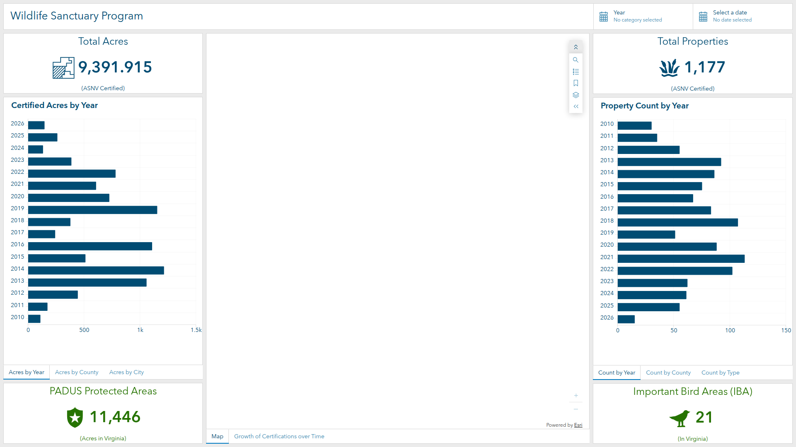
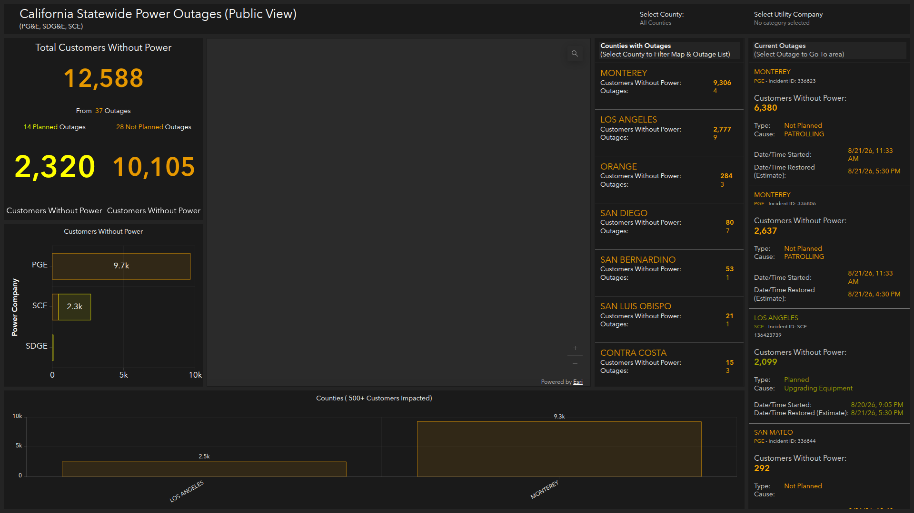
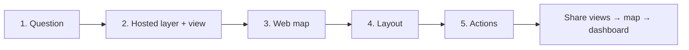

# How to Build Professional ArcGIS Online Dashboards

A step-by-step tutorial based on two public dashboards:

| Example | What it is | Live app |
| --- | --- | --- |
| **Program / conservation summary** | Audubon Society of Northern Virginia (ASNV) Wildlife Sanctuary Program | [Open dashboard](https://www.arcgis.com/apps/dashboards/96896859c42c4301a8032609493a9e00) |
| **Real-time operations** | California Governor’s Office of Emergency Services (Cal OES) statewide power outages | [Open dashboard](https://www.arcgis.com/apps/dashboards/7edefc1970d44b839ebbfd7b45e51e2d) |

These two apps look different, but they use the same ArcGIS Dashboards workflow. The professional result comes from **clean data**, a **well-authored web map**, a **deliberate layout**, and **actions that make every click useful**.



*ASNV: light theme, branded header, KPI indicators, tabbed charts, map in the center.*



*Cal OES: dark operations theme, live KPIs, county/utility filters, lists that zoom the map.*

---

## What you will build

You will not copy these organizations’ data. You will recreate **the same professional patterns** with your own hosted layers.

**Pattern A — Program summary (ASNV style)**

- Light branded theme
- Header with title plus global Year and Date selectors
- Four KPI indicators
- Center map with bookmarks, legend, layers, and search
- Side charts stacked into tabs so one screen holds six charts
- Map extent filters the charts (pan/zoom updates numbers)

**Pattern B — Live operations (Cal OES style)**

- Dark theme for 24/7 monitoring
- Header logo, subtitle, and filter selectors (place, organization, type)
- Large “total impact” number plus planned vs unplanned split
- Center map of current incidents
- Ranked bar charts (filter out noise, for example “500+ customers”)
- Lists that zoom and flash the map when a row is selected

You need an ArcGIS Online account with privileges to create content, hosted feature layers, web maps, and dashboards.

---

## The professional formula (read this first)

Both dashboards follow the same five-stage stack. Each stage has a **gate**: do not start the next stage until the gate passes.

```text
1. Question        → you can name every KPI and every filter in one sentence
2. Hosted data/view → a read-only public view exists (not the editable source)
3. Web map         → pop-ups, symbols, filters, and a bookmark are saved
4. Layout          → the screen looks right, but clicks do nothing yet
5. Actions         → selectors, lists, and the map filter or zoom each other
```

Do not open the dashboard editor until stages 1–3 are done. A dashboard is a **window** onto a map and its layers. If the layers are messy, the dashboard will be messy.

The exact click path for all five stages is in the next section. Parts 1–10 after that are the ASNV and Cal OES recipes (which widgets, which colors, which filters).

---

## The five stages, with exact ArcGIS Online clicks

This is the pipeline in full. Work it once with a small test table (even 20 rows) before you build the real dashboard.



Worked examples used below:

- **Program (ASNV):** “How much certified habitat exists, where is it, and how has it grown?”
- **Operations (Cal OES):** “Who is without power right now, where, and is it planned?”

---

### Stage 1 — Question

**What this stage is.** A one-sentence job for the screen, plus a short list of numbers and filters. It is not a widget sketch yet.

**Why it is first.** Every later click (which field to group by, which selector to add, which action to enable) is answering this sentence. If you skip it, you add charts because they look nice, and the dashboard becomes a poster.

#### Exact steps (paper or a notes doc — nothing in ArcGIS yet)

1. Write **one sentence** in this shape:  
   `[who]` needs to know `[what]` `[where]`, `[how often]`, so they can `[do what]`.
   - ASNV: *The public and chapter staff need to know how much certified habitat exists in Northern Virginia, by year and place, so they can see program growth.*
   - Cal OES: *The public and emergency staff need to know who is without power right now, by county and utility, and whether it is planned.*
2. Circle the **audience**: public wall display, staff operations, or both. That chooses light vs dark theme and how much disclaimer text you need.
3. Circle **freshness**: historical (ASNV, no refresh) or live (Cal OES, refresh every 10–15 minutes).
4. List **at most four KPIs** — numbers a person should read in two seconds.
   - ASNV: total acres, total properties, PADUS count, IBA count.
   - Cal OES: customers without power, planned customers, unplanned customers.
5. For each KPI write the **math**: count of features, sum of a field, or count + sum (Cal OES uses sum of customers and count of outages as a reference).
6. List **filters the user will change** (these become header selectors):
   - ASNV: Year, date range.
   - Cal OES: County, utility company, outage type.
7. List **filters the user should never see** (these become view definitions or map filters):  
   `MapVisibility = 'Visible'`, `OutageStatus = 'Active'`, `State = 'Virginia'`.
8. List **drill-downs**: click a county → map zooms; pan the map → charts update; click a list row → flash the point.
9. Draw a **three-zone wireframe** on paper: header, center map (~50% width), KPIs and charts on the sides. Do not invent extra zones.

**Gate before Stage 2.** You can fill this table without guessing:

| Decision | Your answer |
| --- | --- |
| One-sentence question | |
| Live or historical | |
| KPI 1 / 2 / 3 (and the field + statistic) | |
| Selectors (user-facing filters) | |
| Hidden filters (staff-only rows, inactive rows) | |
| What happens when someone clicks a list/chart/map | |

If a KPI has no field, stop. Add that column to the spreadsheet before you publish.

---

### Stage 2 — Hosted data, then a hosted view

**What this stage is.** Put the table into ArcGIS Online as a **hosted feature layer** (the system of record), then create a **hosted feature layer view** (what the dashboard is allowed to see).

**Why a view.** Both example dashboards use layers named *Public View*. Staff can keep editing the source. The public dashboard reads a filtered, field-trimmed, non-editable copy. Edits in the source still show up in the view.

```text
Staff editing  →  Hosted feature layer (source)
                      ↓ (no extra storage; it is a window)
Public dashboard → Hosted feature layer view  →  Web map  →  Dashboard
```

#### 2a. Clean the table on your computer

1. One row = one feature (one property, one outage, one county).
2. Field names: letters, numbers, underscores only. No spaces (`ImpactedCustomers`, not `Impacted Customers`).
3. Categories in **one spelling** (`Planned` / `Not Planned`, not `planned` and `PLANED`).
4. Dates in a real date column, not text.
5. Add the hidden-filter fields you listed in Stage 1 (`MapVisibility`, `OutageStatus`).
6. Save as CSV (with lat/lon), zipped file geodatabase, zipped shapefile, or GeoJSON.

#### 2b. Publish the hosted feature layer

1. Sign in to [ArcGIS Online](https://www.arcgis.com) with a publisher account.
2. **Content** > **My content**.
3. **New item** > **Your device**.
4. Choose the file > **Open**.
5. Choose **Add and create a hosted layer or table** > **Next**.
6. Confirm field types (text, integer, double, date). Fix any date column that came in as string.
7. Choose how to locate features:
   - Coordinates → **Latitude and longitude** (or MGRS / USNG).
   - Addresses → **Addresses or place names**.
   - Table only → **None**.
8. **Next** > title such as `Wildlife Sanctuary Properties` or `Power Outage Incidents` > folder > tags > **Save**.
9. Wait until the item page opens. Type should be **Feature Layer (hosted)**.

From ArcGIS Pro instead: share the map as a **web layer** > **Feature** > **Copy all data** (hosted).

#### 2c. Make the source usable (aliases, indexes, no public editing)

On the **source** item page:

1. **Data** > **Fields**.
2. Click each field the dashboard will show. Set a human **Display name** / alias (`Jurisdicti` → `County`, `ImpactedCustomers` → `Customers without power`).
3. **Settings** tab:
   - **Editing:** leave editing on only if staff need it. Do **not** share this source with Everyone.
   - If the organization uses **feature layer editing**, restrict it to a staff group later.
4. **Settings** > **Indexes** (or **Data** > field > add index): index every field you will filter or group (`Year`, `County`, `UtilityCompany`, `OutageStatus`, `OutageType`).
5. Optional: **Settings** > **Cache control** — for live layers, set this to how often the table actually updates (for example 5 minutes), not 30 seconds.

#### 2d. Create the hosted view the dashboard will use

1. Stay on the **source** item Overview tab.
2. **Create view layer** > **View layer** (use **Show more** if you do not see it). You must be the owner or an administrator.
3. Uncheck any sublayers the public dashboard does not need > **Next**.
4. Click the layer name to open **Layer definitions**. For each layer:
   - **Add filter** > **Add expression**. Examples:
     - `MapVisibility` `is` `Visible`
     - `OutageStatus` `is` `Active`
     - `State` `is` `Virginia`
   - Use **Match all expressions** unless you truly want OR logic.
   - **Area of interest** (optional): draw a rectangle/polygon so out-of-area points never appear.
   - **Fields** > **Select fields**: turn **off** names, emails, street numbers, internal IDs. You cannot hide required system fields such as the object ID.
5. Arrow back to the layer list. Repeat for every sublayer. **Next**.
6. Title: add `Public View` (`ASNV Certified Properties (Public View)`). Folder, summary, tags > **Create**.
7. On the **view** item **Settings**:
   - **Disable editing** (the whole point of the view).
   - Set cache control to match the source for live data.

Create a **second view** if one layer must serve two jobs (Cal OES: all incidents for the map vs county polygons already summarized). Do not make the dashboard calculate a statewide county sum from thousands of points on every load.

#### 2e. Confirm the view before you map it

1. On the view item, **Open in Map Viewer**.
2. Open the **table**. You should see only public-safe columns and only rows that match the filter.
3. Count the rows. If ASNV still shows hidden properties, the view filter is wrong — fix the view, not the dashboard.

**Gate before Stage 3.** You have two items in My content: a source layer (staff) and a `Public View` (dashboard). The view has no editing, the right filters, and aliases. You have not shared either with Everyone yet.

---

### Stage 3 — Web map

**What this stage is.** A saved web map whose operational layers **are the view**. The dashboard map widget loads this map. Charts, lists, and indicators should also use **these same map layers** as their data source so filters stay in sync and public traffic stays fast.

**Why it is before layout.** Symbology, pop-ups, definition queries, bookmarks, and refresh live on the map. If you style inside the dashboard only, the map and the charts will disagree.

#### Exact steps in Map Viewer

1. From the **view** item, click **Open in Map Viewer** (or app launcher > **Map Viewer** > **Add** > **Browse layers** > add the **view**, not the source).
2. **Contents** toolbar (dark, left) > **Basemap**:
   - Program: **Human Geography Map** or **Light Gray Canvas**. Optional: add **World Hillshade** as a layer and move it under labels.
   - Operations: **Dark Gray Canvas** or **Imagery Hybrid**.
3. **Layers**: click the operational layer to select it.
4. **Settings** toolbar (light, right) > **Filter** > **Add expression** for anything the view did not already hide (example: `Number_Impacted_Customers` `is greater than` `0` on the county layer).
5. **Settings** > **Styles**:
   - Unique values on `Type` or `OutageType` (pick the exact hex colors you will reuse on charts: navy `#004C73`, amber `#E69800`, yellow `#FFFF00`).
   - Or counts and amounts (size/color) on `Acres` or `ImpactedCustomers`.
   - Transparency about 20% so the basemap still reads.
6. **Settings** > **Pop-ups**:
   - Title: `{Name}` or `{UtilityCompany}: ID - {IncidentId}`.
   - **Fields list**: remove `OBJECTID`, shape area, internal color fields.
   - Turn pop-ups **off** on mask and boundary layers.
7. **Settings** > **Properties** > **Refresh interval** (live layers only): turn on **Automatically refresh layer**, set minutes to match the ETL (for example `10`). Minimum is 0.5 minutes.
8. **Settings** > **Properties** > **Visible range** if you have a “zoomed out” layer and a “zoomed in” layer (Cal OES pattern).
9. **Contents** > **Bookmarks** > **Add bookmark**. Name it `Statewide` or `App Placement`. This is the dashboard’s home extent.
10. **Contents** > **Map tools** / search: configure search on `Name` or `County` so the dashboard Search tool works.
11. Zoom to the bookmark. **Contents** > **Save and open** > **Save as**. Title: `Wildlife Sanctuary Program (Public)` or `Statewide Outages (Public View)`.

**Gate before Stage 4.** Click a point: the pop-up is short and public-safe. The default extent is the bookmark. Colors match the KPI colors you wrote in Stage 1. The Layers list contains only what the dashboard needs.

---

### Stage 4 — Layout

**What this stage is.** Place visual elements on one screen. After this stage the dashboard **looks** finished and **does nothing** when you click. That is expected.

**Why actions come last.** Actions target elements by name. If you wire actions while you are still duplicating charts, you will retarget everything twice.

#### 4a. Create the dashboard from the map

1. Open the **web map** item page.
2. **Create app** > **Dashboards** (or **Content** > **Create app** > **Dashboards**, then add the map as the first element).
3. Title, tags, summary, folder > **Create dashboard**.
4. You are in the **desktop view**. The map is already there if you started from the map item.

#### 4b. Theme and header (before more widgets)

1. Left **action bar** > **Theme**.
   - Program: **Light**, then customize primary `#004C73`.
   - Operations: **Dark**, background `#242424`, outline `#1A1A1A`, accent `#E69800`.
2. Action bar > **View**.
3. **Header** tab > **Add header**.
   - Program: type the title (this is the page H1). Optional background image.
   - Operations: **Logo** (upload or URL), logo link to the agency site, **Subtitle** listing data sources. Skip a second title if the logo already names the agency.
4. Do **not** add selectors yet. Selectors without actions only confuse testers.

#### 4c. Add elements, map first

1. If the map is missing: **Add element** (plus on the layout, or **Add element** in the View pane) > **Map** > choose the web map from Stage 3 > **Done**.
2. Hover the map > **Configure**:
   - Tools: Bookmarks, Legend, Layers, Search (program) or Search only (operations).
   - Turn off Compass / Locate unless field staff need them.
   - **Point zoom scale** around `1:200,000`.
   - Leave the **Actions** tabs alone for now.
3. **Add element** > **Indicator** for each KPI from Stage 1.
   - **Data** tab: layer = the **map’s** operational layer (not “add layer” from the web again).
   - Statistic: count or sum of the field you wrote down.
   - Optional **Reference** statistic (Cal OES: count of outages under a sum of customers).
   - **Indicator** tab: `{value}` large, caption top, units bottom, color from Stage 1.
   - **Done**.
4. **Add element** > **Serial chart** or **Pie chart**.
   - Data: same map layer.
   - Categories from **Grouped values**, category field `Year` / `County` / `Type` / `UtilityCompany`.
   - Statistic: sum or count.
   - Filter on the Data tab for noise rules (`Number_Impacted_Customers` `is greater than` `499`).
   - **Done**.
5. **Add element** > **List** (operations).
   - Line item template with field chips (`{County}`, `{ImpactedCustomers}`).
   - Sort descending on the impact field.
   - Write the instruction in the title: `(Select County to Filter Map & Outage List)`.
   - **Done**. Selection still does nothing. That is Stage 5.

#### 4d. Arrange: dock, stack, group

Hover the **Drag item** handle on an element:

1. Drag to an **edge** of the view or of another element until the hint says **Dock as a row** or **Dock as a column**. Release. This builds the three-column body.
2. Drag onto the **center** of another element until **Stack the items**. Release. This creates **tabs**. Click a tab > rename it (`Acres by Year`, `Count by Type`).
3. Same center drop, but hold **Shift** until the hint turns green and says **Group as a row/column**. Release Shift after the mouse button. This glues KPIs together with no inner gap (Cal OES planned | unplanned).
4. Drag element **borders** until the map is about 45–55% of the width. Percent labels appear while you drag.
5. **Save** (dashboard toolbar) often.

**Gate before Stage 5.** At a glance the screen matches your Stage 1 wireframe. Tabs switch. Numbers look right for the **full** dataset. Clicking a chart, list, or selector does **not** change the map yet.

---

### Stage 5 — Actions

**What this stage is.** You pick a **source** (the thing the user clicks) and one or more **targets** (the things that respond). Actions live on the source, on the **Actions** tab.

**Mental model**

```text
User event on SOURCE          Action type            TARGET
-------------------------     -------------------    ---------------------------
Header selector changes   →   Filter (attribute)  →  map layer, charts, KPIs, lists
Map extent changes        →   Filter (geometry)   →  charts and KPIs
List / chart selection    →   Zoom + Flash        →  map
List / chart selection    →   Filter              →  other lists, charts, KPIs
```

ASNV mainly uses **selector → filter** and **map extent → filter**.  
Cal OES mainly uses **selector → filter + zoom** and **list → zoom + flash + filter**.

#### 5a. Header selectors (global filters)

1. Action bar > **View** > **Header**.
2. **Add selector** > **Category selector** (Year, County, Utility) or **Date selector**.
3. **Data / Selector** tab:
   - **Categories from grouped values** when you only need unique values (`Year`, `UtilityCompany`). Actions: Filter (and Zoom/Flash only if the source is a hosted feature layer).
   - **Categories from features** when you also need geometry (Cal OES county). This is what allows **Zoom** on the map. Display text `{NAME}`.
   - **Categories from defined values** for a fixed button bar (`All Outages` / `Planned` / `Not Planned`). Actions: Filter only.
   - Selection: single vs multiple. Multiple uses operator **is in**. Include a **None** option labeled `All Counties` / all years.
   - Presentation: **Dropdown** on a header (compact). **Button bar** + **Inline** for two or three choices.
4. **Actions** tab (still on the selector):
   - Expand **Filter**. Toggle **on** every chart, indicator, list, and **map operational layer** that should follow this selector.
   - If field names differ (`NAME` on counties vs `County` on incidents), set the **field mapping** (source field → target field).
   - For a features-based county selector, also expand **Zoom** (and optionally **Flash**) and toggle the **map** on.
5. **Done**. Repeat for each selector (Year, Date, Utility, Type).
6. Test: choose one year or one county. Every toggled widget must change. Choose None / All. Everything must return.

#### 5b. Map extent filters the side charts (ASNV)

1. Hover the **map** > **Configure**.
2. **Map actions** tab (not Layer actions).
3. When **map extent changes** > expand **Filter**.
4. Toggle on the charts and KPIs that should show **only what is on screen** (acres, property count, pie).
5. Leave statewide context KPIs off (PADUS, IBAs).
6. For a public dashboard: those targets must use the **map’s visible operational layer**, not a stand-alone layer added only inside the widget.
7. **Done**. Pan/zoom the map. Side numbers must change.

#### 5c. List or chart selection zooms the map (Cal OES)

1. Hover the **list** (or serial/pie chart) > **Configure**.
2. If the list allows more than one row, set **Selection mode** to **Single** or **Multiple** first. Actions appear based on this.
3. **Actions** tab:
   - **Zoom** → map on.
   - **Flash** → map on.
   - **Filter** → incident layer, outage list, KPIs, charts. Field map `NAME` → `County` when needed.
4. **Done**. Click a county row: the map should zoom, the polygon should flash, the outage list should shrink.

Layer actions (click a feature **on the map** to filter charts) are configured on the map’s **Layer actions** tab. They do not work if the layer has clustering or binning on.

#### 5d. Action test matrix (do not skip)

| Click this | Must happen | Must not happen |
| --- | --- | --- |
| Header Year / County / Utility | KPIs, charts, lists, map layer all agree | A leftover widget still shows “all” |
| Header None / All | Full dataset returns | Blank charts |
| Pan the map (if extent filter is on) | Side KPIs follow the extent | Statewide context KPI changes |
| List row | Map zooms and flashes | Dashboard crashes or stays put |
| Private / incognito window after sharing | Same behavior while signed out | Empty widgets (a layer was not public) |

**Gate before sharing.** Every row in that table passes.

#### 5e. Share in this order only

Actions do not help if a layer is invisible to the public.

1. View item > **Share** > **Everyone (public)** (and any staff groups).
2. Web map item > **Share** > same.
3. Dashboard item > **Share** > same.
4. Open the dashboard URL in a private window. If any widget is empty, that widget’s layer or map is still org-only.

---

### Why this order fails if you skip a stage

| If you skip… | What breaks |
| --- | --- |
| **Question** | Extra charts, no one knows what the big number means, filters conflict |
| **View** | Public can see staff fields; or you share an editable layer by accident |
| **Web map** | Each widget points at a different copy of the layer; extent filters are slow or unavailable; pop-ups dump `OBJECTID` |
| **Layout before a map** | Charts have no map layer to bind to; you add the same service 12 times |
| **Actions last (good)** | If you wire actions too early, every layout change means retargeting |

End of pipeline. The ASNV and Cal OES recipes below assume you already finished these five stages once with your own data.

---

## Part 1 — Design the information, not the widgets

### 1. Write a one-screen story

Sketch three zones on paper before you open ArcGIS:

| Zone | Job | ASNV | Cal OES |
| --- | --- | --- | --- |
| Header | Identity + global filters | Title, Year, Date | Logo, county, utility, outage type |
| Hero | Spatial context | Map of certified properties | Statewide outage map |
| KPIs | Answer in 2 seconds | Total acres, total properties, PADUS, IBAs | Customers out, planned vs not planned |
| Breakdown | Explain the KPI | Acres/count by year, county, city, type | Customers by utility and county |
| Roster | Take action | (charts replace lists) | County list + current outage list |

If a widget does not serve one of those jobs, leave it out.

### 2. Pick a visual language and stick to it

| | Program summary | Operations |
| --- | --- | --- |
| Theme | Light | Dark |
| Accent | One brand navy, for example `#004C73` | Amber/gold for impact, yellow for planned |
| Context color | Green for reference layers (protected areas, bird areas) | Neutral gray for “all”, colored for status |
| Basemap | Light Human Geography / canvas + hillshade | Dark or imagery hybrid so incident colors pop |
| Density | Tabs so six charts occupy two panels | Lists + charts always visible |

Cal OES uses **orange (`#E69800` / `#FFAA00`) for unplanned** and **yellow (`#FFFF00`) for planned** on the indicators, lists, and stacked bars. That consistency is what makes the dashboard feel official.

### 3. Decide what is “live” vs historical

- **Historical / program data (ASNV):** no refresh interval required. Filter by `Year` and `Close_Date`.
- **Live operations (Cal OES):** source data is updated about every 10–15 minutes. Set the layer refresh interval to match (30 seconds is the ArcGIS Online minimum; 5–15 minutes is usually enough and is kinder to the service).

---

## Part 2 — Prepare the data (this is 50% of a professional dashboard)

Dashboards only look as good as the table behind them.

### Step 1. Model fields the dashboard can group on

Minimum fields for a **site / property** layer (ASNV pattern):

| Field | Type | Why |
| --- | --- | --- |
| `Name` | Text | Pop-up and search |
| `Type` | Text (domain) | Pie chart + unique-value map |
| `Year` | Integer or text | Year selector + bar chart |
| `Close_Date` | Date | Date-range selector |
| `City` | Text | Top-10 chart |
| `County` or `Jurisdicti` | Text | County charts |
| `Acres` | Double | Sum indicators and charts |
| `MapVisibility` | Text | `Visible` vs hidden for public view |

Minimum fields for an **incident** layer (Cal OES pattern):

| Field | Type | Why |
| --- | --- | --- |
| `IncidentId` | Text | List line and pop-up title |
| `UtilityCompany` | Text (domain) | Selector + stacked bars |
| `County` | Text | Selector, list, chart, URL parameter |
| `OutageType` | Text | Planned / Not Planned color |
| `OutageStatus` | Text | Filter to `Active` only |
| `ImpactedCustomers` | Integer | Sum KPI |
| `Cause` | Text | List detail |
| `StartDate` | Date | List |
| `EstimatedRestoreDate` | Date | List |

Use **domains or a lookup list** so pie charts and selectors do not show `Fairfax`, `fairfax `, and `Fairfax County` as three categories.

### Step 2. Publish a hosted feature layer

1. In ArcGIS Online, go to **Content** > **New item** > **Your device** (or **Feature layer** from a template).
2. Upload a file geodatabase, shapefile, GeoJSON, or CSV with coordinates.
3. Enable **Publish this file as a hosted layer**.
4. After publishing, open the item > **Data** > **Fields**.
5. Set **aliases** (`Jurisdicti` → `County`, `ImpactedCustomers` → `Customers without power`). Aliases appear in lists and pop-ups.
6. Create **attribute indexes** on fields you will filter and group: `Year`, `County`, `UtilityCompany`, `OutageStatus`, `OutageType`.

### Step 3. Create a hosted feature layer view for the public

Both example dashboards use **public views**, not the editable source.

1. Open the hosted feature layer item.
2. **Create View Layer**.
3. Set a **view definition**:
   - ASNV: `MapVisibility = 'Visible'` (and drop owner names, emails, street numbers if needed).
   - Cal OES: `OutageStatus = 'Active'` for the incident layer used by KPIs and the live list.
4. On the view, **do not enable editing**.
5. Share the **view** with Everyone later. Keep the source layer in the organization or a staff group.

Create extra views when one layer must serve two jobs. Cal OES uses:

- Incident points for KPIs, lists, and the map
- County polygons summarized with `Number_Impacted_Customers` and `Number_Incidents`
- Outage area polygons (where a utility publishes them)

You can summarize counties with **ArcGIS Online analysis** (Summarize Within) on a schedule, or with Arcade/Attribute Rules, or a notebook. The dashboard should consume the summary, not calculate it from thousands of points on every load.

### Step 4. Set cache and refresh for live layers

On the **view item** (Settings):

- **Cache control:** match how often the data actually changes (for example 5 minutes, not 30 seconds, if the ETL runs every 10 minutes).
- Avoid **relative date** filters in the view definition (`in the last 7 days`). Those prevent effective caching on public dashboards. Cal OES keeps a separate “last week” layer that is **turned off** in the map and used only if needed.

---

## Part 3 — Author the web map (this is 30% of the look)

A dashboard map is not a GIS project map. It is a **display surface** plus a **data source** for every chart.

1. Open **Map Viewer**.
2. Choose the basemap:
   - Program: **Human Geography** (or Light Gray Canvas) + **World Hillshade**.
   - Operations: **Dark Gray Canvas** or **Imagery Hybrid** (Cal OES uses NAIP Imagery Hybrid).
3. **Add** your hosted views.
4. Save the map with a public-facing title, for example `Wildlife Sanctuary Program (Public)` or `Statewide Outages (Public View)`.

### Step 1. Filter in the layer, not only in the dashboard

On each layer: **Filter** (or **Processing** > **Filter**):

- Protected areas: `State = 'Virginia'`
- Chapter boundary: `ChapterName = 'Your Chapter'`
- Counties: `STATE_NAME = 'Virginia'` (or your state)
- Live incidents: `OutageStatus = 'Active'`
- County choropleth: `Number_Impacted_Customers > 0`
- Optional mask: a polygon of “not my state” at ~50% transparency so the study area is obvious (Cal OES does this with a California mask).

### Step 2. Symbolize for the question

**Program properties**

- Duplicate the properties layer.
- Layer A: **Counts and Amounts (size)** on `Acres` (class breaks).
- Layer B: **Types (unique symbols)** on `Type`, with a restrained blue ramp that matches the dashboard navy.
- Set transparency ~20% so the basemap still reads.

**Operations incidents**

- Unique values on `OutageType`: Not Planned = amber, Planned = yellow. Same colors you will use on indicators.
- County polygons: unique values or class breaks on customer-count bins (`0–1,000`, `1,001–2,000`, `2,001–5,000`, `More than 5,000`).
- Scale visibility if needed: a simplified “zoomed out” incident layer statewide, a denser layer when zoomed in. Cal OES keeps both and toggles visibility.

### Step 3. Configure pop-ups for humans and for dashboard lists

Pop-up fields are reused by **List**, **Details**, and **Feature** elements.

Title examples:

- `{UtilityCompany}: ID - {IncidentId}`
- `{Name} ({Type})`

Visible fields only: county, acres, type, year, city — or customers, cause, start, restore. Hide `OBJECTID`, shape area, internal color fields.

Turn **Enable pop-ups** off on mask, boundary, and basemap-context layers.

### Step 4. Bookmarks, labels, and refresh

1. Zoom to the study area. **Add bookmark** (`App Placement`, `Statewide`).
2. Labels: counties at small scales, incident IDs only when zoomed in.
3. On live layers: **Refresh interval** = your ETL cadence (for example 10 minutes).
4. Save the map.

### Step 5. Confirm the map is dashboard-ready

Checklist:

- [ ] Only operational layers you need
- [ ] Public-safe fields only
- [ ] Pop-ups titled and short
- [ ] Bookmark of the default extent
- [ ] Unique-value colors you can reuse in charts
- [ ] Definition queries already applied
- [ ] Search enabled on the name / county field (Map Viewer > **Configure search**)

---

## Part 4 — Create the dashboard shell

1. Sign in to ArcGIS Online.
2. **App launcher** (grid) > **Dashboards**, or **Content** > **Create app** > **Dashboards**.
3. **Create dashboard**.
4. Title, tags, summary, folder. Use a title the public will understand.
5. Click **Create dashboard**. You land on an empty **desktop view**.

Alternatively, open the web map item > **Create app** > **Dashboards**. That adds the map as the first element automatically.

### Theme (do this before adding charts)

1. Action bar > **Theme**.
2. Program: **Light**, then **Custom**:
   - Primary / header text: `#004C73`
   - Background: white / very light gray
   - Tight spacing, slightly rounded corners if you want a modern card look
3. Operations: **Dark**, then **Custom**:
   - Dashboard background `#242424`
   - Element outline / header `#1A1A1A`
   - Accent gold `#E69800`
4. If you set the theme first, new pie and serial charts inherit matching default colors.

### Header

1. Action bar > **View** (or **Header**) > **Add header**.
2. Program:
   - Title: `Wildlife Sanctuary Program` (this is the only H1 on the page — keep it unique).
   - Optional background image of habitat, sized **Fit height**, placed center.
   - Title color = brand navy.
3. Operations:
   - Large **logo** (agency seal).
   - Logo URL → organization website.
   - Subtitle: `(PG&E, SDG&E, SCE)` or whoever the data covers.
   - No extra title if the logo already names the agency.

You will add selectors to this header in Part 6.

---

## Part 5 — Recreate the ASNV-style layout

Target structure:

```text
HEADER  [ Title ......................... Year selector | Date selector ]

LEFT 25%                         CENTER 50%                      RIGHT 25%
┌─────────────────────┐          ┌────────────────────────┐      ┌─────────────────────┐
│ KPI: Total Acres    │          │ TAB: Map               │      │ KPI: Total Properties│
├─────────────────────┤          │ TAB: Growth over time  │      ├─────────────────────┤
│ TABS:               │          │   (embedded app)       │      │ TABS:               │
│  Acres by Year      │          └────────────────────────┘      │  Count by Year      │
│  Acres by County    │                                          │  Count by County    │
│  Acres by City      │                                          │  Count by Type (pie)│
├─────────────────────┤                                          ├─────────────────────┤
│ KPI: PADUS areas    │                                          │ KPI: IBAs           │
└─────────────────────┘                                          └─────────────────────┘
```

### Step 1. Add the map

1. **Add element** > **Map**.
2. Choose your web map.
3. **Map tools:** Bookmarks, Legend, Layers (map contents), Search. Turn **Compass** and **Locate** off unless field staff need them.
4. Scale bar: **Ruler** (program) or **None** (operations).
5. **Point zoom scale:** something like `1:200,000` so a selected point does not zoom to 1:500.
6. Pop-ups: on.
7. **Done**. Drag the map to the center and size it to about half the width.

### Step 2. Add four indicators

**Add element** > **Indicator**, once per KPI.

| Indicator | Data | Statistic | Top text | Bottom text | Color |
| --- | --- | --- | --- | --- | --- |
| Total Acres | Properties view | Sum of `Acres` | Total Acres | (ASNV Certified) | Navy `#004C73` |
| Total Properties | Properties view | Count of features | Total Properties | (ASNV Certified) | Navy |
| PADUS Protected Areas | PADUS layer (filtered to state) | Count (or sum of acres) | PADUS Protected Areas | (Acres in Virginia) | Green `#267300` |
| Important Bird Areas | IBA layer | Count | Important Bird Areas (IBA) | (In Virginia) | Green |

Configuration tips:

1. **Data** tab: layer from the **map** (not a second copy of the service) so map filters can flow through.
2. **Indicator** tab: value type **Statistic**.
3. Middle section: `{value}` at a large size (ASNV uses a very large middle font).
4. Add a simple icon (land parcel, plant, shield, bird) in the same color as the number.
5. **Value formatting:** grouping on, 0–1 decimal places for acres, 0 for counts.
6. **General:** give each indicator a unique **name** (`TotalAcresIndicator`) and a descriptive **Accessible name**.

Dock Total Acres top-left, Total Properties top-right, PADUS bottom-left, IBAs bottom-right.

**Quality check:** the statistic must match the caption. If the subtitle says “acres”, sum an acres field; do not count polygons and call it acres.

### Step 3. Add the six charts, then stack them into two tab sets

**Serial chart — Certified Acres by Year**

1. **Add element** > **Serial chart**.
2. Layer: properties view.
3. Categories from **Grouped values**, category field `Year`.
4. Statistic: **Sum** of `Acres`.
5. Sort: Year descending (newest at the top if you use a bar chart).
6. Series: **Bar** (horizontal) in brand navy. Hide the legend. Show data labels.
7. Title: `Certified Acres by Year`.
8. **Actions:** Selection change > **Filter** the map properties layer (optional; ASNV mainly filters from the header and the map).

**Serial chart — Certified Acres by County**

- Group by `County`.
- Sum of `Acres`.
- Sort by value descending.
- **Maximum categories: 10** if you only want the leaders.
- Optional **label overrides** (`Arlington/City of Alexandria` → `Alexandria`).

**Serial chart — Certified Acres by Top Ten Cities**

- Group by `City`, sum `Acres`, sort value desc, **max 10**.

**Serial chart — Property Count by Year**

- Group by `Year`, **Count**.

**Serial chart — Property Count by County**

- Group by `County`, **Count**, sort desc.

**Pie chart — Count by Property Type**

1. **Add element** > **Pie chart**.
2. Group by `Type`, Count.
3. Turn **color match** on if the map already uses unique symbols for `Type`.
4. Legend on the right, showing counts (not only percents).
5. Inner radius 0 (full pie) or a small donut if you prefer.

**Stack into tabs**

1. Drag **Acres by County** onto the center of **Acres by Year** until the hint says **Stack the items**.
2. Drag **Acres by City** onto the same stack.
3. Click each tab > rename: `Acres by Year`, `Acres by County`, `Acres by City`.
4. Repeat on the right: `Count by Year`, `Count by County`, `Count by Type`.

Tabs are how ASNV stays informative without looking busy. Viewers see one chart; power users click for the rest.

### Step 4. Optional: embed a second story in the map’s tab

ASNV stacks an **Embedded content** element with the map. The second tab is titled `Growth of Certifications over Time` and points at an ArcGIS Experience.

1. **Add element** > **Embedded content**.
2. Type: **Document** (or **Dashboard** / URL).
3. Paste a public Experience, StoryMap, or chart URL. The URL must allow iframe embedding and be HTTPS.
4. Stack it with the map. Rename tabs `Map` and `Growth of Certifications over Time`.

### Step 5. Wire the map to the charts

This is the behavior that makes ASNV feel alive: **as you pan the map, side charts and KPIs update to the visible extent**.

1. Hover the map > **Configure**.
2. **Actions** tab > **When map extent changes**.
3. **Filter** > enable every chart and every indicator that should follow the map (acres, property count, pie, year charts).
4. Filter method: **Geometry** (spatial).
5. Do **not** filter the statewide context indicators (PADUS, IBAs) if those numbers should stay statewide.

### Step 6. Add header selectors

1. On the header, **Add category selector**.
   - Name: `Year`.
   - Categories from **Grouped values** on `Year`.
   - Display: **Dropdown**, compact.
   - Selection: **Multiple**, operator **is in**.
   - Include **None** option (show all years).
   - **Actions** > Filter the map properties layer **and** every chart/indicator that uses that layer.
2. **Add date selector**.
   - Type: **Date picker**, **Range**, dates only (no time).
   - Presentation: dropdown.
   - **Actions** > Filter the same targets using field `Close_Date` (or your certification date).

Test: pick one year. Map points, KPIs, and every tabbed chart should drop to that year. Clear the selector (None) and everything returns.

---

## Part 6 — Recreate the Cal OES-style layout

Target structure:

```text
HEADER  [ Logo + subtitle ........ County | Utility | Outage type ]

LEFT ~22%              CENTER ~50%                 RIGHT ~18%           FAR RIGHT ~18%
┌──────────────────┐   ┌─────────────────────┐    ┌─────────────────┐  ┌──────────────┐
│ KPI: Customers   │   │                     │    │ LIST: Counties  │  │ LIST: Current│
│     without power│   │        MAP          │    │  with outages   │  │ outages      │
│ Planned | Unplan │   │                     │    │                 │  │              │
│ H-BAR: by utility│   │                     │    │                 │  │              │
└──────────────────┘   └─────────────────────┘    └─────────────────┘  └──────────────┘
┌─────────────────────────────────────────────┐
│ COLUMN CHART: Counties with 500+ customers  │
└─────────────────────────────────────────────┘
```

### Step 1. Map for operations

1. Add the outage web map.
2. Map tools: **Search only** (Cal OES keeps the map clean). Zoom buttons stay on.
3. Default bookmark: Statewide.
4. Selection / highlight color that shows on imagery (Cal OES uses orange selection).

### Step 2. KPI row with a reference statistic

Cal OES does not show a lone number. The main indicator is:

- **Value:** Sum of `ImpactedCustomers` (active outages)
- **Reference:** Count of outage features
- Caption: `Total Customers Without Power`
- Description: `From {reference} Outages`
- Value color: amber `#E69800`

Then two sibling indicators:

| | Filter | Value | Reference (caption) | Color |
| --- | --- | --- | --- | --- |
| Planned | `OutageType = 'Planned'` AND `OutageStatus = 'Active'` | Sum customers | Count of those outages (`{reference} Planned Outages`) | Yellow |
| Not planned | `OutageType <> 'Planned'` AND active | Sum customers | Count (`{reference} Not Planned Outages`) | Amber |

How to configure the reference:

1. Indicator > **Data**.
2. Statistic for the main value (sum of customers).
3. Enable **Reference** > statistic **Count**.
4. Apply the **same filter** to both, or the caption will disagree with the number.
5. Bottom text: `Customers Without Power`.

Group the two smaller indicators **side by side** under the total (Shift-drag to **Group as a column** so they share one card).

### Step 3. Serial chart — customers by utility (stacked, horizontal)

1. **Serial chart**.
2. Layer: active incidents.
3. Category field: `UtilityCompany`.
4. Split by (series): `OutageType`.
5. Statistic: Sum of `ImpactedCustomers`.
6. Filter: `OutageStatus = 'Active'`.
7. Chart type: **Bar** (horizontal).
8. Stack: **Stacked** (regular).
9. Series colors: Not Planned = `#FFAA00`, Planned = `#FFFF00`.
10. Sort by value descending.
11. Data labels on. Legend optional if the KPI colors already teach the legend.
12. Title: `Customers Without Power`. Axis title: `Power Company`.

### Step 4. Serial chart — counties with serious impact only

Noise kills operations dashboards. Cal OES **does not chart every county**.

1. Layer: county summary.
2. Category: `NAME`.
3. Sum `Number_Impacted_Customers`.
4. **Filter:** `Number_Impacted_Customers > 499`.
5. Chart type: **Column** (vertical).
6. Category labels rotated ~30°.
7. Integers only on the value axis.
8. Color: amber.
9. Title: `Counties (500+ Customers Impacted)`.
10. Dock this chart **under** the map + left column so it reads as a statewide strip.

### Step 5. List — counties with outages

1. **Add element** > **List**.
2. Layer: county summary (or counties with `Number_Impacted_Customers > 0`).
3. Sort: `Number_Impacted_Customers DESC`.
4. Max features: 60.
5. Line item (rich text), for example:

```text
{NAME}
Customers Without Power: {Number_Impacted_Customers}
Outages: {Number_Incidents}
```

6. Selection mode: **Multiple**.
7. Title: `Counties with Outages` and a one-line instruction: `(Select County to Filter Map & Outage List)`.
8. Background: `#1A1A1A`. Selection color: a dark orange.

**Actions** (this is the operations pattern):

- Selection change > **Zoom** the map
- **Flash** the map
- **Filter** incident points where `County` = selected `NAME` (use a **field map** if the names differ)
- **Filter** the outage list, utility chart, and KPIs the same way

### Step 6. List — current outages

1. Layer: incident points.
2. Filter: `OutageStatus = 'Active'`.
3. Sort: `ImpactedCustomers DESC`.
4. Max features: 100.
5. Line item:

```text
{County}
{UtilityCompany} - Incident ID: {IncidentId}
Customers Without Power: {ImpactedCustomers}
Type: {OutageType}    Cause: {Cause}
Date/Time Started: {StartDate}
Date/Time Restored (Estimate): {EstimatedRestoreDate}
```

6. **Actions:** Zoom + Flash the map. Do not also filter the whole dashboard unless you want a drill-down that hides other outages.

### Step 7. Header selectors

**County** (categories from **features**, not grouped values)

- Layer: counties.
- Display field `{NAME}`.
- Sort A–Z.
- Dropdown, single selection.
- None option labeled **All Counties**, placed first.
- Actions: Filter incidents (`NAME` → `County`), filter county layer, filter both lists, filter charts and indicators, **Zoom** the map.

Using **features** (not grouped values) is what allows zoom/flash because the selector still has geometry.

**Utility company** (grouped values)

- Group by `UtilityCompany`.
- Multiple selection, operator **is in**.
- Filter incidents, lists, KPIs, and charts.

**Outage type** (defined values or grouped values)

- Display: **Button bar**, inline in the header.
- Options: All Outages | Planned | Not Planned (Cal OES also uses static PSPS labels for specific utility messages).
- Single selection, default **All Outages**.
- Filter `OutageType`.

### Step 8. Optional URL parameter

Cal OES adds a **feature** URL parameter so a county link can open the dashboard already zoomed and filtered.

1. Dashboard **options** / **URL parameters**.
2. Type: **Feature** (or Category).
3. Layer: counties, ID field `NAME`.
4. Actions: Zoom map + the same filters as the county selector.

Example: append a parameter such as `?county=Monterey` (exact name depends on how you configure the parameter).

---

## Part 7 — Layout craft (what makes it look “designed”)

### Docking vs grouping vs stacking

| Move | How | Use |
| --- | --- | --- |
| **Dock as row / column** | Drag to an edge until the hint says Dock | Three-column body |
| **Stack** | Drop on the center of another element | Tabs (ASNV charts and map) |
| **Group** | Same as stack but hold **Shift** (green hint) | KPI pair with no inner margin (Cal OES planned | unplanned) |

Resize by dragging borders. Percentages appear as you drag. Typical map share: **45–55%** of width. KPIs: about **15%** of height each.

### Element titles are part of the UI

- Every chart and list needs a visible title (H2).
- Put the **instruction in the title or subtitle**: `(Select County to Filter Map & Outage List)`.
- Leave KPI titles inside the indicator (top section), not as a duplicate element title.

### Last update, empty states, and expansion

- Map: **Show last update** on for live data.
- Charts: often off so the chrome stays quiet.
- Configure **No data** text (`No outages in this county`) instead of a blank panel.
- Allow **element expansion** (both examples do). Allow **resize** on exploratory dashboards; Cal OES turns resize **off** so operators cannot break the layout.

### Mobile view

1. **View** pane > **Add mobile view**.
2. Copy only: header title, the main KPI, the map, and one list.
3. Put selectors in the **drawer**, not the header.
4. Reconfigure actions on the mobile copies (they are not copied).
5. Skip refresh intervals on mobile (not supported).

---

## Part 8 — Share, document, and scale

### Item pages

Complete the **dashboard**, **web map**, and **layer** item pages:

- Summary that states what the numbers mean and how often they update
- Thumbnail (Cal OES uses a branded 600×600 graphic: agency mark + “Dashboard” + public badge)
- Credits and a disclaimer (Cal OES: data compiled from utilities, not certified by the agency)
- Tags people will search

### Sharing order

Share **inside-out** so the dashboard never shows a broken layer:

1. Hosted views
2. Web map
3. Dashboard
4. Then **Everyone (public)** if it is a public app

If any layer is organization-only, anonymous users see empty widgets.

### High-demand public dashboards

Follow Esri’s [scalable dashboard](https://doc.arcgis.com/en/dashboards/latest/reference/build-highly-scalable-dashboards.htm) rules:

- Hosted feature layers or hosted views only (not dynamic map services) for public traffic
- No public editing
- Cache control aligned with real update frequency
- No relative-date view definitions
- Indexes on filter fields
- Do not point twenty widgets at twenty duplicate layer items; reuse the map’s layers

### Accessibility

- One H1: the header title
- Element titles stay H2
- Contrast: navy on white, or amber on `#1A1A1A` — check both
- Accessible names on charts
- Do not encode meaning in color alone; Cal OES also writes `Planned` / `Not Planned` in the list

---

## Part 9 — Click-path cheat sheet (from a blank organization)

Use this when you are actually at the keyboard. For the reason behind each step, use [The five stages, with exact ArcGIS Online clicks](#the-five-stages-with-exact-arcgis-online-clicks).

1. **Content** > New item > publish hosted feature layer from your cleaned table.
2. **Create View Layer** > definition query > disable editing > set aliases and indexes.
3. **Map Viewer** > basemap > add views > filter > symbolize > pop-ups > bookmark > refresh interval > save.
4. Map item > **Create app** > **Dashboards**.
5. **Theme** (light or dark custom colors).
6. **Add header** (title or logo).
7. Configure the **map** element (tools, zoom scale, extent actions).
8. Add **indicators** (statistic + optional reference).
9. Add **serial / pie charts**; stack related charts into **tabs**.
10. Add **lists** with line-item templates.
11. **Group** KPI pairs with Shift-drag.
12. Add **selectors** to the header; Actions > Filter / Zoom / Flash.
13. Map **Actions** > extent change > Filter charts.
14. List **Actions** > Zoom + Flash + Filter.
15. **View** > mobile view (optional).
16. Save. Fill in item details and thumbnail.
17. Share views → map → dashboard.
18. Open the public URL in a private window and click every selector.

---

## Part 10 — Why these two dashboards feel professional

Steal these habits; do not steal the data.

**From ASNV (program summary)**

- Brand color on every number, chart bar, and header
- Tabs instead of a wall of charts
- Map-driven statistics (extent filter)
- Context KPIs in a second color (protected areas vs certified acres)
- Public view that hides sensitive properties
- Header filters for year and date so one dashboard serves annual reports and ad-hoc questions

**From Cal OES (operations)**

- Dark theme and a quiet map toolbar
- One huge number (customers) plus a count of events as `{reference}`
- Color = status, reused on KPIs, bars, and lists
- Lists are **controllers**, not decoration: click a county, the map and incident list follow
- Charts that **drop the long tail** (`> 499` customers) so the signal is readable
- County selector based on **features** so zoom works
- Disclaimer and branded thumbnail on the item page
- Deep link via URL parameter

**Shared habits**

- Hosted **views** named “Public View”
- One web map as the single data source
- Instructions written on the element (`Select Outage to Go To area`)
- Default extent bookmarks
- No unused tools, no unused fields, no unused layers

---

## Official Esri references

- [Create a dashboard](https://doc.arcgis.com/en/dashboards/latest/get-started/create-a-dashboard.htm)
- [Dashboard layouts](https://doc.arcgis.com/en/dashboards/latest/get-started/dashboard-layout.htm)
- [Create web maps for dashboards](https://doc.arcgis.com/en/dashboards/latest/reference/create-web-maps-for-dashboards.htm)
- [Actions](https://doc.arcgis.com/en/dashboards/latest/create-and-share/actions.htm)
- [Selectors](https://doc.arcgis.com/en/dashboards/latest/create-and-share/selectors.htm)
- [Themes](https://doc.arcgis.com/en/dashboards/latest/get-started/change-theme.htm)
- [Build highly scalable dashboards](https://doc.arcgis.com/en/dashboards/latest/reference/build-highly-scalable-dashboards.htm)
- [Accessibility best practices](https://doc.arcgis.com/en/dashboards/latest/reference/accessibility-best-practices.htm)
- [Learn lesson: Build an interactive dashboard](https://learn.arcgis.com/en/projects/build-an-interactive-dashboard/)
- [Learn lesson: Showcase fire data with a dashboard](https://learn.arcgis.com/en/projects/showcase-fire-data-with-a-dashboard/)

---

## Source dashboards (for study)

- ASNV dashboard item: `96896859c42c4301a8032609493a9e00`  
  Map: [ASNV Wildlife Sanctuary Program Summary (Public)](https://www.arcgis.com/home/item.html?id=fd8e15e1be434958833f3a59240a7ceb)
- Cal OES dashboard item: `7edefc1970d44b839ebbfd7b45e51e2d`  
  Map: [Cumulative Statewide Power Outages (Public View)](https://www.arcgis.com/home/item.html?id=2d5a95786c69479c84e3291ab4cadffe)  
  Data: [Statewide Power Outages (Public View)](https://www.arcgis.com/home/item.html?id=439afad071eb4754903906aff1946719)
