# InSAR with Python — a self-learning course

### Inspired by Alexey Pechnikov's InSAR.dev and PyGMTSAR, written for a curious 16-year-old

> "I often tell you that InSAR is not magic. It should not be like black magic — the core principles are transparent and easy to understand." — Alexey Pechnikov (pechnikov.dev)

This course teaches you how a radar satellite 700 km above your head can tell that a street in your town sank by 3 millimetres last year, and how to compute that yourself, in Python, for free, in your browser.

**What you need:** a laptop or even a phone with a browser, a free Google account (for Google Colab), a free NASA Earthdata account (for satellite data), and curiosity. No maths beyond school trigonometry is required. Whenever a formula appears, there is a picture and a plain-English sentence next to it.

**How to use it:** read one part at a time. Each part ends with a **Checkpoint** (questions you should be able to answer) and, from Part 7 on, a **Lab** (something you run). All figures in this document were generated with the Python scripts in `scripts/`; running them is Lab 0.

---

## Table of contents

- [Part 1 — Who is Alexey Pechnikov and what are PyGMTSAR and InSAR.dev?](#part-1--who-is-alexey-pechnikov-and-what-are-pygmtsar-and-insardev)
- [Part 2 — SAR: a radar camera that works at night and through clouds](#part-2--sar-a-radar-camera-that-works-at-night-and-through-clouds)
- [Part 3 — InSAR: measuring millimetres with two radar photos](#part-3--insar-measuring-millimetres-with-two-radar-photos)
- [Part 4 — The InSAR recipe, step by step](#part-4--the-insar-recipe-step-by-step)
- [Part 5 — The Python toolbox: every library and what it does](#part-5--the-python-toolbox-every-library-and-what-it-does)
- [Part 6 — Setting up your environment (4 ways)](#part-6--setting-up-your-environment-4-ways)
- [Part 7 — Lab 0: InSAR in a shoebox (NumPy only, runs anywhere)](#part-7--lab-0-insar-in-a-shoebox-numpy-only-runs-anywhere)
- [Part 8 — Lab 1: Imperial Valley subsidence with InSAR.dev (SBAS time series)](#part-8--lab-1-imperial-valley-subsidence-with-insardev-sbas-time-series)
- [Part 9 — Lab 2: an earthquake interferogram (Türkiye 2023)](#part-9--lab-2-an-earthquake-interferogram-türkiye-2023)
- [Part 10 — Lab 3: the classic PyGMTSAR pipeline, plus SBAS + PSI](#part-10--lab-3-the-classic-pygmtsar-pipeline-plus-sbas--psi)
- [Part 11 — Lab 4: read a complete InSAR processor in 243 lines](#part-11--lab-4-read-a-complete-insar-processor-in-243-lines)
- [Part 12 — Reading and trusting your results](#part-12--reading-and-trusting-your-results)
- [Part 13 — Your learning path (stages and milestones)](#part-13--your-learning-path-stages-and-milestones)
- [Part 14 — Glossary](#part-14--glossary)
- [Part 15 — References and links](#part-15--references-and-links)

---

## Part 1 — Who is Alexey Pechnikov and what are PyGMTSAR and InSAR.dev?

**Alexey (Aleksei) Pechnikov** is a data scientist and software engineer (radio-physics background, based in Chiang Mai) who builds open geospatial software in his free time and shares it on GitHub, Google Colab, DockerHub, Patreon ([pechnikov.dev](https://pechnikov.dev)) and LinkedIn. Two of his projects matter for us:

| Project | What it is | Status |
|---|---|---|
| **PyGMTSAR** ("Python InSAR") | A Python library that wraps the classic GMTSAR C programs and makes Sentinel-1 interferometry run from a notebook: downloads scenes, orbits and DEM, computes interferograms, coherence, unwrapping, SBAS/PSI time series and 3D maps. BSD licence. | Production-ready "previous generation". Sentinel-1 only, NetCDF files, needs GMTSAR binaries and the SNAPHU unwrapper. |
| **InSAR.dev** ([insar.dev](https://insar.dev)) | The pure-Python successor. No C binaries, no SNAPHU. Supports **Sentinel-1 and NISAR**, stores data as **Zarr v3**, runs on **GPU** (NVIDIA CUDA or Apple MPS), unwraps 40,000 × 40,000-pixel grids in minutes, and handles **thousands of bursts** and **1,000+ interferograms**. | Active development ("pin your library versions"). Three packages: `insardev` (core, source-available, free for students and hobby use), `insardev_pygmtsar` (Sentinel-1/NISAR preprocessing, BSD), `insardev_toolkit` (downloaders and helpers, BSD). |

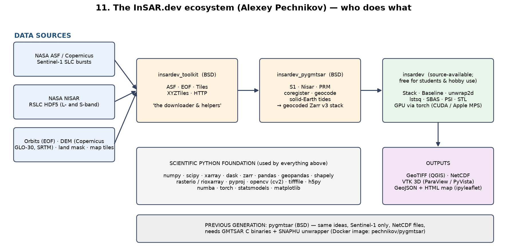

### Alexey's ten big ideas (the "philosophy" you will meet again and again)

1. **InSAR is not magic.** The physics is always the same: a radar pulse leaves the satellite, bounces off the ground, changes polarization, **accumulates a phase delay** and **loses amplitude**, then comes back. Everything else is bookkeeping.
2. **Two kinds of pixels.** *Persistent scatterers (PS)* are stable, low-noise pixels (building corners, rocks, pylons) that stay coherent with other stable pixels over long distances. *Distributed scatterers (DS)* are noisier pixels (fields, gravel) that only agree with neighbours nearby. Once you can estimate the **coherence of every pixel pair**, "the hardest part of InSAR is solved". Fancy schemes and amplitude tricks (amplitude dispersion index) are workarounds for that computational problem.
3. **Everything runs on free Google Colab.** Preprocess at lower resolution, save the preprocessed Zarr stack, share it (GitHub, Zenodo), and anyone can reproduce your result in 10–15 minutes. "That's ideal for educators and students."
4. **Bursts, not scenes.** A Sentinel-1 SLC scene is 4.5–8.5 GB. It contains 2 polarizations × 3 subswaths × ~9 bursts. Pick one polarization, one subswath and only the bursts over your area and the download shrinks by up to **2 × 3 × 9 = 54 times**.
5. **Modern data formats.** NetCDF support in Python "has been degrading for years"; InSAR.dev moved to **Zarr v3** (chunked, cloud-native, works on local disk or S3/GCS).
6. **Use many interferograms.** Classic software struggles with dozens; InSAR.dev processes **all pairs in a dense baseline network**. The only real limit is physics: interferograms spanning years are decorrelated, so temporal baselines are usually limited to 6–12 months.
7. **The two hardest problems are topographic phase and atmospheric delay.** Residual topography is "often called easy, but…" it is not; both need explicit modelling (his Patreon post "Topographic Phase and Atmospheric Phase Delay Compensation").
8. **When 2D unwrapping fails, unwrap in time.** SNAPHU-style 2D unwrapping is "not usable for low coherence phase maps"; the alternative is **1D time-series unwrapping** pixel by pixel across the stack.
9. **The newest idea: skip interferograms entirely.** The 2026 InSAR.dev release fits models directly on the **complex phase stack**: one call detects and removes atmospheric phase, another fits a **velocity and height-residual model (dv, dh)** to every pixel; PS networks first, then DS pixels attached to them. Dual-polarization (VV+VH) optimisation recovers scatterers hidden under vegetation or snow.
10. **Read short code.** His `InSARdev/edu` repository has a complete Sentinel-1 processor in **243 lines** and a NISAR processor in **76 lines**: "90–95% of my code is needed for optimization only". Learners should read the short version first.

**Checkpoint 1.** Can you say in one sentence what the difference between PyGMTSAR and InSAR.dev is? Can you name the three InSAR.dev packages and what each is for?

---

## Part 2 — SAR: a radar camera that works at night and through clouds

### 2.1 Radar = echoes with a stopwatch

A normal camera collects sunlight bounced off things. A **radar** makes its own light (microwaves, wavelengths of centimetres), sends a pulse, and listens for the echo. Because it brings its own flashlight it works **at night**, and because microwaves pass through clouds it works **in any weather**. The delay of the echo tells the distance; the strength of the echo tells how "rough" or "metallic" the target is.

### 2.2 The satellite looks sideways

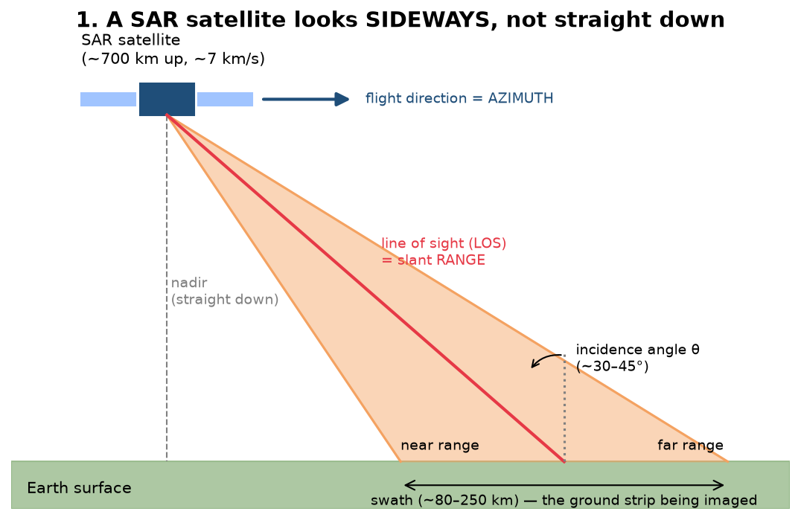

- **Azimuth** = the flight direction.
- **Range** = across the flight direction, along the beam; measured as distance from the antenna ("slant range").
- **Incidence angle θ** ≈ 30–45° for Sentinel-1. It matters later, because the radar only measures motion **along its line of sight**.
- **Swath** = the strip on the ground being imaged (Sentinel-1 IW mode: 250 km wide, made of three **subswaths** IW1, IW2, IW3, each split into **bursts** about 20 km long).

Why sideways? If it looked straight down, an echo from 5 km to the left and 5 km to the right would arrive at the same time and the image would fold over itself.

### 2.3 "Synthetic aperture" — faking a 15 km antenna

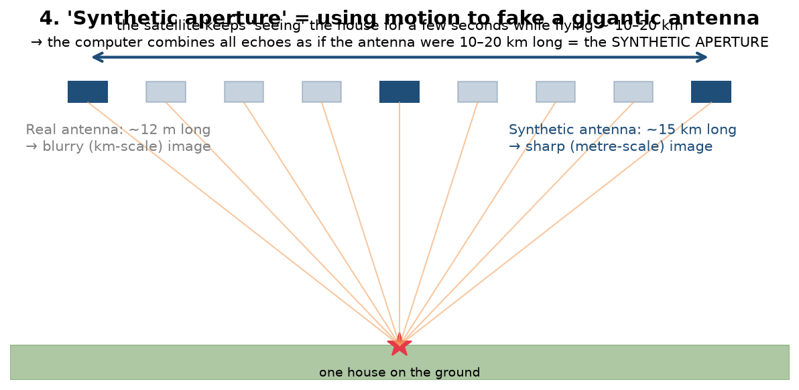

A real antenna 12 m long from 700 km up would produce kilometre-sized blurry pixels. The trick (Carl Wiley, 1951): the satellite keeps illuminating the same house while flying several kilometres; the computer later **adds up all the echoes with their phases** as if one enormous antenna had been there. The result: pixels of a few metres. That is the "synthetic aperture" in SAR.

### 2.4 Wavelength bands = the tick marks on your ruler

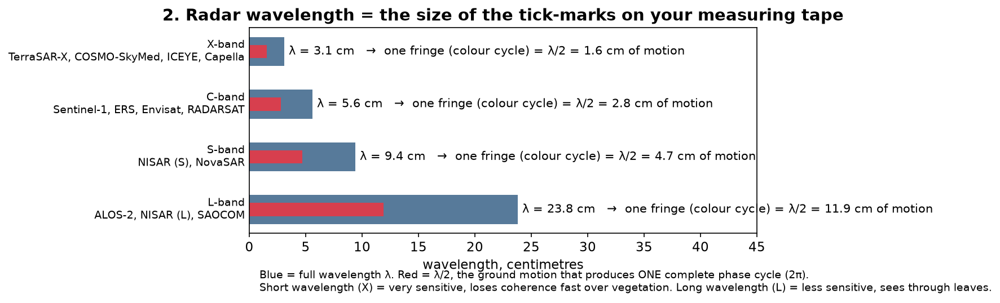

Sentinel-1 is **C-band, λ = 5.55 cm**. NISAR is **L-band (24 cm)** and S-band (9.4 cm). Shorter wavelengths are more sensitive to tiny motion but lose coherence quickly where leaves and branches move; longer wavelengths see through vegetation better.

### 2.5 The most important fact in this course: a SAR pixel is a complex number

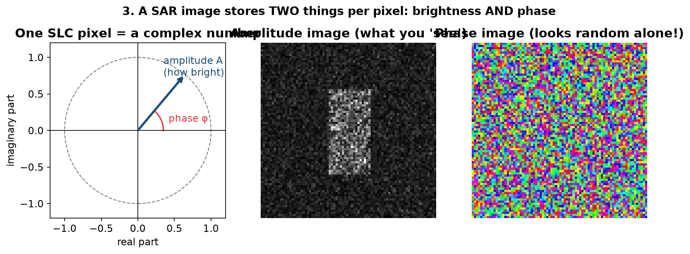

Every pixel of a **Single Look Complex (SLC)** image stores two numbers:

- **Amplitude** — how strong the echo was (the grey image you can "see": cities bright, calm water dark).
- **Phase** — where in its wave cycle the echo arrived, an angle between −π and +π. On its own it looks like random noise, because it depends on the exact distance to a fraction of a centimetre and on the arrangement of pebbles inside the pixel.

Phase is useless alone and priceless in pairs. That is InSAR.

**Checkpoint 2.** Why can a SAR satellite image at night? What does "synthetic aperture" replace? What two numbers does an SLC pixel contain? What is one fringe worth, in centimetres, for Sentinel-1?

---

## Part 3 — InSAR: measuring millimetres with two radar photos

### 3.1 The tape-measure idea

Take two SLC images of the same place from (almost) the same orbit position on two dates. For each pixel, subtract the phases. Almost everything that was "random" (the pebbles) is the same in both images and cancels. What is left is the **change in distance** between satellite and ground.

The wave travels down **and** back, so a ground movement of `d` changes the path by `2d`. One full phase cycle (2π) equals one wavelength of path. Therefore:

```
phase change  φ = 4π · d / λ            (radians)
one fringe (2π) ⇔  d = λ/2  =  2.77 cm  for Sentinel-1
```

Plain English: **every full colour cycle in an interferogram means the ground moved 2.77 cm towards or away from the satellite.** Count the cycles and you have centimetres; with time-series averaging you get millimetres.

### 3.2 From a sinking town to fringes and back

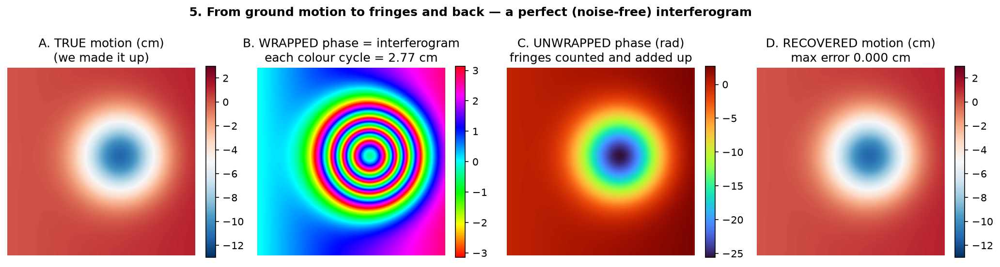

This is the output of `scripts/lab0_toy_insar.py`:

- **A.** We invent a "subsidence bowl" 12 cm deep, plus a gentle tilt.
- **B.** We turn it into radar phase and **wrap** it into (−π, π]: the famous rainbow **fringes**. The bowl is 12 cm deep → about 4.5 fringes.
- **C.** **Unwrapping** counts the cycles and adds them back to get a continuous phase surface.
- **D.** Multiply by λ/4π and we recover the motion — perfectly, because there was no noise.

### 3.3 Coherence: how much can I trust this pixel?

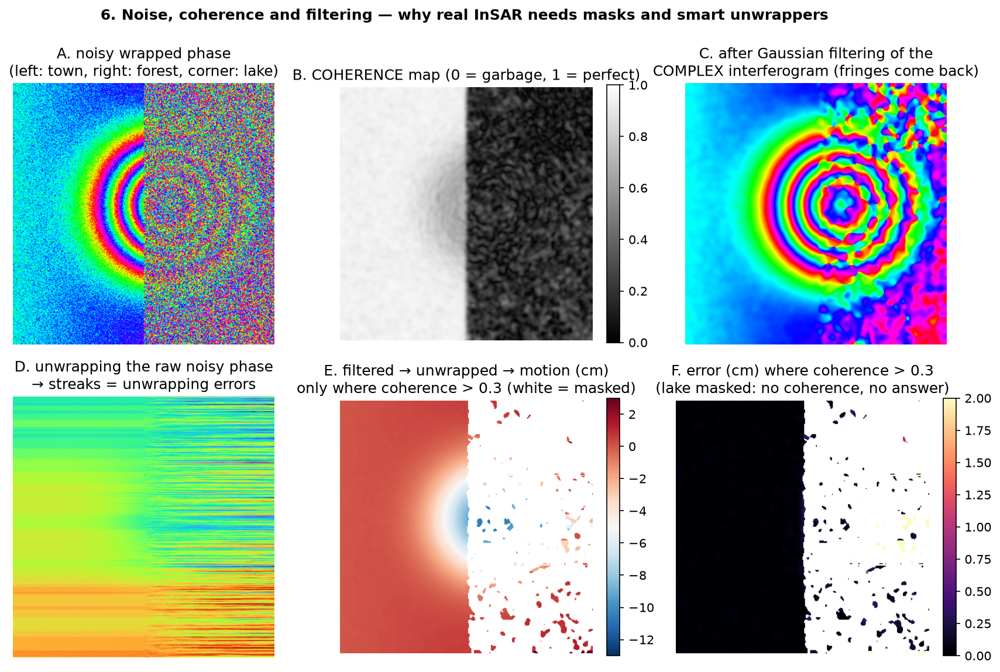

Real pixels change between dates: crops grow, snow falls, water ripples. Then the "pebbles" do not cancel and the phase difference is noise. **Coherence** (0 = garbage, 1 = perfect) measures this in a small window. In the figure the town on the left has coherence 0.9, the forest on the right 0.35 and the lake in the corner ~0.

Three lessons that every InSAR library implements:

1. **Filter the complex interferogram, never the wrapped phase.** Averaging the complex numbers (multilooking, Gaussian filter, Goldstein filter) makes fringes reappear (panel C).
2. **Unwrap after filtering and mask low coherence.** Unwrapping raw noisy phase produces streaks (panel D); after filtering and masking, the error is millimetres (panels E–F).
3. **Where coherence is ~0 there is no answer**, only white space. Lakes, forests in leaf, and fresh snow are the enemy — which is why L-band and PS/DS techniques exist.

### 3.4 What is actually inside an interferogram's phase

```
φ_interferogram = φ_flat-Earth + φ_topography + φ_displacement + φ_atmosphere + φ_orbit-error + φ_noise
```

- **Flat-Earth and topography**: known geometry. Removed using precise orbits and a DEM (that is why every pipeline downloads orbits and a DEM). What remains is a *differential* interferogram (DInSAR).
- **Displacement**: the signal we want.
- **Atmosphere**: water vapour delays the wave; looks like smooth blobs, can fake centimetres. Removed by averaging many dates, by spatial detrending, or by explicit models. (Alexey's "greatest challenge no. 2".)
- **Orbit errors**: long ramps across the image. Detrended.
- **Residual topography**: if the DEM is wrong by 10 m, a phase error appears that scales with the *perpendicular baseline*; time-series methods estimate it as a "height residual dh". (Alexey's "greatest challenge no. 1".)

### 3.5 Line of sight is not "down"

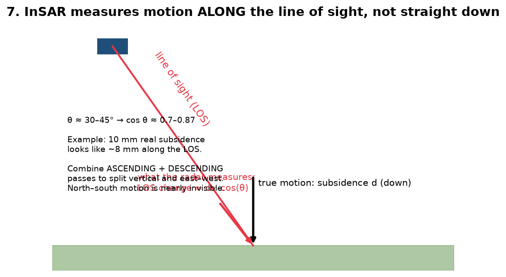

The satellite measures motion along its line of sight (LOS). For pure subsidence `LOS = d · cos θ`, so 10 mm of sinking looks like ~8 mm. Combine an **ascending** (northbound, evening) and a **descending** (southbound, morning) pass to split vertical and east–west motion. North–south motion is nearly invisible to polar-orbiting radars. Also remember every map is **relative** to a reference point that you assume is stable.

### 3.6 Time series: SBAS and PSI

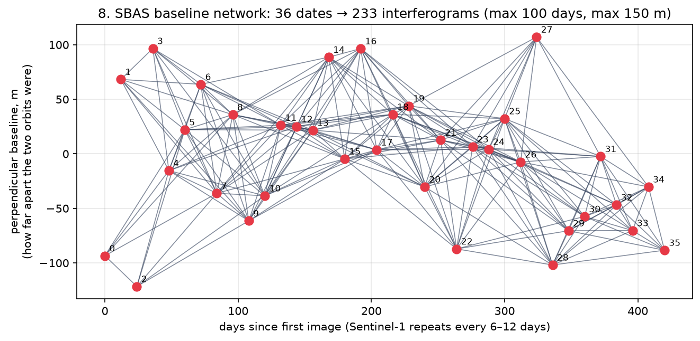

One interferogram is a noisy snapshot. With 20–100 dates you can form a **network** of pairs — every two dates that are close in time (small *temporal baseline*) and in orbit position (small *perpendicular baseline*). That is `stack.baseline(days=100, meters=150)` in InSAR.dev, or `sbas.baseline_pairs(days=100, meters=150)` in PyGMTSAR.

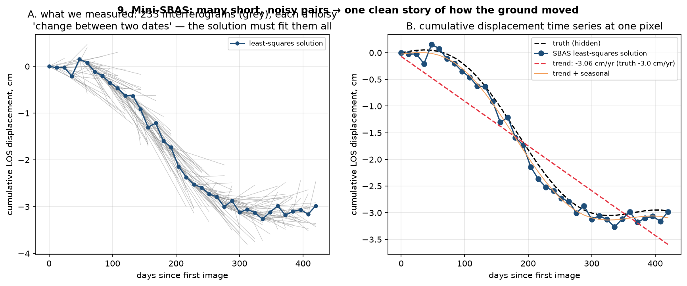

**SBAS (Small BAseline Subset)** solves a least-squares problem: find one displacement value per date such that all the pair differences fit. Panel A shows 233 noisy pair measurements; panel B the single clean curve that explains them, its **velocity** (slope, in cm/year) and a **seasonal** wiggle (groundwater swelling in the wet season). That is `stack.lstsq(displacement, corr)` and `.velocity()`; the seasonal split is what `.stl()` (Seasonal-Trend decomposition using LOESS) does properly.

**PSI (Persistent Scatterer Interferometry)** does the same thing on single stable pixels (PS) without spatial filtering, so it keeps full resolution in cities. **SBAS works better in rural areas, PS in urban ones**; PyGMTSAR and InSAR.dev combine both ("PS-SBAS").

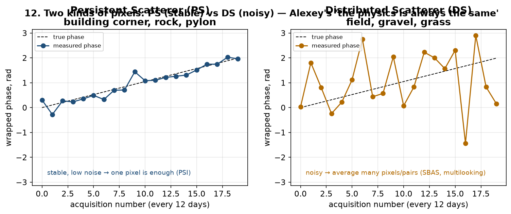

**Checkpoint 3.** If an earthquake interferogram shows 10 fringes between two points, how many centimetres did their LOS distance change? Why do we filter the complex interferogram rather than the phase? Name three things that live inside interferometric phase besides displacement. What does a baseline network drawing show on its two axes?

---

## Part 4 — The InSAR recipe, step by step

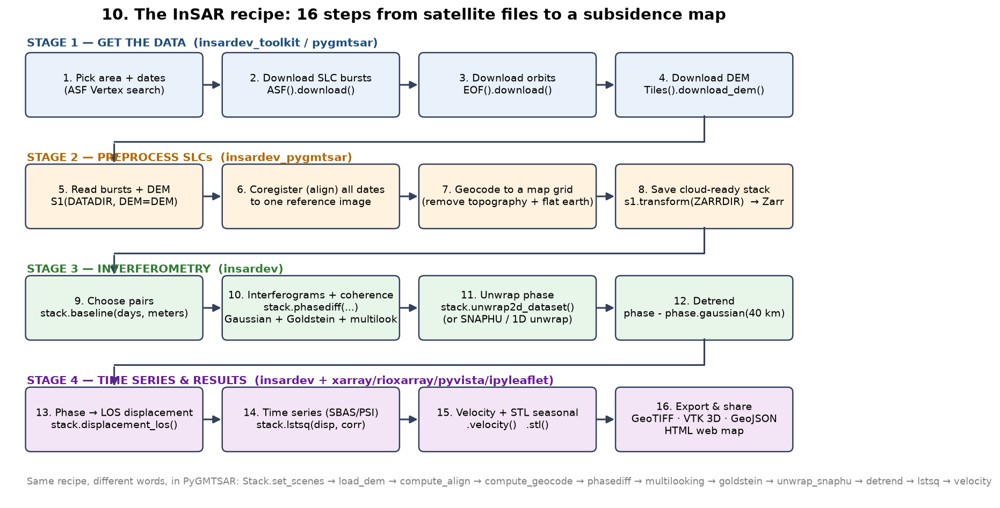

Every InSAR software runs the same 16 steps; only the function names differ. Here is each step, why it exists, and its name in **InSAR.dev** and **PyGMTSAR**.

| # | Step | Why | InSAR.dev | PyGMTSAR |
|---|---|---|---|---|
| 1 | Choose area and dates | Same orbit track, same look direction | ASF Vertex website, `ASF.search()` | same |
| 2 | Download SLC bursts | Raw complex radar images | `ASF(user, pwd).download(DATADIR, BURSTS)` | `ASF(...).download(DATADIR, SCENES, SUBSWATH)` |
| 3 | Download orbits | Precise satellite positions (cm level) | `EOF().download(DATADIR, s1.to_dataframe())` | `S1.download_orbits(DATADIR, S1.scan_slc(DATADIR))` |
| 4 | Download DEM (and land mask) | Remove topographic phase; mask water | `Tiles().download_dem(geom, provider='GLO', filename=DEM)` | `Tiles().download_dem(AOI, filename=DEM)` |
| 5 | Read bursts + DEM | Build the catalogue of images | `s1 = S1(DATADIR, DEM=DEM)` | `scenes = S1.scan_slc(DATADIR)`; `Stack(WORKDIR).set_scenes(scenes)` |
| 6 | Coregister (align) | Every image on the reference image's pixel grid, sub-pixel accuracy | inside `s1.transform(...)` (geometric + cross-correlation) | `sbas.compute_align()` |
| 7 | Geocode / remove topography | Radar coordinates → map coordinates; subtract flat-Earth + topo phase | inside `s1.transform(...)` | `sbas.compute_geocode()`, `sbas.phasediff(pairs)` uses topo |
| 8 | Save the stack | Cloud-ready, reusable, shareable | `s1.transform(ZARRDIR, ref='2015-01-21')` → Zarr | NetCDF grids in `WORKDIR` |
| 9 | Choose pairs | Small baselines = high coherence | `baseline = stack.baseline(days=100, meters=150)` | `pairs = sbas.baseline_pairs(days=100, meters=150)` |
| 10 | Interferograms + coherence | Phase difference, filtered and multilooked | `intf, corr = stack.phasediff(baseline.tolist(), wavelength=100, goldstein=32).downsample(30).compute()` | `phase = sbas.multilooking(sbas.phasediff(pairs), wavelength=400, coarsen=(1,4))`; `corr = sbas.correlation(phase, intensity)`; `sbas.goldstein(phase, corr, 32)` |
| 11 | Unwrap | Count the fringes | `stack.unwrap2d_dataset(intf.to_dataset(), corr.to_dataset())` (DCT+IRLS solver, GPU) | `sbas.unwrap_snaphu(intf60m, corr60m.where(corr60m>=0.075))` or `sbas.unwrap1d(...)` |
| 12 | Detrend | Kill orbit ramps and long-wavelength atmosphere | `phase - phase.gaussian(wavelength=40000)` | `unwrap.phase - sbas.gaussian(unwrap.phase, wavelength=60000)` or `sbas.regression(...)` |
| 13 | Phase → LOS displacement | Radians → metres/millimetres | `stack.displacement_los(phase_detrend)` | `sbas.los_displacement_mm(...)` |
| 14 | Time series | Coherence-weighted least squares (SBAS) | `stack.lstsq(displacement, corr)` | `sbas.lstsq(detrend, corr60m)` |
| 15 | Velocity and seasonal split | mm/year map, STL | `displacement_cum.velocity()`, STL utilities | `sbas.velocity(disp)`, `sbas.stl(disp)` |
| 16 | Export and share | GIS files, 3D, web maps | `.rio.to_raster('displacement.tif')`, `stack.to_vtk(...)`, `.to_geojson(...)`, `ipyleaflet` | `sbas.export_vtk(...)`, `sbas.ra2ll(...)`, `ipyleaflet` |

Two design differences worth remembering:

- **InSAR.dev separates the work into two stages.** Stage 1 (`insardev_pygmtsar`) turns raw SLCs into a *geocoded, cloud-ready Zarr stack* (aligned, flat-Earth and topographic phase removed, tides corrected, any EPSG projection and resolution you like, e.g. `resolution=(100, 25)`, `epsg=32637`). Stage 2 (`insardev`) does the interferometry on that stack. You can publish the Zarr stack and let others skip Stage 1.
- **PyGMTSAR works in radar coordinates** and geocodes at the end (`sbas.ra2ll(...)`, "range-azimuth to lat-lon"). Its grids are NetCDF files handled as xarray DataArrays, with Dask for parallelism.

**Checkpoint 4.** Without looking, list the 16 steps in order. Which steps need the DEM? Which step needs orbits? Which two steps are "the hardest problems" according to Alexey?

---

## Part 5 — The Python toolbox: every library and what it does

Think of these as departments in a factory. You do not need to master all of them; you need to know who to call.

### 5.1 Alexey's libraries

| Library | Import | Job | Licence |
|---|---|---|---|
| `insardev_toolkit` | `from insardev_toolkit import ASF, EOF, Tiles, XYZTiles`; `from insardev_toolkit.HTTP import unzip` | Download Sentinel-1/NISAR data from ASF, orbits (EOF), DEM (Copernicus GLO-30 or SRTM), land mask, satellite basemap tiles; unzip published datasets | BSD-3 |
| `insardev_pygmtsar` | `from insardev_pygmtsar import S1` (also `Nisar`) | Read SLC bursts, coregister, geocode, remove topo/tidal phase, write Zarr stack (`S1(...).transform(...)`) | BSD-3 |
| `insardev` | `from insardev import Stack, BatchUnit`; `from insardev.UI import UI` | Interferograms, coherence, Goldstein/Gaussian filtering, multilooking, detrending, 1D/2D unwrapping, baselines, SBAS/PSI least squares, STL, VTK/GeoJSON export, GPU via torch | Source-available; free for students, personal and unfunded coursework; subscription for institutional/professional use |
| `pygmtsar` | `from pygmtsar import S1, Stack, ASF, Tiles, tqdm_dask` | Previous generation; all of the above for Sentinel-1 via GMTSAR binaries | BSD-3 |

Versions verified while writing this course: `pygmtsar 2025.4.8.post1`, `insardev_toolkit 2026.3.21`, `insardev_pygmtsar 2026.3.21`, `insardev 2026.3.21.post3`. **Pin them** in your own projects.

### 5.2 The scientific-Python foundation these are built on

| Library | What it does in InSAR | One-line example |
|---|---|---|
| `numpy` | Arrays and complex numbers; the interferogram is literally `rep * np.conj(ref)` | `np.angle(np.exp(1j*phase))` wraps a phase |
| `scipy` | Filters, interpolation, constants | `scipy.ndimage.gaussian_filter`, `scipy.constants.speed_of_light` |
| `xarray` | Labelled N-D arrays: dimensions `date`, `pair`, `y`, `x`; `.sel()`, `.plot()` | `disp.sel(y=..., x=..., method='nearest')` |
| `dask` / `dask.distributed` | Lazy, chunked, parallel computing so a 16 GB laptop can process terabytes | `Client(threads_per_worker=1)` |
| `zarr` (v3), `fsspec` | Chunked cloud storage for the stack (local, S3, GCS) | `Stack().load('zarr')` |
| `netCDF4`, `h5netcdf`, `h5py` | NetCDF grids (PyGMTSAR) and HDF5 (NISAR RSLC files) | `h5py.File('NISAR.h5')` |
| `pandas`, `geopandas`, `shapely` | Tables of scenes/bursts; footprints, areas of interest (AOI), points of interest (POI) | `gpd.GeoDataFrame(geometry=[shapely.Point(lon, lat)]).set_crs(4326)` |
| `rasterio`, `rioxarray`, `pyproj` | GeoTIFF read/write, reprojection, EPSG codes | `da.rio.to_raster('velocity.tif')` |
| `tifffile` | Read the raw Sentinel-1 burst `.tiff` (complex int16) | `tifffile.imread(path)` |
| `opencv-python` (`cv2`) | Fast image remapping/resampling and phase correlation for coregistration | `cv2.remap(...)`, `cv2.phaseCorrelate(...)` |
| `ortools` | Max-flow/min-cut solver used in the educational branch-cut unwrapper | `max_flow.SimpleMaxFlow()` |
| `torch`, `torch_dct` | GPU tensors; DCT-based 2D unwrapping and filtering in InSAR.dev | `torch.cuda.is_available()` |
| `numba` | JIT-compiled loops ("much faster than old-school C-coded InSAR tools") | `@numba.njit` |
| `statsmodels` | STL seasonal decomposition | `sbas.stl(disp)` |
| `scikit-learn`, `xgboost` | Regression/detrending helpers (PyGMTSAR) | `sbas.regression(...)` |
| `matplotlib`, `seaborn`, `adjustText` | 2D plots | `intf.plot(rows=3, cols=3)` |
| `pyvista`, `vtk`, `panel`, `xvfbwrapper` | Interactive 3D maps of displacement on the DEM (needs a virtual display on Colab) | `pv.read('intf/VV.vtk')` |
| `ipyleaflet`, `ipywidgets` | Interactive 2D web maps you can save as a single HTML file | `Map(center=[lat, lon], zoom=12)` |
| `asf_search`, `remotezip`, `requests`, `tqdm`, `joblib` | Searching/downloading ASF data, partial ZIP downloads, progress bars, parallel loops | `asf.download(...)` |
| `jupyter`, `ipykernel` | The notebook itself | `jupyter lab` |

### 5.3 Other InSAR software you will hear about (so the names are not scary)

- **GMTSAR** (C, Scripps) — the engine under PyGMTSAR; **SNAPHU** — the classic 2D unwrapper.
- **ISCE2 / ISCE3** (NASA JPL) and **MintPy** (time series in Python) — the NASA-world equivalents; **ASF HyP3** — on-demand processing service.
- **SNAP** (ESA, Java GUI) — ESA's toolbox; several ESA tutorials that Alexey reproduces (Mexico City subsidence, Erzincan DEM) were written for SNAP.
- **GAMMA** (commercial), **StaMPS** (MATLAB PSI), **LiCSBAS** (Python SBAS for LiCSAR products).

**Checkpoint 5.** Which library stores the stack as Zarr? Which one opens a NISAR HDF5 file? Which library would you use to save a GeoTIFF for QGIS? Which package needs a subscription for university-funded research, and which do not?

---

## Part 6 — Setting up your environment (4 ways)

### 6.0 Accounts you need once

1. **NASA Earthdata Login** (free): <https://urs.earthdata.nasa.gov/users/new>. This is your username/password for `ASF(...)`. Alexey's public notebooks contain a shared demo login; make your own — shared logins get throttled.
2. **Google account** for Colab (free tier: 2 slow vCPUs, 12 GB RAM; Colab Pro ~US$10/month gives ~60 GPU hours — enough to run the NISAR example at full resolution "100–300 times").

### 6.1 Way A — Google Colab (zero install, recommended first)

Open any notebook from [insar.dev](https://insar.dev) (or the InSARdev/core `notebooks/` folder) and use *Runtime → Run all*. The first cell installs everything:

```python
import sys
if 'google.colab' in sys.modules:
    !{sys.executable} -m pip install -q pyvista xvfbwrapper jupyter_bokeh vtk panel
    from google.colab import output
    output.enable_custom_widget_manager()
    # install the exact commit from GitHub (no pip cache) — or use PyPI: pip install insardev_toolkit insardev_pygmtsar insardev
    !{sys.executable} -m pip install --no-cache-dir "git+https://github.com/AlexeyPechnikov/InSARdev.git#subdirectory=insardev_toolkit"
    !{sys.executable} -m pip install --no-cache-dir "git+https://github.com/AlexeyPechnikov/InSARdev.git#subdirectory=insardev_pygmtsar"
    !{sys.executable} -m pip install --no-cache-dir "git+https://github.com/AlexeyPechnikov/InSARdev.git#subdirectory=insardev"
```

For PyGMTSAR notebooks the first cell is different, because C binaries must be compiled:

```python
import sys
if 'google.colab' in sys.modules:
    !{sys.executable} -m pip install -q pygmtsar
    import importlib.resources as resources
    with resources.as_file(resources.files('pygmtsar.data') / 'google_colab.sh') as script:
        !sh {script}          # apt installs csh, gfortran, GMT, HDF5, LAPACK; clones and compiles GMTSAR into /usr/local/GMTSAR
    from google.colab import output
    output.enable_custom_widget_manager()
    import xvfbwrapper                     # virtual screen for 3D plots
    display = xvfbwrapper.Xvfb(width=800, height=600); display.start()
import os
os.environ['PATH'] += ':/usr/local/GMTSAR/bin/'
```

Colab tips from Alexey's notebooks: choose a **GPU runtime** for InSAR.dev; mount Google Drive if you want to keep downloads; export results with `from google.colab import files; files.download('displacement.tif')`.

### 6.2 Way B — Docker (reproducible, any OS)

```bash
docker pull pechnikov/pygmtsar
docker run -dp 8888:8888 --name pygmtsar docker.io/pechnikov/pygmtsar
docker logs pygmtsar        # copy the JupyterLab link (with token) into your browser
```

Inside the container everything (GMTSAR, SNAPHU, Python libs, example notebooks) is preinstalled; `sudo` works without a password; upgrade with `!sudo {sys.executable} -m pip install -U pygmtsar`. Give Docker Desktop at least 4 CPUs / 8 GB RAM and a 120 GB virtual disk if you want to run all examples. Alexey's timings on an M1 iMac: Imperial Valley SBAS 6 min native, 9 min in a 4-CPU/8 GB container, 21 min with 1 CPU/2 GB; the Türkiye earthquake (112 bursts) 15 min native. Download time excluded.

### 6.3 Way C — Local install of InSAR.dev (pure Python, Python ≥ 3.11)

```bash
# 1. get a Python ≥ 3.11 (conda/mamba, pyenv, or python.org)
conda create -n insar python=3.12 -y
conda activate insar

# 2. install the three packages (torch is pulled in automatically; choose a CUDA build of torch first if you have an NVIDIA GPU)
pip install "insardev_toolkit==2026.3.21" "insardev_pygmtsar==2026.3.21" "insardev==2026.3.21.post3"

# 3. notebook + optional 3D/2D map extras
pip install jupyterlab ipyleaflet pyvista panel vtk

# 4. check
python -c "import insardev, insardev_pygmtsar, insardev_toolkit; print(insardev.__version__)"
jupyter lab
```

Works on macOS (Apple Silicon GPU via MPS), Linux, Windows, GitHub runners and even a Raspberry Pi 4/5. Pin versions (Alexey: "new features (and occasionally bugs) are added frequently").

### 6.4 Way D — Local install of PyGMTSAR (needs GMTSAR)

On Ubuntu 22.04/24.04 (what `google_colab.sh` does):

```bash
sudo apt-get install -y csh autoconf gfortran libtiff5-dev libhdf5-dev liblapack-dev libgmt-dev gmt
cd /usr/local && sudo git clone --depth=1 --branch master https://github.com/gmtsar/gmtsar GMTSAR
cd GMTSAR && sudo autoconf && sudo ./configure --with-orbits-dir=/tmp && sudo make -j4 && sudo make install
export PATH=$PATH:/usr/local/GMTSAR/bin           # add to ~/.bashrc
pip install pygmtsar jupyterlab pyvista panel ipyleaflet
```

On macOS use Homebrew for `gmt`, `hdf5`, `lapack`, `gcc`; Alexey's note for Apple Silicon: run Jupyter as `OBJC_DISABLE_INITIALIZE_FORK_SAFETY=YES no_proxy='*' jupyter notebook` if SNAPHU unwrapping crashes.

### 6.5 Hardware and data expectations

- Disk: one Sentinel-1 scene 4.5–8.5 GB, one **burst** ~100–200 MB. Select bursts.
- RAM: 8 GB is comfortable for a few interferograms; 2 GB works for the "efficient" notebooks. Unwrapping is the RAM hog: limit `n_jobs`, decimate to 60 m.
- Dask: start a local cluster in every notebook. InSAR.dev: `Client(silence_logs='CRITICAL', threads_per_worker=1, resources={'gpu': 1})` (one thread per worker avoids CUDA out-of-memory). PyGMTSAR: `Client()`.
- GPU: optional but makes InSAR.dev unwrapping and filtering minutes instead of hours.

### 6.6 The tiny environment for THIS course's Lab 0

```bash
pip install numpy matplotlib          # that is all
python scripts/make_figures.py
python scripts/lab0_toy_insar.py
```

**Checkpoint 6.** Which way needs no installation? Which needs C compilers? Why does InSAR.dev set `threads_per_worker=1`? Where do you get the username for `ASF(...)`?

---

## Part 7 — Lab 0: InSAR in a shoebox (NumPy only, runs anywhere)

Open `scripts/lab0_toy_insar.py` and read it top to bottom; it is 200 lines with comments. It produces figures 5, 6, 8 and 9 above. The skeleton:

```python
WAVELENGTH_CM = 5.5466                       # Sentinel-1 C-band

def displacement_to_phase(d_cm):             # down AND back → factor 4π/λ
    return 4 * np.pi * d_cm / WAVELENGTH_CM

def wrap(phase):                             # what the satellite really gives you
    return np.angle(np.exp(1j * phase))

# PART A: invent a subsidence bowl, wrap, unwrap, recover
true_disp = -12 * np.exp(-((x-180)**2 + (y-140)**2) / (2*45**2)) + 0.004*x
wrapped   = wrap(displacement_to_phase(true_disp))
unwrapped = unwrap_2d_simple(wrapped)         # np.unwrap along a column, then each row
recovered = phase_to_displacement(unwrapped)  # error 0.000 cm

# PART B: coherence-dependent noise; filter the COMPLEX interferogram; mask; unwrap
ifg      = np.exp(1j * (phase + noise_sigma(gamma) * randn))
coh      = |gaussian(ifg)| / gaussian(|ifg|)  # local coherence
filtered = gaussian_blur(ifg, sigma=3)        # multilooking / Gaussian filter
rec      = phase_to_displacement(unwrap_2d_simple(np.angle(filtered)))
rec[coh < 0.3] = np.nan                       # no coherence, no answer

# PART C: SBAS network = all pairs with |Δdays| ≤ 100 and |ΔB⊥| ≤ 150 m
# PART D: mini-SBAS — design matrix A (+1 at date j, −1 at date i), weighted least squares
sol, *_ = np.linalg.lstsq(A * w[:, None], pair_meas * w, rcond=None)
velocity = np.polyfit(t_years, est_cum, 1)[0]   # cm/year
```

**Exercises (change one line, rerun, look):**

1. Make the bowl 40 cm deep. How many fringes now? At what depth per pixel does simple unwrapping break (aliasing: more than half a fringe between neighbouring pixels)?
2. Change `WAVELENGTH_CM` to 23.8 (L-band). What happens to the fringe count and to the noise sensitivity?
3. Lower the forest coherence from 0.35 to 0.15. Does filtering with `sigma=3` still rescue it? Try `sigma=6`. What do you lose?
4. In Part C set `max_days=36`. How many pairs remain, and does the SBAS velocity in Part D get noisier?
5. In Part D remove the weights (`w[:] = 1`). Compare the RMS error printed in the terminal.

What you have just done by hand is exactly what `stack.phasediff`, `stack.unwrap2d_dataset`, `stack.baseline` and `stack.lstsq` do on real data.

---

## Part 8 — Lab 1: Imperial Valley subsidence with InSAR.dev (SBAS time series)

**Goal:** reproduce the classic GMTSAR "Sentinel-1 TOPS time series" example (Imperial Valley, California, 2015: groundwater and geothermal subsidence) and produce a velocity map in mm/year. The Colab notebook is linked from [insar.dev](https://insar.dev) ("Imperial Valley Subsidence, CA USA (2015)"); the code below is that notebook, explained.

### Stage 1 — preprocess SLCs into a geocoded Zarr stack (`insardev_pygmtsar`)

```python
import numpy as np, geopandas as gpd, shapely, json
import matplotlib.pyplot as plt
from insardev.UI import UI; UI('dark')                  # optional dark plots
from insardev_pygmtsar import S1
from insardev_toolkit import EOF, ASF, Tiles, XYZTiles

# 1. WHICH data: 20 bursts = 4 neighbouring bursts of subswath IW1 × 5 dates (descending track 173).
#    Names come from ASF Vertex ("SENTINEL-1 BURSTS" dataset, path 173, Jan–May 2015).
BURSTS = """
S1_370328_IW1_20150521T134424_VV_13DD-BURST
S1_370327_IW1_20150521T134421_VV_13DD-BURST
...                                             # (see the notebook for all 20 names)
S1_370325_IW1_20150121T134413_VV_DBBE-BURST
"""
BURSTS = list(filter(None, BURSTS.split('\n')))

DATADIR, ZARRDIR = 'data', 'zarr'
DEM = f'{DATADIR}/dem.nc'

# 2. download bursts (your Earthdata login), 3. orbits, 4. DEM
asf = ASF('your_earthdata_user', 'your_password')
print(asf.download(DATADIR, BURSTS))
s1 = S1(DATADIR)                                        # catalogue of what was downloaded
EOF().download(DATADIR, s1.to_dataframe())              # precise/restituted orbit files
Tiles().download_dem(s1.to_dataframe(), provider='GLO', filename=DEM)[::4, ::4].plot.imshow(cmap='cividis')

# 5–8. read with DEM, preview footprints, coregister + geocode + remove topo/tidal phase → Zarr
s1 = S1(DATADIR, DEM=DEM)
s1.plot(ref='2015-01-21')
s1.transform(ZARRDIR, ref='2015-01-21')                 # default: EPSG 'auto' (UTM), resolution=(16, 4) m
```

What `transform` does for you: TOPS deramping, geometric coregistration to the reference date refined by cross-correlation, differential topographic phase correction, flat-Earth removal, solid-Earth tide correction, and writing per-burst Zarr arrays with per-pixel azimuth, range and elevation. This is the step you can publish: `unzip("https://zenodo.org/.../stack.zip", ZARRDIR)` lets a classmate start at Stage 2.

### Stage 2 — interferometry and time series (`insardev`)

```python
from insardev import Stack, BatchUnit
import xarray as xr, rioxarray as rio, torch, gc, logging
from dask.distributed import Client
logging.getLogger('distributed').setLevel(logging.CRITICAL)
client = Client(silence_logs='CRITICAL', threads_per_worker=1, resources={'gpu': 1})

stack = Stack().load('zarr').align_elevation()          # load bursts, put all on one elevation reference
stack.plot(cmap='autumn', alpha=0.15)                   # footprints (add a Google satellite basemap with XYZTiles if you like)

# 9. pairs: ≤100 days apart and ≤150 m perpendicular baseline
baseline = stack.baseline(days=100, meters=150)
baseline.plot(); baseline.hist()

# 10. interferograms + coherence: 100 m Gaussian anti-aliasing, Goldstein 32-px patches, 30 m output pixels
intf, corr = stack.phasediff(baseline.tolist(), wavelength=100, goldstein=32).downsample(30).compute()
intf = intf.align().dissolve().compute()                # stitch bursts into one image per pair
corr = corr.dissolve().compute()
intf.plot(rows=3, cols=3, size=2.5); corr.plot(rows=3, cols=3, size=2.5)

# 11. unwrap all pairs as one raster each (GPU DCT+IRLS solver), then back to the burst stack
phase2d = stack.unwrap2d_dataset(intf.to_dataset(), corr.to_dataset()).compute()
phase   = intf.from_dataset(phase2d)

# 12. detrend: subtract a 40 km Gaussian (orbit ramps + long-wavelength atmosphere)
phase_detrend = phase - phase.gaussian(wavelength=40000)

# 13. radians → metres along the line of sight
displacement = stack.displacement_los(phase_detrend)

# 14. SBAS: coherence-weighted least squares → cumulative displacement per date
displacement_cum = stack.lstsq(displacement, corr).compute()
displacement_cum.isel(date=slice(1, None)).plot(quantile=[0.001, 0.999], alpha=0.8)

# one pixel's story (UTM coordinates of the notebook's point of interest, lat 32.43, lon −115.15)
pix = displacement_cum.to_dataset().VV.sel(y=3_589_599, x=674_000, method='nearest').fillna(0)
(1000*pix).plot.scatter('date'); (1000*pix).plot(lw=0.5)
plt.ylabel('LOS displacement, mm')

# 15. velocity (m/yr → ×1000 mm/yr) and 16. export
velocity, disp0 = displacement_cum.velocity()
(1000*displacement_cum).to_dataset().VV[-1].rio.to_raster('displacement.tif')        # open in QGIS
geojson = (1000*velocity).downsample(500).to_geojson(crs='EPSG:4326')                # for an ipyleaflet web map
stack.to_vtk('intf', intf.downsample(100))                                            # 3D in PyVista/ParaView
```

Expected result: a bowl of subsidence of several cm/year around the geothermal fields and farmland south of the Salton Sea; the interactive map Alexey publishes is at <https://insar.dev/ui/Imperial_Valley_2015.html>.

**Exercises.** (a) Change `days=100, meters=150` to `days=48` and compare the velocity map. (b) Replace `wavelength=100` by `400` and `downsample(30)` by `downsample(90)`: faster, smoother, less detail. (c) Pick your own point with `.sel(y=..., x=..., method='nearest')` in a stable area — is the time series flat? If not, why might that be (atmosphere? reference point?).

---

## Part 9 — Lab 2: an earthquake interferogram (Türkiye 2023)

Single-pair InSAR is the "wow" case: one interferogram, dozens of fringes, metres of ground motion after the 6 February 2023 Kahramanmaraş earthquakes. Two consecutive Sentinel-1 scenes = 56 bursts. Differences from Lab 1:

```python
# Stage 1: bursts for 2023-01-29 and 2023-02-10 (3 subswaths × ~9 bursts × 2 scenes × 2 dates)
s1.transform(ZARRDIR, ref='2023-01-29', resolution=(100, 25), epsg=32637)   # coarser grid, UTM zone 37N

# land mask so the Mediterranean does not produce noise
LAND = 'workdir/land.nc'
Tiles().download_landmask(s1.to_dataframe(), filename=LAND, product='1s')
landmask = np.isfinite(xr.open_dataarray(LAND).rio.reproject(stack.crs))

# Stage 2: ONE pair, [0, 1] = first and second date; 400 m filter, Goldstein 16, 100 m pixels
intf, corr = stack.phasediff_multilook([0, 1], wavelength=400, goldstein=16).mask(landmask).downsample(100).compute()
intf = intf.align().dissolve().compute(); corr = corr.dissolve().compute()
intf.plot()                                        # count the fringes around the fault!

elevation = stack.transform()[['ele']].downsample(100).compute()
phase2d = stack.unwrap2d_dataset(intf.to_dataset(), corr.to_dataset())
phase   = intf.from_dataset(phase2d).compute()
los     = stack.displacement_los(phase)            # metres of LOS motion
los.plot(alpha=0.8)
los.to_dataset().VV[0].rio.to_raster('los.tif')
stack.to_vtk('los', los.downsample(400), elevation.downsample(400))   # 3D surface on the DEM
```

Look for: (1) fringes cut sharply along the East Anatolian Fault — that is where phase is genuinely discontinuous (the ground on the two sides moved metres in opposite directions), so unwrapping must break there; (2) low coherence right on the rupture and in mountains with snow. Alexey's notebooks compare the result with GMTSAR, SNAP and GAMMA outputs for the 2017 Iran–Iraq earthquake — a good way to build trust.

---

## Part 10 — Lab 3: the classic PyGMTSAR pipeline, plus SBAS + PSI

Learning PyGMTSAR is worth it because thousands of published papers used it and the Docker image just works. The same Imperial Valley example in PyGMTSAR (from `tests/imperial_valley_2015.py` in the repository):

```python
from pygmtsar import S1, Stack, tqdm_dask, ASF, Tiles
from dask.distributed import Client
import numpy as np, dask, matplotlib.pyplot as plt

SCENES = ['S1A_IW_SLC__1SSV_20150121T134412_20150121T134426_004270_005317_DBBE',
          'S1A_IW_SLC__1SSV_20150310T134411_20150310T134426_004970_006386_36B8',
          'S1A_IW_SLC__1SSV_20150403T134412_20150403T134426_005320_006BC4_3A7A',
          'S1A_IW_SLC__1SSV_20150427T134413_20150427T134428_005670_00745C_C1D8',
          'S1A_IW_SLC__1SSV_20150521T134415_20150521T134429_006020_007C3F_13DD']
SUBSWATH, POLARIZATION, REFERENCE = 1, 'VV', '2015-04-03'
WORKDIR, DATADIR = 'raw_imperial', 'data_imperial'
DEM = f'{DATADIR}/dem.nc'

asf = ASF('your_earthdata_user', 'your_password')
asf.download(DATADIR, SCENES, SUBSWATH)                     # only IW1, only VV → much smaller than full scenes
S1.download_orbits(DATADIR, S1.scan_slc(DATADIR))
AOI = S1.scan_slc(DATADIR)
Tiles().download_dem(AOI, filename=DEM)

client = Client()
scenes = S1.scan_slc(DATADIR)
sbas = Stack(WORKDIR, drop_if_exists=True).set_scenes(scenes).set_reference(REFERENCE)
sbas.load_dem(DEM, AOI)                                     # heights converted to the WGS84 ellipsoid via EGM96
sbas.compute_align()                                        # coregistration (GMTSAR under the hood)
baseline_pairs = sbas.baseline_pairs(days=100, meters=150)
sbas.plot_baseline(baseline_pairs)
sbas.compute_geocode()                                      # default 60 m geographic grid
sbas.plot_topo()

pairs = baseline_pairs[['ref', 'rep']]
data = sbas.open_data()
intensity = sbas.multilooking(np.square(np.abs(data)), wavelength=400, coarsen=(1, 4))
phase     = sbas.multilooking(sbas.phasediff(pairs), wavelength=400, coarsen=(1, 4))
corr      = sbas.correlation(phase, intensity)
intf_filt = sbas.interferogram(sbas.goldstein(phase, corr, 32))
decimator = sbas.decimator()                                # to 60 m
tqdm_dask(result := dask.persist(decimator(corr), decimator(intf_filt)), desc='Phase and Correlation')
corr60m, intf60m = result
sbas.plot_interferograms(intf60m, cols=3, size=3); sbas.plot_correlations(corr60m, cols=3, size=3)

CORRLIMIT = 0.075                                           # mask very low coherence before SNAPHU
tqdm_dask(unwrap := sbas.unwrap_snaphu(intf60m, corr60m.where(corr60m >= CORRLIMIT)).persist(), desc='SNAPHU')
tqdm_dask(detrend := (unwrap.phase - sbas.gaussian(unwrap.phase, wavelength=60000)).persist(), desc='Detrend')
tqdm_dask(disp := sbas.los_displacement_mm(sbas.lstsq(detrend, corr60m)).persist(), desc='SBAS')
sbas.plot_displacements(disp, cols=3, size=3, caption='Cumulative LOS Displacement, [mm]')

# one point, geocoded ("ra2ll" = range-azimuth → lat-lon)
pix = sbas.ra2ll(disp).sel(lat=32.43, lon=-115.15, method='nearest').fillna(0)
pix.plot.scatter('date')
velocity = sbas.velocity(disp)
sbas.export_vtk(sbas.ra2ll(disp), 'disp', mask='auto')      # 3D for PyVista / ParaView
```

### SBAS + PSI together (the Golden Valley notebook)

Golden Valley (Santa Clarita, CA) has subsidence "exceeding 5 cm/year" next to the Antelope Valley Freeway. Alexey's notebook first runs SBAS at low resolution to learn the trend, then a **persistent-scatterer** analysis at full resolution using that trend:

```python
sbas.compute_ps()                                            # amplitude-stability map of persistent scatterers
sbas.plot_psfunction(quantile=[0.01, 0.90])
baseline_pairs = sbas.sbas_pairs(days=24)

# SBAS at multilook resolution, weighted by the PS function (stable pixels count more)
sbas.compute_interferogram_multilook(baseline_pairs, 'intf_mlook', wavelength=30, weight=sbas.psfunction())
ds = sbas.open_stack('intf_mlook'); intf_sbas, corr_sbas = ds.phase, ds.correlation
unwrap_sbas = sbas.unwrap_snaphu(intf_sbas, corr_sbas)

# model the "trend": topography-correlated atmosphere + orbital ramps, as a polynomial in
# elevation (topo), incidence angle (inc) and image position (yy, xx), weighted by coherence
decimator = sbas.decimator(resolution=15, grid=(1, 1))
topo = decimator(sbas.get_topo()); inc = decimator(sbas.incidence_angle())
yy, xx = xr.broadcast(topo.y, topo.x)
trend_sbas = sbas.regression(unwrap_sbas.phase,
        [topo, topo*yy, topo*xx, topo*yy*xx, topo**2, topo**3, inc, inc*xx, yy, xx, yy**2, xx**2, yy*xx],
        corr_sbas)                                            # (the notebook uses a longer list of terms)
disp_sbas  = sbas.los_displacement_mm(sbas.lstsq(unwrap_sbas.phase - trend_sbas, corr_sbas))
velocity_sbas = sbas.velocity(disp_sbas)

# PSI at single-look resolution, reusing the SBAS trend; 1D (time-series) unwrapping instead of SNAPHU
sbas.compute_interferogram_singlelook(baseline_pairs, 'intf_slook', wavelength=30,
                                      weight=sbas.psfunction(), phase=trend_sbas)
ds = sbas.open_stack('intf_slook'); intf_ps, corr_ps = ds.phase, ds.correlation
disp_ps_pairs = sbas.los_displacement_mm(sbas.unwrap1d(intf_ps))
disp_ps  = sbas.lstsq(disp_ps_pairs, corr_ps)
velocity_ps = sbas.velocity(disp_ps)

# seasonal vs trend at a point of interest with STL
stl_pixel = sbas.stl(disp_ps.sel(y=[y], x=[x], method='nearest')).isel(x=0, y=0)
plt.plot(stl_pixel.date, stl_pixel.trend, 'r--'); plt.plot(stl_pixel.date, stl_pixel.seasonal, 'r')
rmse_ps = sbas.rmse(disp_ps_pairs, disp_ps, corr_ps)         # how well the pairs fit the solution
```

This is Alexey's "unified PS-SBAS process": SBAS for coverage in rural pixels, PS for precision in built-up pixels, and an **amplitude stability matrix** to weight interferograms towards stable pixels.

---

## Part 11 — Lab 4: read a complete InSAR processor in 243 lines

Repository: <https://github.com/InSARdev/edu> → `Sentinel-1/s1.py` (MIT licence). It uses only `numpy, scipy, tifffile, cv2, ortools` (+ `matplotlib`) and turns two Sentinel-1 bursts (Erzincan, Türkiye, 2019-07-02 and 2019-07-08) into a geocoded, unwrapped interferogram in 80 s on a laptop. Read it in this order and tick each concept:

| Lines (approx.) | Block | Concept from this course |
|---|---|---|
| 30–88 | `deramped_burst()` — parse the annotation XML (radar frequency, sampling rate, slant range time, azimuth steering rate, orbit velocity, FM rate, Doppler centroid), multiply the burst by `exp(1j·phase)` | Sentinel-1 **TOPS** mode steers the beam during a burst; "deramping" removes that steering phase so the two dates can be compared |
| 95–123 | amplitude cross-correlation on 6 × 12 patches with `cv2.phaseCorrelate`, robust bilinear fit of offsets | **Coregistration** (step 6): align the repeat image to the reference at sub-pixel accuracy |
| 126–140 | `cv2.remap(..., cv2.INTER_LANCZOS4)` of real and imaginary parts | Resampling a complex image |
| 143–153 | `reramp_phase()` and the differential reramp | TOPS phase does not cancel between S1A/S1B, so it is re-applied differentially |
| 161–199 | orbit vectors → baseline `B`, angle `alpha_b`, local Earth radius, look angle `theta`, `phase_flat = −4π/λ · Δρ` | **Flat-Earth phase** (step 7) computed from geometry — the 4π/λ you met in Part 3 |
| 202–209 | `intf = rep_aligned * conj(slc_ref) * exp(−1j·(diff_reramp − phase_flat))`, `multilook()`, coherence `|Σ| / sqrt(ΣA²·ΣB²)` | **Interferogram**, **multilooking**, **coherence** (step 10) |
| 212–229 | `goldstein()` (FFT patch filter, `|F|^alpha`), `gaussian()` on real/imag | **Filtering the complex interferogram**, exactly Lab 0's lesson |
| 232–272 | `unwrap_maxflow()` — branch-cut unwrapping as a max-flow/min-cut problem with OR-Tools, weights from coherence, then remove a 2nd-order polynomial in range | **Unwrapping** (step 11) and **detrending** (step 12) |
| 275–307 | geolocation grid from XML → `griddata` → `cv2.remap` | **Geocoding** (step 7 done at the end, PyGMTSAR-style) |
| 310–331 | three panels: coherence, filtered wrapped phase, unwrapped phase | Your first real result |

The companion `NISAR/nisar.py` (76 lines, `numpy + h5py + scipy + cv2`) shows that for NISAR L-band RSLC HDF5 files the same story is even shorter because NASA already delivers coregistered, deramped stripmap data.

**Exercise.** Run `s1.py` after downloading the Erzincan dataset with the InSAR.dev "Erzincan Elevation, Türkiye (2019)" Colab notebook. Then change `psize=32, alpha=0.5` in `goldstein()` to `alpha=0.0` (no filtering). What happens to the unwrapping time and to the result?

---

## Part 12 — Reading and trusting your results

**Colours.** In wrapped interferograms one full colour cycle = λ/2 (2.77 cm). In velocity maps, `turbo` or `RdBu` with a symmetric range (e.g. ±60 mm/yr); by convention negative LOS = ground moving **away** from the satellite = subsidence (check the sign convention of your library; InSAR.dev and PyGMTSAR report LOS displacement, positive towards the satellite).

**Reference point.** All values are relative to a pixel or area you assume stable. Choose bedrock or a GNSS station, not farmland.

**Validation.** Compare with GNSS/levelling if available, compare ascending vs descending tracks, and compare against published results (Alexey's notebooks reproduce ESA tutorials, GMTSAR examples and peer-reviewed papers on purpose). Check the **RMSE** of pairs vs. the time series (`sbas.rmse`) and look at the residuals.

**Common artefacts and their fingerprints**

| Looks like | Probably is | Fix |
|---|---|---|
| Smooth blobs 5–20 km, different in every pair, correlated with mountains | Tropospheric delay | Average more dates; detrend; regress phase on topography (`sbas.regression` with `topo`) |
| Straight ramp across the whole image | Orbit error / long-wavelength atmosphere | Subtract a 40–60 km Gaussian or a plane |
| Sudden 2π jumps, "islands" with wrong colour | Unwrapping error | Mask low coherence, filter more, use 1D time-series unwrapping, check connected components |
| Salt-and-pepper noise, white holes | Decorrelation (vegetation, snow, water) | Land mask, shorter temporal baselines, L-band, PS analysis |
| Pattern that follows hills and changes sign with perpendicular baseline | DEM error (residual topography) | Better DEM (Copernicus GLO-30), estimate height residual `dh` in the time series |
| Yearly up-and-down wiggle | Real seasonal motion (groundwater, freeze–thaw, thermal expansion) or seasonal atmosphere | STL decomposition; look at `trend` and `seasonal` separately |

**Checklist before you believe a subsidence rate**

1. Coherence of the pixel > ~0.3 in most pairs.
2. Time series is smooth and consistent across neighbouring pixels.
3. Same sign and similar size in ascending and descending tracks.
4. Reference point is truly stable.
5. Rate is far larger than the RMSE of the fit.

---

## Part 13 — Your learning path (stages and milestones)

**Stage 1 — Concepts.** Read Parts 1–4 of this course; run Lab 0 and all its exercises. *Milestone:* explain to a friend, with a drawing, why one fringe is 2.77 cm and why we need a DEM and orbits.

**Stage 2 — First real interferogram.** Open the InSAR.dev "Erzincan Elevation" or "Iran–Iraq Earthquake (2017)" Colab notebook, *Run all*, then change the dates/bursts to an earthquake you choose from ASF Vertex. *Milestone:* an interferogram you made yourself, exported as GeoTIFF and opened in QGIS.

**Stage 3 — Time series.** Lab 1 (Imperial Valley) end to end; then Golden Valley. *Milestone:* a velocity map in mm/yr and a time-series plot for a point, with a one-paragraph interpretation.

**Stage 4 — Your own subsidence project.** Pick a city with known subsidence (Mexico City, Jakarta, Tehran, Bangkok, the Central Valley, or a mining area near you). Select ~30 dates of one track, one subswath, ≤ 8 bursts; preprocess once at 30–60 m; save the Zarr stack to Google Drive; run SBAS; try the PSI extension. *Milestone:* a written report with maps, a coherence map, the baseline network, validation against any published rate.

**Stage 5 — Read the code.** Lab 4 (`s1.py`, `nisar.py`), then browse `insardev` modules `utils_unwrap2d.py`, `utils_goldstein.py`, `Baseline.py`. *Milestone:* modify the educational script (different filter, different unwrapper settings) and explain the effect.

**Stage 6 — Theory.** Now the classic papers make sense: Massonnet & Feigl 1998, Rosen et al. 2000, Ferretti 2001 (PS), Berardino 2002 (SBAS), and the ESA TM-19 manual. See Part 15.

---

## Part 14 — Glossary

- **Amplitude** — strength of the radar echo; the visible SAR image.
- **AOI / POI** — area / point of interest, usually a `geopandas` geometry in EPSG:4326.
- **ASF** — Alaska Satellite Facility, NASA's archive for Sentinel-1 and NISAR data; the Vertex website is its search tool.
- **Ascending / descending** — satellite flying north / south; two viewing geometries.
- **Baseline (perpendicular)** — distance between the two orbit positions, measured perpendicular to the look direction; large baselines add topographic sensitivity and decorrelation.
- **Baseline (temporal)** — days between two acquisitions.
- **Burst** — the ~20 km-long unit of a Sentinel-1 TOPS subswath; the smallest thing you download.
- **Coherence / correlation** — 0–1 measure of phase stability between two images.
- **Coregistration / alignment** — resampling one image onto another's pixel grid at sub-pixel accuracy.
- **DEM** — digital elevation model (Copernicus GLO-30, SRTM); needed to remove topographic phase.
- **Deramping** — removing Sentinel-1's TOPS beam-steering phase from a burst.
- **DInSAR** — differential InSAR: interferogram with topography removed, leaving displacement.
- **DS / PS** — distributed / persistent scatterer pixels.
- **EOF** — orbit file format for Sentinel-1 (precise and restituted orbits).
- **Fringe** — one full colour cycle (2π) in an interferogram = λ/2 of LOS change.
- **Geocoding** — mapping radar coordinates (range, azimuth) to map coordinates (lat/lon or UTM).
- **Goldstein filter** — adaptive FFT-based phase filter that sharpens fringes.
- **Interferogram** — complex product of two coregistered SLCs; its angle is the wrapped phase difference.
- **Incidence angle θ** — angle between the radar beam and the vertical at the ground.
- **LOS** — line of sight; the only direction InSAR measures.
- **Multilooking** — averaging neighbouring pixels (looks) to reduce noise at the cost of resolution.
- **NISAR** — NASA–ISRO L- and S-band SAR mission (launched 2025); data as RSLC HDF5.
- **Phase** — position in the wave cycle, −π to π; the raw material of InSAR.
- **PSI / SBAS** — persistent scatterer interferometry / small-baseline subset time-series methods.
- **SLC** — single look complex image (amplitude + phase per pixel).
- **SNAPHU** — statistical-cost network-flow 2D unwrapper (C program) used by PyGMTSAR/GMTSAR.
- **STL** — seasonal-trend decomposition using LOESS; splits a time series into trend, seasonal and remainder.
- **Subswath (IW1–IW3)** — the three ~80 km strips of Sentinel-1's Interferometric Wide swath.
- **TOPS** — Terrain Observation with Progressive Scans, Sentinel-1's burst mode.
- **Unwrapping** — recovering continuous phase from wrapped phase by counting 2π jumps.
- **Zarr** — chunked, compressed N-D array storage format for local disk or cloud object stores.

---

## Part 15 — References and links

### Alexey Pechnikov's resources (the source of this course's practical parts)

- InSAR.dev home, components, features and Colab notebooks: <https://insar.dev>
- InSARdev GitHub organisation — `core` (packages + notebooks), `edu` (243-line and 76-line processors): <https://github.com/InSARdev/core>, <https://github.com/InSARdev/edu>
- PyGMTSAR repository (README with Colab examples, `tests/*.py` scripts, `docker/`, `book/` previews, `pubs/` list of publications): <https://github.com/AlexeyPechnikov/pygmtsar>
- PyPI: `insardev`, `insardev_pygmtsar`, `insardev_toolkit`, `pygmtsar`
- DockerHub image: <https://hub.docker.com/r/pechnikov/pygmtsar>
- Patreon / pechnikov.dev (articles: "InSAR Revolution: pure-phase PSI, SBAS", "Process 1,000+ interferograms without manual selection", "Topographic phase and atmospheric phase delay compensation", "Baseline networks for PS and SBAS analyses", "Time series phase unwrapping", "Validate SBAS interferograms", "Creating compact Sentinel-1 datasets", Colab Pro notebooks for Gastein Valley, Baku two-orbit decomposition, Otmanbozdagh mud volcano, Mexico City NISAR split-spectrum): <https://pechnikov.dev>
- LinkedIn (announcements and explanations quoted in Part 1): <https://www.linkedin.com/in/alexey-pechnikov/>
- PyGMTSAR AI assistant: <https://insar.dev/ai>; interactive result example: <https://insar.dev/ui/Imperial_Valley_2015.html>
- Example application paper using PyGMTSAR's STL feature: Kumar et al., "Multi-sensor-based rock glacier detection over Sikkim Himalaya", *iScience* (2026).

### Data and accounts

- NASA Earthdata Login: <https://urs.earthdata.nasa.gov/users/new>
- ASF Vertex search (choose dataset "SENTINEL-1 BURSTS"): <https://search.asf.alaska.edu>
- Copernicus Data Space (alternative Sentinel-1 source): <https://dataspace.copernicus.eu>
- ESA tutorials reproduced by the notebooks: "DEM generation with Sentinel-1 IW" (SNAP), "HAZA03 Land subsidence with Sentinel-1, Mexico City".

### Textbooks and papers (start with the first three)

1. ESA TM-19, *InSAR Principles: Guidelines for SAR Interferometry Processing and Interpretation* (free PDF).
2. Moreira et al. (2013), "A tutorial on synthetic aperture radar", *IEEE GRSM*, doi:10.1109/MGRS.2013.2248301.
3. *Satellite Radar Interferometry: Theory and Practice* (Cambridge, open access).
4. Massonnet & Feigl (1998), *Reviews of Geophysics*, doi:10.1029/97RG03139.
5. Rosen et al. (2000), *Proceedings of the IEEE*, doi:10.1109/5.838084.
6. Bamler & Hartl (1998), *Inverse Problems*, doi:10.1088/0266-5611/14/4/001.
7. Hanssen (2001), *Radar Interferometry: Data Interpretation and Error Analysis*, Springer.
8. Ferretti, Prati & Rocca (2001), "Permanent scatterers in SAR interferometry", doi:10.1109/36.898661.
9. Berardino et al. (2002), SBAS, doi:10.1109/TGRS.2002.803792.
10. Crosetto et al. (2016), "Persistent Scatterer Interferometry: a review", doi:10.1016/j.isprsjprs.2015.10.011.
11. Raspini et al. (2022), "Review of satellite radar interferometry for subsidence analysis", *Earth-Science Reviews*, doi:10.1016/j.earscirev.2022.104239.
12. Galloway & Burbey (2011), "Regional land subsidence accompanying groundwater extraction", *Hydrogeology Journal*, doi:10.1007/s10040-011-0775-5.
13. NASA ARSET training, "Introduction to SAR and its applications" (free videos and slides).
14. USGS, "Interferometric Synthetic Aperture Radar (InSAR)" — Land Subsidence in California program.

---

*Figures and code in this course were generated with `scripts/make_figures.py` and `scripts/lab0_toy_insar.py` (NumPy + Matplotlib). Library names, function signatures and notebook code were checked against `pygmtsar 2025.4.8.post1`, `insardev_toolkit 2026.3.21`, `insardev_pygmtsar 2026.3.21` and the public InSAR.dev notebooks in September 2026. Quotes attributed to Alexey Pechnikov come from insar.dev, his LinkedIn posts and his Patreon (pechnikov.dev) post titles and summaries.*
